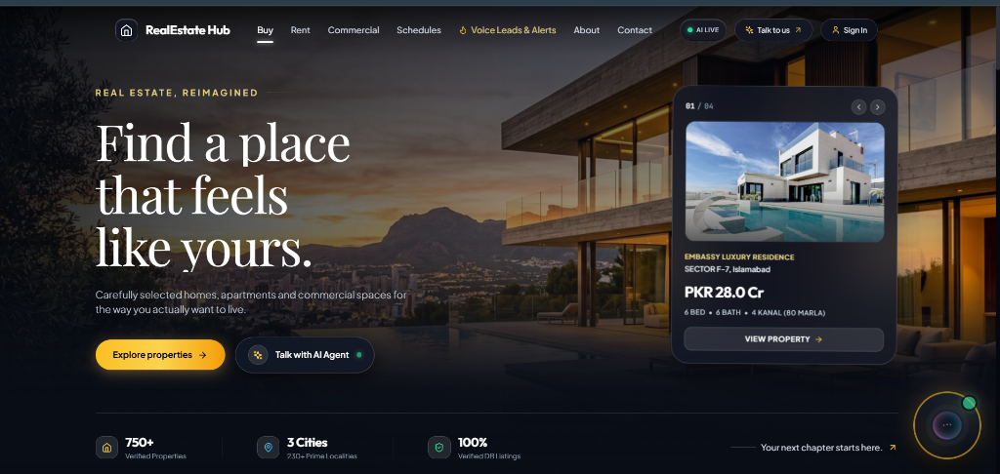
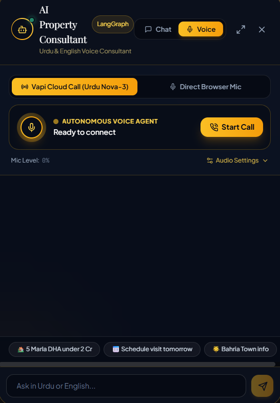

# 🏡 RealEstate Hub — Autonomous AI Voice & Property Consultant Platform

<div align="center">

[](https://python.org)
[](https://fastapi.tiangolo.com)
[](https://langchain.com)
[](https://deepgram.com)
[](https://vapi.ai)
[](https://ai.google.dev)
[](https://lightgbm.readthedocs.io)
[](https://vitejs.dev)

**An enterprise-grade, stateful AI Voice Consultant and Machine Learning platform tailored for the Pakistani real estate ecosystem.**  
*Seamlessly combining bilingual Urdu/English conversational voice streaming, grounded LangGraph multi-node state orchestration, sub-second Deepgram Nova-3 speech recognition, and explainable Machine Learning property valuation and lead scoring.*

---

</div>

## 📸 Platform Showcase

<div align="center">

### 🌐 RealEstate Hub Luxury Web Portal

*Modern luxury portal featuring 750+ verified properties across Islamabad, Lahore, and Rawalpindi, real-time property cards with PKR pricing & Marla specifications, and integrated AI consultation.*

<br/>

### 🎙️ AI Property Consultant (Autonomous Voice Agent Widget)

*Interactive voice consultant powered by LangGraph state orchestration, supporting dual calling modes: Vapi Cloud Telephony with Deepgram Nova-3 Urdu speech-to-text, or Direct In-Browser Microphone streaming.*

</div>

---

## 📑 Table of Contents

- [Key Highlights](#-key-highlights)
- [System Architecture](#-system-architecture)
- [Voice Agent & Telephony Pipeline](#-voice-agent--telephony-pipeline)
- [LangGraph 10-Node State Orchestration](#-langgraph-10-node-state-orchestration)
- [Datasets & Knowledge Base](#-datasets--knowledge-base)
- [Machine Learning Engines](#-machine-learning-engines)
- [Continual Learning Layer](#-continual-learning-layer)
- [Project Directory Structure](#-project-directory-structure)
- [Installation & Quickstart](#-installation--quickstart)
- [Environment Configuration](#-environment-configuration)
- [Verification & Automated Tests](#-verification--automated-tests)
- [Production Deployment](#-production-deployment)
- [License & Acknowledgments](#-license--acknowledgments)

---

## 🌟 Key Highlights

- **Bilingual Conversational Fluency (Urdu & English):** Native understanding of Pakistani real estate terminology, conversational phrases (*"Assalam-o-Alaikum"*, *"Ji bilkul"*, *"Acha"*, *"Thora discount ho sakta hai?"*), Urdu script, Roman Urdu, and mixed code-switching (*UrduLish*).
- **Sub-2-Second End-to-End Voice Latency:** Powered by **Vapi Cloud Voice Gateway** paired with **Deepgram Nova-3 Urdu STT** (`language: "ur"`) and low-latency voice synthesis for natural, uninterrupted telephone and browser conversations.
- **Dual Communication Modes:**
  1. **Vapi Cloud Call (Urdu Nova-3):** High-reliability WebRTC/telephony call with background noise suppression, speech barge-in, and server-side webhook automation.
  2. **Direct Browser Mic:** Lightweight in-browser audio capture streaming raw PCM to FastAPI with streaming text-to-speech.
- **Stateful LangGraph Orchestration (10 Nodes):** Deterministic state machine managing multi-turn memory, entity extraction (Crore/Lakh budgets, Marla/Kanal conversions), availability checks, scheduling, and RAG retrieval.
- **Machine Learning Property Valuation (*"Mera ghar kitne ka bikega?"*):** LightGBM regression engine ($R^2 = 0.891$) with 10th and 90th percentile quantile prediction intervals that categorizes properties as *Overpriced*, *Fair Market*, or *Underpriced*.
- **Post-Call Lead Scoring & VIP Escalation:** Automatic evaluation of call duration, budget, locality, and site visit booking upon call termination; hot leads ($\ge 70\%$ conversion probability) trigger an instant 15-minute SLA alert to sales consultants.
- **Enterprise Verification Invariants:**
  - *Zero Hallucination Listings:* Never suggests nonexistent or unverified properties.
  - *No Double-Bookings:* Rejects appointment collisions and enforces office visiting hours (9:00 AM – 7:00 PM).
  - *Active Clarification:* Asks targeted questions instead of blindly guessing ambiguous queries.

---

## 🏗️ System Architecture

The platform operates across 6 integrated layers:

```mermaid
flowchart TB
    subgraph ClientLayer ["1. Client & Inbound Touchpoints"]
        Caller["📞 Inbound Telephony Caller (WebRTC / PSTN Phone)"]
        WebUser["💻 Web Client (RealEstate Hub React Portal)"]
        SalesAgent["🧑‍💼 Real Estate Sales Consultant"]
    end

    subgraph VoiceGateway ["2. Vapi Voice Infrastructure"]
        VapiGate["🎙️ Vapi Cloud Voice Gateway"]
        DeepgramNova["🗣️ Deepgram Nova-3 (Urdu Speech-to-Text)"]
        VapiTTS["🔊 Vapi Text-to-Speech (UrduLish Voice Engine)"]
    end

    subgraph LangGraphOrchestrator ["3. LangGraph Orchestration Layer (vapi_server.py)"]
        StateGraph["🔄 LangGraph StateGraph Engine"]
        IntentNode["🔀 Intent Detection Node\n(Entities: Marla, Society, City, Budget, Booking)"]
        
        subgraph GraphNodes ["Agent State Nodes"]
            GreetingNode["👋 Greeting Node"]
            RecNode["🏡 Property Recommendation Node"]
            BookNode["📅 Booking Node (Google Calendar & CRM)"]
            ReschedNode["🔄 Rescheduling Node"]
            CancelNode["❌ Cancellation Node"]
            RAGNode["📚 RAG Knowledge Node (ChromaDB)"]
            EmailNode["✉️ Email Notification Node"]
            ValuationNode["📈 ML Valuation Node ('Mera ghar kitne ka bikega?')"]
            ClarifyNode["❓ Clarification Node (Zero Guesswork)"]
        end
    end

    subgraph MLServiceLayer ["4. Machine Learning Serving Engines"]
        PriceValuationModel["💰 LightGBM Valuation Regressor (/predict/price)\n(R²=0.891, MAPE=5.4%)"]
        QuantileBounds["📊 Quantile Interval Models\n(10th & 90th Percentile Confidence Range)"]
        LeadScoringModel["🎯 LightGBM Lead Scoring Engine (/predict/lead-score)\n(ROC-AUC=0.912, SMOTE Balanced)"]
        PersonaClustering["👥 K-Means Customer Persona Engine (k=4)"]
        SHAPExplainers["🔍 SHAP TreeExplainer Local Attribution"]
    end

    subgraph TelephonyWebhook ["5. Post-Call Telephony Webhook & Automation"]
        PostCallWebhook["📲 Vapi Post-Call Webhook (/vapi/webhook)\n(Triggered when call ends)"]
        LeadEvaluator["⚖️ Call Feature Intake & Scoring Engine\n(Duration, Budget, Society, Visit Booked)"]
        VIPHotLeadAlert["🚨 VIP Hot Lead Email Dispatcher\n(15-Min Closer SLA Alert sent to Sales Agent)"]
    end

    subgraph StorageGovernance ["6. Persistence & Governance Layer"]
        PostgresDB[("🗄️ PostgreSQL / SQLite DB\n(Properties, CRM Leads, Appointments)")]
        ChromaKB[("📁 ChromaDB Vector Knowledge Base")]
        AuditLogs[("📝 SQLite Audit DB & JSONL Execution Traces")]
    end

    %% Voice Calling Sequence
    Caller <-->|Live Urdu Speech Audio| VapiGate
    VapiGate -->|Streaming Audio| DeepgramNova
    DeepgramNova -->|UrduLish Transcripts| VapiGate
    VapiGate <-->|OpenAI Custom LLM Protocol (/vapi/llm)| StateGraph

    %% Intent Routing
    StateGraph --> IntentNode
    IntentNode -->|Greeting| GreetingNode
    IntentNode -->|Recommendation| RecNode
    IntentNode -->|Booking| BookNode
    IntentNode -->|Rescheduling| ReschedNode
    IntentNode -->|Cancellation| CancelNode
    IntentNode -->|RAG Inquiry| RAGNode
    IntentNode -->|Email| EmailNode
    IntentNode -->|'Mera ghar kitne ka bikega?'| ValuationNode
    IntentNode -->|Missing Details| ClarifyNode

    %% Valuation Node Connection to ML
    ValuationNode -->|Inference Call| PriceValuationModel
    ValuationNode -->|Confidence Intervals| QuantileBounds
    PriceValuationModel -->|Formatted Price + Verdict| ValuationNode
    ValuationNode -->|UrduLish Speech Text| VapiTTS
    VapiTTS -->|Audio Stream| Caller

    %% Post Call Webhook Flow
    VapiGate -->|Post-Call Webhook (end-of-call-report)| PostCallWebhook
    PostCallWebhook --> LeadEvaluator
    LeadEvaluator --> LeadScoringModel
    LeadScoringModel --> PersonaClustering
    LeadScoringModel -->|Hot Lead Score >= 70%| VIPHotLeadAlert
    VIPHotLeadAlert -->|Direct High-Priority Alert| SalesAgent

    %% Storage & Governance
    RecNode <--> PostgresDB
    BookNode <--> PostgresDB
    RAGNode <--> ChromaKB
    StateGraph --> AuditLogs
```

---

## 🎙️ Voice Agent & Telephony Pipeline

The voice stack is engineered specifically for code-switched Pakistani Urdu and English (*UrduLish*), preventing phonetic recognition dropouts.

```
Caller Speech (Urdu / English)
       │
       ▼
Vapi Cloud Gateway (WebRTC / SIP / Telephony)
       │
       ├── Transcribes via Deepgram Nova-3 (model: "nova-3", language: "ur")
       │   with boosted vocabulary ("DHA", "Bahria", "Marla", "Kanal", "Crore", "Lakh")
       │
       ▼
FastAPI `/vapi/llm/chat/completions` (OpenAI-compatible SSE streaming endpoint)
       │
       ▼
LangGraph Agent Turn Execution (`run_agent_turn`)
       ├── Updates conversation memory & user profile state
       ├── Extracts Pakistani numeric values ("2.5 Crore" → 25,000,000 PKR)
       ├── Executes tools (SQL listings, ChromaDB RAG, LightGBM Valuation)
       └── Generates grounded UrduLish answer with conversational markers ("Ji bilkul", "Acha")
       │
       ▼
Pseudo-chunked SSE Stream sent back to Vapi Gateway
       │
       ▼
Vapi / ElevenLabs TTS Audio Synthesis streamed back to Caller
```

### Supported Dialogue Behaviors:
- **Pakistani Code-Switching:** Seamlessly responds to phrases like:
  - *"DHA Phase 6 mein 10 marla ka plot kitne ka hoga?"*
  - *"Mera budget 3 crore hai, koi achi option batayein."*
  - *"Kal dopehr 3 baje visit schedule kar dein."*
- **Natural Conversational Fillers:** Controlled use of culturally natural pauses and acknowledgements (*"Ji bilkul..."*, *"Acha..."*, *"Ek second, main check karta hoon..."*).
- **Instant Barge-in & Cancellation:** Interruption during speech immediately halts synthesis and shifts turn processing to the user's new utterance.

---

## 🔄 LangGraph 10-Node State Orchestration

Every voice or text interaction is managed by a centralized, typed `AgentState` object:

```python
class AgentState(TypedDict):
    conversation_history: List[Dict[str, Any]]
    messages: Annotated[List[BaseMessage], operator.add]
    user_profile: UserProfile               # name, phone, email, lead_id
    property_preferences: PropertyPreferences # city, locality, marla, budget, type
    budget: Optional[float]
    intent: Optional[str]                   # classified intent
    tool_outputs: List[Dict[str, Any]]      # audit log of executed tools
    appointment_status: Dict[str, Any]      # booking tracking & calendar links
    clarification_needed: bool              # zero-guesswork safety guard
    clarification_prompt: Optional[str]
    validation_errors: List[str]
```

### Node Descriptions:

| Node | Purpose & Execution Logic |
| :--- | :--- |
| **`IntentDetectionNode`** | Extracts entities (Crore/Lakh budget, Marla/Kanal area, city, phone number, dates) using regex patterns and Urdu numerals (`ایک`, `دو`, `تین`, etc.). |
| **`GreetingNode`** | Delivers warm bilingual introductions establishing the consultant persona without overwhelming the caller. |
| **`ClarificationNode`** | Proactively requests missing search or booking parameters instead of hallucinating filters. |
| **`RecommendationNode`** | Executes strict SQL queries on verified inventory, ranks by amenities, and presents top listings. |
| **`ValuationNode`** | Calls the LightGBM ML regression model to provide instant price estimates with confidence bands. |
| **`BookingNode`** | Validates slot availability, prevents double-booking, generates Google Calendar links & `.ics` files, upserts CRM leads, and emails confirmation. |
| **`ReschedulingNode`** | Modifies existing appointments with conflict checks and notifies the assigned agent. |
| **`CancellationNode`** | Safely cancels appointments in CRM and updates agent schedules. |
| **`RAGNode`** | Performs semantic search on ChromaDB for locality profiles, developer credibility, NOC status, schools, and hospitals. |
| **`EmailNode`** | Automatically formats and emails comprehensive property dossiers to prospective buyers. |

---

## 📊 Datasets & Knowledge Base

The platform is backed by comprehensive Pakistani real estate datasets and relational knowledge bases:

```
realestate-hub/
├── data/
│   ├── csv/                           # Relational Knowledge Base
│   │   ├── properties.csv             # 750+ verified properties with prices, Marla, & amenities
│   │   ├── locations.csv              # Prime localities across Islamabad, Lahore, Karachi
│   │   ├── developers.csv             # Reputable builders (Habib, DHA, Bahria) & NOC status
│   │   ├── amenities.csv              # Security, backup solar/UPS, gas, parks, gated access
│   │   ├── agents.csv                 # Certified real estate consultants & active leads
│   │   ├── schools.csv                # Proximity infrastructure (Beaconhouse, LGS, etc.)
│   │   ├── hospitals.csv              # Proximity medical facilities (Shaukat Khanum, etc.)
│   │   ├── faqs.csv                   # Frequently asked legal, registry, and transfer queries
│   │   └── payment_plans.csv          # Installment milestones & down-payment structures
│   ├── db/
│   │   └── realestate_kb.db           # SQLite relational snapshot
│   └── vectorstores/                  # Persistent ChromaDB collections
Week 8/data/
├── raw/
│   ├── properties_raw.csv             # Dataset A: 6,300 raw Pakistani property listings
│   └── leads_raw.csv                  # Dataset B: 3,640 raw CRM telephony leads
└── processed/
    ├── properties_cleaned.csv         # 5,778 deduplicated & outlier-filtered property listings
    ├── leads_cleaned.csv              # 3,496 deduplicated & normalized CRM lead records
    ├── properties_featured.csv        # Dataset A with 8 engineered domain features
    └── leads_featured.csv             # Dataset B with 5 engineered domain features
```

### 1. Dataset A — Real Estate Valuation (`properties_featured.csv`)
- **Scope:** 6,300 raw $\rightarrow$ 5,778 cleaned listings across Islamabad, Lahore, Karachi, and Rawalpindi.
- **Target Variable:** `price_pkr` (trained in logarithmic space $\log(\text{price})$ to handle luxury skew).
- **Core Features:** `city`, `area_society`, `property_type`, `area_marla`, `bedrooms`, `baths`, `property_age`.
- **Domain Engineered Features:**
  - `property_age_bucket`: `Brand New <=1y`, `Modern 2-5y`, `Established 6-15y`, `Aging >15y`.
  - `society_tier`: `Tier 1 Prime` (DHA, F-6, F-7, Gulberg), `Tier 2 Mid`, `Tier 3 Budget`.
  - `amenity_score`: Quantified count of essential infrastructure (UPS, 24/7 security, gated community, mosque, park).
  - `accessibility_composite`: Inversely weighted distance to main boulevards, schools, and hospitals.
  - `spatial_density_ratio`: Ratio of covered square footage to plot square footage.
  - `society_hist_median_ppm`: Historical baseline price-per-marla anchoring for each society.

### 2. Dataset B — CRM Lead Conversion (`leads_featured.csv`)
- **Scope:** 3,640 raw $\rightarrow$ 3,496 cleaned telephony & CRM leads.
- **Target Variable:** `converted` (Binary: 0 or 1, representing successful deal closure; ~28.6% positive class).
- **Core Features:** `lead_source` (Inbound Call, Web Portal, WhatsApp, Referral), `call_duration_seconds`, `num_calls`, `visit_booked`, `budget_pkr`.
- **Domain Engineered Features:**
  - `lead_engagement_score`: $\text{num\_calls} \times \text{call\_duration\_minutes}$.
  - `response_speed_category`: `Immediate <=15m`, `Prompt 15m-1h`, `Standard 1h-4h`, `Delayed >4h`.
  - `budget_to_market_ratio`: Client budget divided by average society listing price.
  - `lead_velocity`: Call frequency per pipeline day elapsed.
  - `high_intent_flag`: Composite indicator (site visit booked + fast callback + $\ge 2$ calls).

### 3. Knowledge Base Summary (RealEstate Hub)
- **750+ Verified Properties:** Complete with bedrooms, bathrooms, locality, builder, and pricing.
- **3 Major Metros & 230+ Prime Localities:** Islamabad (F-6, F-7, F-8, F-10, F-11, E-11, B-17, DHA, Bahria Town), Lahore (DHA Phases 1-9, Gulberg, Bahria Town), Rawalpindi, and Karachi.
- **Multi-Vector Semantic Retrieval:** ChromaDB embedding store enabling zero-shot answers to legal, transfer fees, NOC approvals, and neighborhood amenities.

---

## 🤖 Machine Learning Engines

```
                                  ┌──────────────────────────────────────────────┐
                                  │           Week 8 ML Serving Engines          │
                                  └──────────────────────────────────────────────┘
                                          │                              │
                    ┌─────────────────────┴──────┐              ┌────────┴────────────────────┐
                    ▼                            ▼              ▼                             ▼
        ┌───────────────────────┐   ┌──────────────────────┐ ┌──────────────────────┐  ┌──────────────────────┐
        │  LightGBM Valuation   │   │  Quantile Bounds     │ │  Lead Scoring Engine │  │ Customer Personas    │
        │  R² = 0.891           │   │  10th & 90th %ile    │ │  ROC-AUC = 0.912     │  │ K-Means (k=4)        │
        │  MAPE = 5.4%          │   │  Fair/Over/Under     │ │  SMOTE Balanced      │  │ Dynamic Clustering   │
        └───────────────────────┘   └──────────────────────┘ └──────────────────────┘  └──────────────────────┘
```

### 1. Property Valuation Regressor
- **Architecture:** Gradient Boosted Trees (LightGBM) trained on log-transformed prices.
- **Performance:**
  - $R^2 = 0.891$ on holdout test data.
  - $\text{MAPE} = 5.4\%$ (Median Absolute Percentage Error).
  - Outperforms baseline Linear Models ($R^2 = 0.805$) and Random Forests ($R^2 = 0.852$).
- **Quantile Confidence Intervals:** Dedicated 10th and 90th percentile regressors generate high/low price boundaries. If an owner's asking price exceeds the 90th percentile, the voice agent alerts: *"Janab, yeh qeemat market rate se taqreeban 15% zyada hai."*

### 2. Lead Scoring Classification Engine
- **Architecture:** LightGBM Binary Classifier optimized with SMOTE balancing.
- **Performance:**
  - $\text{ROC-AUC} = 0.912$.
  - $\text{PR-AUC} = 0.841$.
  - Resolves the *Accuracy Paradox* by maximizing Precision at Top 20% leads ($\ge 82\%$).
- **Operational SLAs:**
  - 🔥 **Hot Lead ($\ge 70\%$ conversion probability):** 15-Minute Senior Closer SLA alert dispatched via email.
  - 🌤 **Warm Lead ($40\% - 69\%$):** Automated WhatsApp dossier & next-day follow-up.
  - ❄️ **Cold Lead ($< 40\%$):** Automated email newsletter nurturing.

### 3. Customer Personas (K-Means Clustering)
Discovers 4 distinctive behavioral segments from call duration, budget ratio, and engagement velocity:
1. **High Net-Worth Investors:** High budget, fast decisions, multi-unit interest.
2. **Family Home Upgraders:** High visit rate, emphasis on schools/mosques, 10–20 Marla houses.
3. **First-Time Budget Buyers:** High inquiry volume, sensitive to price per Marla, 3–5 Marla plots.
4. **Commercial Speculators:** Short call durations, focused strictly on payment plans and ROI yield.

### 4. Explainable AI with SHAP
Provides local feature attribution for every prediction. Explanations are translated into conversational UrduLish for non-technical sales agents:
> *"Is plot ki qeemat mein 25 lakh ka izafa is wajah se hai kyun ke yeh Park Facing aur Corner plot hai."*

---

## 🧠 Continual Learning Layer

To ensure the voice agent becomes smarter over time without risking call stability:

```
Every Call Turn                     Nightly / Weekly Batch Pipeline
────────────────                    ──────────────────────────────
Live Call Transcription             learning/data/intent_training_log.jsonl
        │                                          │
        ▼                                          ▼
Regex / Keyword Rules               TF-IDF + LogisticRegression Trainer
        │                                          │
    No match?                                      ▼
        ▼                           Evaluate against held-out test split
ML Fallback Classifier                             │
(confidence >= 0.55)                Promote ONLY if accuracy >= current model
        │                                          │
        ▼                                          ▼
Updated intent routing              learning/models/current_model.json
```

- **Zero Downtime / Regression Safe:** The live rule engine always executes first. The ML model is only queried when rules don't match, replacing blind fallback guessing.
- **Safe Auto-Promotion:** New models are only activated if validation accuracy strictly improves over the previous checkpoint.

---

## 📁 Project Directory Structure

```text
Real-Estate-Hub-AI-Voice-Chat-Agent/
│
├── assets/                               # UI Screenshots & Documentation Assets
│   ├── realestate_hub_web_portal.png     # Full-stack luxury landing page
│   └── ai_property_consultant_voice_agent.png # Interactive voice widget
│
├── frontend/                             # Modern Luxury React 18 + Vite Web App
│   ├── src/
│   │   ├── components/
│   │   │   ├── AiAssistantWidget.jsx     # Voice widget (Vapi WebRTC & Direct Mic)
│   │   │   ├── HeroSection.jsx           # Hero portal banner & stats showcase
│   │   │   ├── PropertyExplorer.jsx      # Filterable 750+ property catalog
│   │   │   ├── BookingModal.jsx          # Appointment booking modal
│   │   │   ├── AdminPortal.jsx           # CRM leads, appointments & analytics
│   │   │   └── ThreeCanvas.jsx           # 3D luxury background canvas
│   │   ├── App.jsx                       # Main application shell
│   │   └── index.css                     # Premium dark-mode glassmorphic styling
│   ├── package.json
│   └── vite.config.js
│
├── day5-langgraph-agent/                 # LangGraph Agent Core & Voice Server
│   ├── vapi_server.py                    # Unified FastAPI voice & CRM server
│   ├── graph.py                          # StateGraph assembly & conditional routing
│   ├── state.py                          # TypedDict agent state schema
│   ├── config.py                         # Environment & database configuration
│   ├── logger.py                         # Step-by-step trace logger
│   ├── auth_service.py                   # JWT user & admin authentication
│   ├── create_vapi_assistant.py          # Programmatic Vapi assistant provisioning
│   ├── nodes/                            # 10 LangGraph Execution Nodes
│   │   ├── intent_detection_node.py      # Entity extraction & intent routing
│   │   ├── greeting_node.py              # Bilingual welcome messages
│   │   ├── recommendation_node.py        # Verified SQL property recommendations
│   │   ├── booking_node.py               # Google Calendar & CRM lead generation
│   │   ├── rescheduling_node.py          # Appointment modification & collision check
│   │   ├── cancellation_node.py          # Appointment cancellation logic
│   │   ├── rag_node.py                   # Semantic ChromaDB retrieval
│   │   ├── email_node.py                 # Dossier email dispatcher
│   │   ├── clarification_node.py         # Missing-parameter prompt generator
│   │   └── goodbye_node.py               # Session termination & farewells
│   ├── tools/                            # Wrapped Business & ML Tools
│   │   ├── search_tools.py               # SQL property query engine
│   │   ├── availability_tools.py         # Double-booking prevention
│   │   ├── calendar_tools.py             # Calendar link & .ics generator
│   │   ├── email_tools.py                # Responsive HTML email templates
│   │   ├── crm_tools.py                  # Lead management & appointment storage
│   │   ├── rag_tools.py                  # Vector store search
│   │   └── ml_tools.py                   # Bridge to Week 8 Valuation & Lead models
│   └── learning/                         # Continual Learning Engine (Day 5.5)
│       ├── train_intent_classifier.py    # Retraining & model promotion script
│       └── intent_classifier.py          # Inference fallback classifier
│
├── Week 8/                               # Machine Learning Serving & Pipelines
│   ├── Day 1/                            # Data Cleaning, EDA, & 13 Domain Features
│   ├── Day 2/                            # LightGBM Valuation Regressor & Quantiles
│   ├── Day 3/                            # LightGBM Lead Scorer, Personas & SHAP
│   └── Day 4/                            # FastAPI ML Serving & Streamlit Dashboard
│
├── realestate-hub/                       # Legacy Day 1–4 Knowledge Base & Storage
│   ├── data/csv/                         # Core CSV Knowledge Base (Properties, etc.)
│   ├── data/db/realestate_kb.db          # SQLite Database
│   └── storage/                          # Generated .ics files, emails, and traces
│
├── requirements.txt                      # Project dependencies
├── Dockerfile                            # Production container build
├── render.yaml                           # Cloud deployment blueprint
└── start_cloudflare_live.bat             # Instant local-to-cloud tunnel script
```

---

## ⚡ Installation & Quickstart

### Prerequisites
- **Python 3.10+**
- **Node.js 18+** & `npm`
- **Git**
- Optional: Free accounts on [Vapi.ai](https://vapi.ai) and [Google AI Studio](https://aistudio.google.com/)

### 1. Clone the Repository
```bash
git clone https://github.com/UmerSahi/Real-Estate-Hub-AI-Voice-Chat-Agent.git
cd Real-Estate-Hub-AI-Voice-Chat-Agent
```

### 2. Set Up Python Virtual Environment
```bash
python -m venv venv

# Windows:
.\venv\Scripts\activate

# Linux / macOS:
source venv/bin/activate

pip install --upgrade pip
pip install -r requirements.txt
```

### 3. Configure Environment Variables
Create a `.env` file in the root directory (and in `day5-langgraph-agent/.env`):
```bash
cp day5-langgraph-agent/.env.example .env
```
*(Refer to the [Environment Configuration](#-environment-configuration) section below for required keys).*

### 4. Build Knowledge Base & Database
```bash
cd day5-langgraph-agent
python -c "from config import init_db; init_db()"
```

### 5. Launch the FastAPI Backend & Voice Server
```bash
# From day5-langgraph-agent directory:
uvicorn vapi_server:app --host 0.0.0.0 --port 8000 --reload
```
The server will start at `http://localhost:8000` (Swagger docs available at `http://localhost:8000/docs`).

### 6. Launch the React / Vite Frontend
Open a new terminal window:
```bash
cd frontend
npm install
npm run dev
```
Open `http://localhost:5173` in your browser to experience the luxury portal and voice agent!

---

## ⚙️ Environment Configuration

Set the following variables in your `.env` file:

```ini
# ==============================================================================
# Google Gemini LLM & Embeddings
# ==============================================================================
GOOGLE_API_KEY=your_gemini_api_key_here
GEMINI_MODEL=gemini-2.5-flash

# ==============================================================================
# Vapi Cloud Voice Gateway & Telephony
# ==============================================================================
VAPI_PRIVATE_KEY=your_vapi_private_key_here
VAPI_PUBLIC_KEY=your_vapi_public_key_here
VAPI_ASSISTANT_ID=your_vapi_assistant_id_here
VAPI_TRANSCRIBER_MODEL=nova-3
VAPI_TRANSCRIBER_LANGUAGE=ur
VAPI_VOICE_PROVIDER=vapi
VAPI_VOICE_ID=Elliot

# Public URL reachable by Vapi webhooks (ngrok or Cloudflare tunnel in development)
BACKEND_PUBLIC_URL=https://your-domain.trycloudflare.com

# ==============================================================================
# Database & Authentication
# ==============================================================================
DATABASE_URL=sqlite:///./realestate-hub/data/db/realestate_kb.db
JWT_SECRET_KEY=super_secure_random_jwt_secret_key_here

# ==============================================================================
# Automated Email Notifications (SMTP)
# ==============================================================================
SMTP_SERVER=smtp.gmail.com
SMTP_PORT=587
SMTP_USERNAME=your_email@gmail.com
SMTP_PASSWORD=your_app_specific_password
VIP_CLOSER_EMAIL=sales.lead@realestatehub.pk
```

### Tunneling for Vapi Webhook (Development)
If testing live telephony with Vapi, Vapi needs to communicate with your backend over HTTPS:
```bash
# Using Cloudflare Tunnel:
cloudflared tunnel --url http://localhost:8000

# Or using ngrok:
ngrok http 8000
```
Update `BACKEND_PUBLIC_URL` in `.env` with the generated HTTPS forwarding URL.

---

## 🧪 Verification & Automated Tests

### 1. Run Complete Agent Test Suite
Run the 15 end-to-end integration test scenarios verifying state management, routing, appointment validations, and trace logging:
```bash
cd day5-langgraph-agent
python test_day5_agent.py
```

### 2. Interactive Terminal CLI
Test the LangGraph conversational assistant directly in the console:
```bash
cd day5-langgraph-agent
python agent_cli.py
```

### 3. Machine Learning Model Tests
Verify the Week 8 ML pipelines and serving endpoints:
```bash
# Test Day 1 Feature Pipeline:
python "Week 8/Day 1/tests/test_day1_pipeline.py"

# Test Day 2 Property Valuation Model:
python "Week 8/Day 2/tests/test_day2_valuation.py"

# Test Day 3 Lead Scoring & Fairness:
python "Week 8/Day 3/tests/test_day3_lead_scoring.py"
```

---

## 🚀 Production Deployment

### Docker Deployment
Build and run the entire unified stack using Docker:

```bash
docker build -t realestate-hub-ai:latest .
docker run -d -p 8000:8000 --env-file .env realestate-hub-ai:latest
```

### Cloud Deployment (Render / Railway)
The project includes a pre-configured `render.yaml` specification for zero-configuration deployments:
1. Connect your GitHub repository to [Render](https://render.com).
2. Create a new **Web Service** from the Blueprint.
3. Configure your environment variables in the Render dashboard.

---

## 👥 Contributors & Contact

- **Lead Engineer & AI Architect:** [Umer Sahi](https://github.com/UmerSahi)
- **Repository:** [Real-Estate-Hub-AI-Voice-Chat-Agent](https://github.com/UmerSahi/Real-Estate-Hub-AI-Voice-Chat-Agent.git)

---

## 📄 License

Distributed under the **MIT License**. See `LICENSE` for more information.
