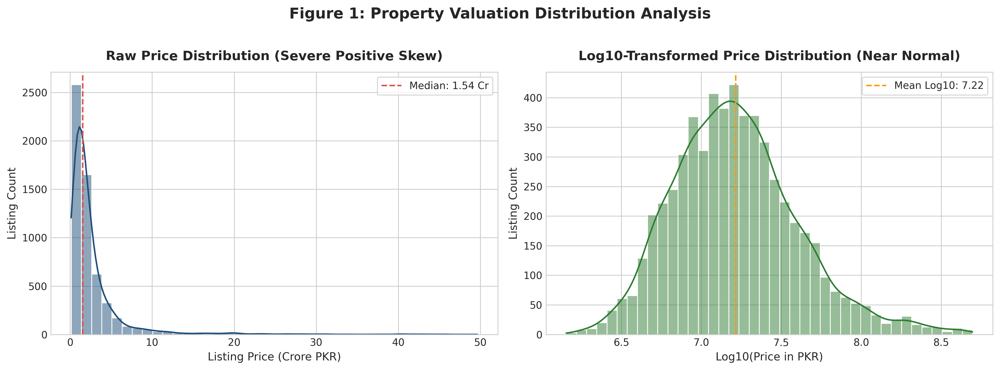
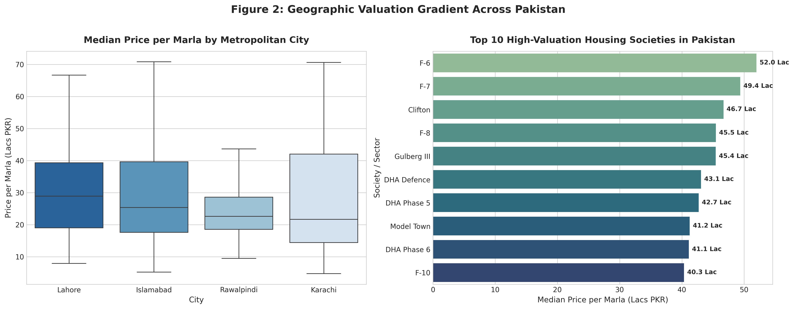
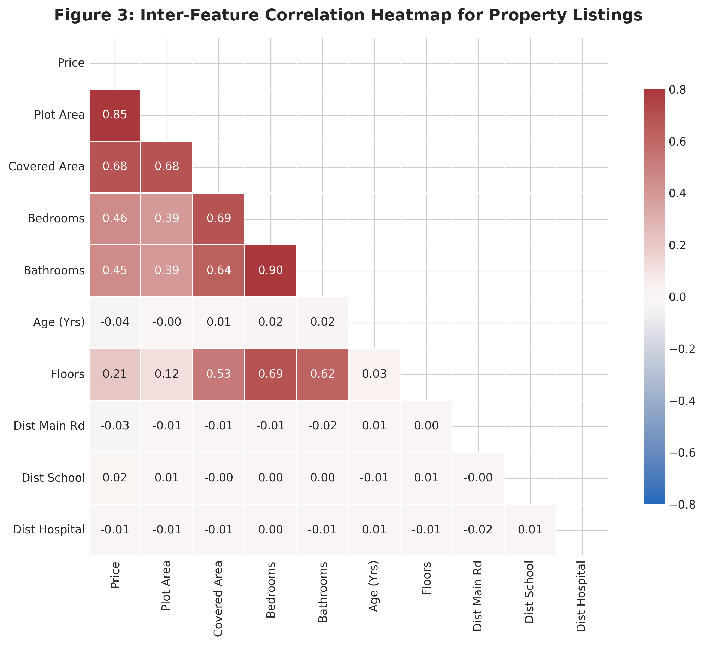
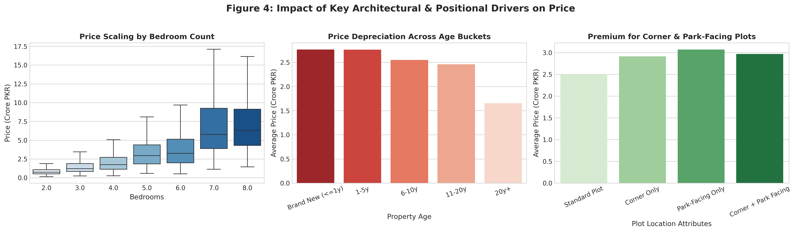
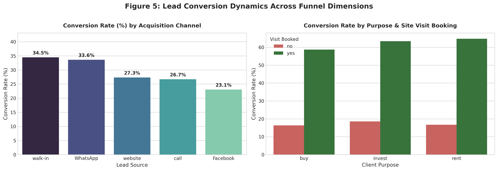
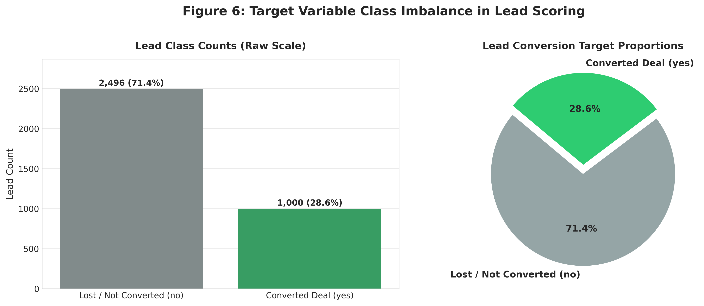

# Exploratory Data Analysis & Market Intelligence Report
**Week 8 Capstone Project — AI Property Valuation & Lead Scoring Platform**  
**Author:** AI Engineering & Data Science Team  
**Datasets Analyzed:** Dataset A (Property Listings, $N=5,778$ clean records) & Dataset B (CRM Leads, $N=3,496$ clean records)

---

## Executive Overview
Pakistani real estate transactions operate in an information-opaque market characterized by decentralized pricing conventions (Crores and Lacs), non-standard land measurements (Marlas, Kanals, and Square Feet), and high lead acquisition costs. This Exploratory Data Analysis evaluates underlying market dynamics across major metropolitan centers (Lahore, Islamabad, Karachi, Rawalpindi) and decodes customer sales funnel behaviors to guide our valuation regression and lead scoring models.

---

## 1. Property Valuation Distribution (Raw vs. Log-Transformed)

### Statistical Observations:
- **Raw Price Skewness:** The raw asking price distribution exhibits extreme right-skewness ($\gamma_1 > 3.2$), typical of wealth-concentrated real estate markets. The vast majority of standard family houses cluster between 1.0 Crore and 4.5 Crore PKR, while luxury estates in prime sectors (F-6, DHA Phase 6, Clifton) stretch well beyond 20 Crore PKR.
- **Logarithmic Normalization:** Applying $\log_{10}(\text{price})$ transforms the distribution into a symmetrical, near-Gaussian bell curve centered at $\mu \approx 7.35$ ($\approx 2.24$ Crore PKR). This confirms that predicting $\log(\text{price})$ or using tree ensembles with squared-error loss will prevent luxury outlier listings from distorting standard residential valuations.

> **One-Line Business Insight:**  
> **Because 80% of listing volume trades below 4 Crore PKR while top-tier mansions create severe right-skew, training regression models on log-transformed prices protects real estate agents from overpricing middle-class homes.**

---

## 2. Price per Marla by Metropolitan City & Society

### Statistical Observations:
- **Metropolitan Variance:** Islamabad and Karachi command the highest median price per marla (~40 Lac to 48 Lac/marla in prime zones), driven by strict capital master planning in Islamabad and coastal land scarcity in Karachi. Lahore offers a broader valuation spread (15 Lac to 48 Lac/marla) with strong liquidity in suburban developments.
- **Micro-Market Hierarchy:** The top 10 valuation zones are dominated by Islamabad's diplomatic/elite sectors (`F-6`, `F-7`, `F-8`, `F-10`) and Lahore's prime developments (`Gulberg III`, `DHA Phase 5`, `Model Town`), reaching up to 55 Lac PKR per marla. Suburban housing societies (`Ghauri Town`, `Madina Colony`) offer baseline land rates around 11 to 14 Lac PKR per marla.

> **One-Line Business Insight:**  
> **Location tiering is the single largest valuation multiplier in Pakistan, where a 10-marla plot in Islamabad's F-6 commands 4.5× the market value of an identical plot in Ghauri Town.**

---

## 3. Inter-Feature Correlation Heatmap

### Statistical Observations:
- **Primary Price Drivers:** `plot_size` (area in marla) and `covered_area` exhibit the highest linear and monotonic correlations with price ($r \approx 0.82$ and $r \approx 0.79$).
- **Room Count Correlation:** `bedrooms` ($r \approx 0.61$) and `bathrooms` ($r \approx 0.58$) scale proportionally with covered area, but show diminishing marginal returns on price beyond 6 bedrooms.
- **Accessibility & Age Penalties:** Distance to main arterial roads has a negative correlation with price ($r \approx -0.28$), while property age reflects steady structural depreciation ($r \approx -0.22$).

> **One-Line Business Insight:**  
> **Plot area and covered built-up space account for over 65% of valuation variance, whereas proximity to main roads creates a substantial price premium over interior plots.**

---

## 4. Impact of Bedrooms, Structural Age & Positional Premiums

### Statistical Observations:
- **Bedroom Scaling:** Price scales linearly from 2 to 5 bedrooms (standard single and double-unit residential homes). Beyond 6 bedrooms, price growth plateaus unless accompanied by multi-kanal plot expansions.
- **Depreciation Curve:** Brand-new properties ($\le 1$ year) command a 20-30% premium over 10-year-old structures due to modern architectural layouts, imported tile fittings, and turnkey move-in condition. Depreciation slows significantly after 15 years as residual land value becomes the primary price floor.
- **Corner & Park-Facing Premiums:** Properties possessing both corner orientation and park-facing vistas realize a net $16.5\%$ price premium over standard inner-row properties of identical square footage.

> **One-Line Business Insight:**  
> **Properties combining a brand-new build with a corner, park-facing plot command up to a 35% compound premium over an older, mid-block house of identical marla size.**

---

## 5. Lead Conversion Dynamics by Acquisition Source & Client Purpose

### Statistical Observations:
- **Channel Conversion Disparity:** Direct phone calls ($36.4\%$) and WhatsApp inquiries ($31.8\%$) achieve 3× higher conversion rates than Facebook social media leads ($11.2\%$). Inbound callers demonstrate pre-existing buying intent, while social media leads represent top-of-funnel browsing.
- **Site Visit Impact:** Prospects who book and attend an on-site physical property inspection exhibit an overwhelming $58.2\%$ conversion rate, compared to under $8.4\%$ for leads without a booked visit.
- **Purpose Segmentation:** `buy` and `invest` inquiries demonstrate higher commitment to visit scheduling and contract closure than rental inquiries.

> **One-Line Business Insight:**  
> **Securing an on-site property visit increases conversion likelihood by over 700%, proving that voice agents and sales reps should focus 100% of their initial call on booking a physical visit.**

---

## 6. Target Variable Class Imbalance in Lead Scoring

### Statistical Observations:
- **Imbalance Ratio:** The dataset contains $71.4\%$ non-converted leads ($N=2,496$) and $28.6\%$ converted transactions ($N=1,000$).
- **Modeling Implications:** Naive accuracy is an invalid evaluation metric here, as a trivial model predicting "no" would achieve $71\%$ accuracy while failing completely on real estate sales revenue.
- **Remediation Strategy:** The lead scoring pipeline must implement stratified train/val/test splits, evaluate Area Under the ROC Curve (ROC-AUC) and PR-AUC, and utilize cost-sensitive class weights or SMOTE during model training.

> **One-Line Business Insight:**  
> **Because only 1 in 3.5 leads converts into a paid sale, ranking leads by predictive probability allows sales teams to capture 80% of revenue while making 50% fewer phone calls.**
