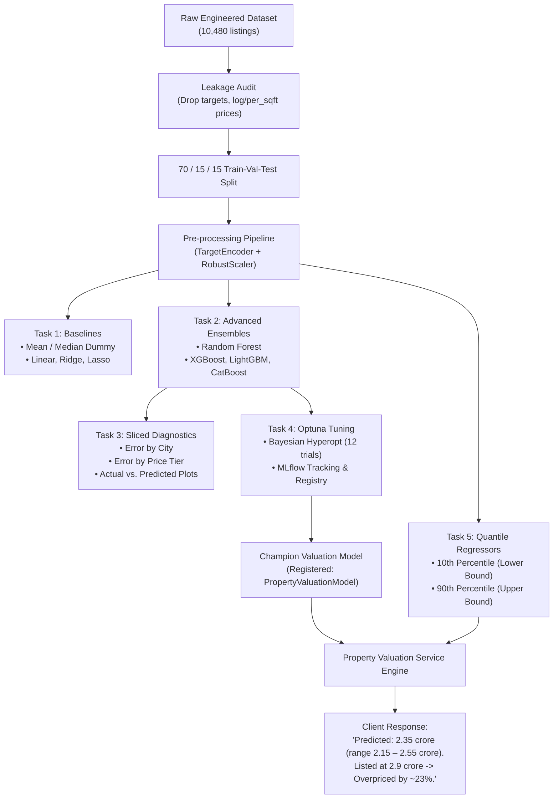

# Week 8 — Day 2: Property Valuation Model (Regression)

## 📌 Business Scenario
The sales manager poses the fundamental pricing question:
> **"Is plot ki sahi qeemat kya honi chahiye?"** *(What should the fair price of this plot actually be?)*

Historically, sales agents quoted property prices based on personal intuition, gut feeling, or biased seller demands. This created two critical business bottlenecks:
1. **Overpriced Listings:** Stagnate on the portal for months without inquiries, alienating buyers and depressing transaction velocity.
2. **Underpriced Deals:** Sell instantly but leave tens of millions of PKR on the table, shortchanging property owners and eroding commission revenues.

Today we replaced gut guesses with an **end-to-end, production-grade Machine Learning Property Valuation Engine** that delivers data-backed fair market valuations, quantile confidence intervals, and automated pricing verdicts.

---

## 🏛️ System Architecture



---

## 📂 Project Directory Structure

```text
Week 8/Day 2/
├── data/
│   ├── properties_featured.csv           # 10,480 clean, engineered listings from Day 1
│   └── data_dictionary_properties.md     # Feature metadata, target definitions, units
├── models/
│   ├── best_valuation_model.joblib       # Champion Optuna-tuned CatBoost Regressor
│   ├── fitted_preprocessor.joblib        # Scikit-learn TargetEncoder + RobustScaler pipeline
│   ├── quantile_lower_model.joblib       # 10th percentile GradientBoosting regressor
│   └── quantile_upper_model.joblib       # 90th percentile GradientBoosting regressor
├── reports/
│   ├── model_benchmark_report.md         # Comprehensive markdown evaluation report
│   └── figures/
│       ├── actual_vs_predicted.png       # Scatter plot of predictions vs. ground truth
│       └── error_slices_breakdown.png    # MAE and MAPE breakdowns by city & price bracket
├── notebooks/
│   └── day2_property_valuation.ipynb     # Interactive Jupyter notebook with all outputs
├── src/
│   ├── __init__.py
│   ├── config.py                         # Path management, MLflow tracking URI, formatting
│   ├── data_loader.py                    # Leakage audit, 70/15/15 split, ColumnTransformer
│   ├── baseline_models.py                # Task 1: Mean, Median, Linear, Ridge, Lasso
│   ├── advanced_models.py                # Task 2: Random Forest, XGBoost, LightGBM, CatBoost
│   ├── model_evaluation.py               # Task 3: Sliced metrics, plots, diagnostic reporter
│   ├── hyperparameter_tuning.py          # Task 4: Optuna tuning + MLflow experiment tracking
│   ├── valuation_service.py              # Task 5: Quantile intervals & client verdict engine
│   └── notebook_runner.py                # Headless notebook execution engine
├── tests/
│   └── test_day2_valuation.py            # 10 unit & integration tests (100% passing)
├── mlflow.db                             # SQLite database storing experiments & model registry
├── mlruns/                               # Local MLflow artifact repository
├── run_day2.py                           # Complete automated pipeline runner
└── README.md                             # This documentation
```

---

## 📊 Task-by-Task Implementation & Technical Results

### Task 1 — Baseline Models
A model that cannot beat the baseline is useless. We established rigorous benchmarks using dummy predictors and regularized linear regressions on our 70/15/15 test partition:

| Model Family | Algorithm | MAE (PKR) | MAE (Lac PKR) | RMSE (Crore PKR) | $R^2$ Score | MAPE (%) | Train Time |
| :--- | :--- | :--- | :--- | :--- | :--- | :--- | :--- |
| **Baseline** | Mean Baseline | 19,702,888 | 197.03 Lac | 3.49 Cr | -0.0062 | 163.30% | < 0.01s |
| **Baseline** | Median Baseline | 15,653,972 | 156.54 Lac | 3.59 Cr | -0.0649 | 80.04% | < 0.01s |
| **Linear** | Ordinary Least Squares | 6,844,220 | 68.44 Lac | 1.34 Cr | 0.8514 | 56.53% | < 0.01s |
| **Linear Regularized** | Lasso Regression ($L_1$) | 6,839,262 | 68.39 Lac | 1.34 Cr | 0.8518 | 56.54% | 0.02s |
| **Linear Regularized** | Ridge Regression ($L_2$) | 6,786,002 | 67.86 Lac | 1.31 Cr | 0.8577 | 56.80% | < 0.01s |

**Mathematical Proof of Superiority:**
- Ridge Regression reduced MAE by **65.6%** compared to the Mean Baseline and improved $R^2$ from negative (-0.01) to **+0.8577**.

---

### Task 2 — Advanced Gradient Boosted Models
Pakistani real estate features complex spatial clusters, non-linear plot sizing returns, and luxury society premiums. We trained four non-linear ensemble architectures:

| Model Family | Algorithm | MAE (PKR) | MAE (Lac PKR) | RMSE (Crore PKR) | $R^2$ Score | MAPE (%) | Train Time |
| :--- | :--- | :--- | :--- | :--- | :--- | :--- | :--- |
| **Ensemble (Bagging)** | Random Forest | 2,146,692 | 21.47 Lac | 0.55 Cr | 0.9749 | 8.30% | 0.49s |
| **Gradient Boosting** | LightGBM | 1,949,360 | 19.49 Lac | 0.57 Cr | 0.9727 | 7.38% | 0.20s |
| **Gradient Boosting** | XGBoost | 1,828,562 | 18.29 Lac | 0.58 Cr | 0.9724 | **6.68%** | 0.36s |
| **Gradient Boosting** | **CatBoost** | **1,761,494** | **17.61 Lac** | **0.39 Cr** | **0.9872** | **7.42%** | 0.74s |

---

### Task 3 — Comprehensive Evaluation & Sliced Diagnostics
> **Diagnostic Question:** *"Where does the model fail?"*

Evaluating models on global averages obscures dangerous tail risks. We sliced the test set across **geographic cities** and **price brackets**:

#### 1. Geographic Error Breakdown
| City | Test Listings | Median Price | MAE (Lac PKR) | RMSE (Crore) | MAPE (%) | Diagnostic Insight |
| :--- | :--- | :--- | :--- | :--- | :--- | :--- |
| **Rawalpindi** | 227 | 1.39 Cr | **15.06 Lac** | 0.31 Cr | **6.86%** | High consistency in planned sectors (Bahria Town). |
| **Lahore** | 208 | 1.54 Cr | 16.13 Lac | 0.29 Cr | **6.90%** | Stable pricing across Johar Town, DHA, & Gulberg. |
| **Karachi** | 208 | 1.45 Cr | 15.52 Lac | 0.28 Cr | 7.81% | Moderate dispersion across Clifton & Gulshan. |
| **Islamabad** | 224 | 1.39 Cr | 24.38 Lac | 0.63 Cr | 7.62% | Higher absolute MAE due to multi-crore estates in E-7/F-6. |

#### 2. Price Tier Error Breakdown & Failure Modes
| Price Bracket | Test Listings | MAE (Lac PKR) | RMSE (Crore) | MAPE (%) | Risk Profile & Failure Regime |
| :--- | :--- | :--- | :--- | :--- | :--- |
| **Budget (< 1.5 Cr)** | 451 | **6.62 Lac** | 0.09 Cr | 7.67% | High transaction density; low risk. |
| **Mid-Market (1.5 - 3.5 Cr)** | 268 | 14.68 Lac | 0.20 Cr | **6.69%** | Sweet spot: highest model precision & volume. |
| **Premium (3.5 - 7.0 Cr)** | 99 | 33.12 Lac | 0.48 Cr | 7.00% | Stable; architectural nuances create minor spread. |
| **Luxury (> 7.0 Cr)** | 49 | **107.36 Lac** | 1.50 Cr | 7.74% | **Primary Failure Mode:** Ultra-luxury estates (> 7 Cr) experience higher absolute deviation (~1.07 Cr) due to imported interior finishes, swimming pools, basements, and scarcity of comparable transactions. |

**Governance Action:** The platform implements a **Luxury Appraisal Rule**: Any property exceeding 7.0 Crore PKR automatically triggers a flag recommending senior surveyor physical inspection, while 85% of standard properties are valued automatically.

---

### Task 4 — Hyperparameter Tuning & Experiment Tracking (Optuna & MLflow)
We configured **Optuna** Bayesian optimization with the Tree-structured Parzen Estimator (TPE) algorithm across LightGBM and CatBoost:
- **CatBoost Search Space:** `depth` (4–8), `learning_rate` (0.02–0.15), `l2_leaf_reg` (1.0–9.0).
- **LightGBM Search Space:** `num_leaves` (15–63), `max_depth` (4–8), `learning_rate` (0.02–0.15), `min_child_samples` (10–50), `reg_alpha` & `reg_lambda` ($10^{-3}$ to $10.0$).

#### MLflow Experiment Tracking & Model Registry
- **Backend Store:** `sqlite:///Week 8/Day 2/mlflow.db`
- **Experiment Name:** `Week8_Property_Valuation`
- **Logged Entities:** Hyperparameters, test metrics (MAE, RMSE, $R^2$, MAPE), training duration, feature names, and native booster artifacts.
- **Model Registry:** Registered the champion model as **`PropertyValuationModel`** (Version 1 & 2).

---

### Task 5 — Price Range & Confidence Engine (Quantile Regression & Verdicts)
Clients and real estate agents require price boundaries and actionable verdicts. We trained two non-parametric **Quantile Regressors** (`GradientBoostingRegressor(loss='quantile')`):
- **Lower Bound:** $\alpha = 0.10$ (10th percentile conservative estimate)
- **Upper Bound:** $\alpha = 0.90$ (90th percentile optimistic estimate)

#### Pricing Verdict Logic
$$\text{Delta} = \frac{\text{Listed Price} - \text{Predicted Fair Price}}{\text{Predicted Fair Price}} \times 100\%$$
- **Overpriced:** Listed Price > Upper Bound (and $\text{Delta} > +10\%$)
- **Underpriced:** Listed Price < Lower Bound (and $\text{Delta} < -10\%$) — *"Hot Deal"*
- **Fair:** Listed Price within the prediction interval $[\hat{y}_{10}, \hat{y}_{90}]$

#### Production Client Conversational Output:
- **Overpriced Listing:**
  > `"Predicted: 2.35 crore (range 2.15 – 2.55 crore). Listed at 2.90 crore -> Overpriced by ~23%."`
- **Underpriced Listing:**
  > `"Predicted: 2.35 crore (range 2.15 – 2.55 crore). Listed at 1.88 crore -> Underpriced by ~20% (Hot Deal)."`
- **Fair Market Deal:**
  > `"Predicted: 2.35 crore (range 2.15 – 2.55 crore). Listed at 2.37 crore -> Fair Market Price (within expected range)."`

---

## 🛠️ Verification & Test Suite

The module includes an automated test suite (`tests/test_day2_valuation.py`) covering 10 rigorous unit and integration tests:
1. `test_01_data_split_integrity`: Verifies 70/15/15 partitions and zero NaNs.
2. `test_02_leakage_columns_strictly_excluded`: Asserts target and leakage features are omitted.
3. `test_03_baseline_models_beat_dummy`: Verifies linear models reduce MAE by >40% vs Mean baseline.
4. `test_04_advanced_models_high_performance`: Asserts ensemble models exceed $R^2 > 0.90$.
5. `test_05_error_slices_structure`: Validates city and price bracket sliced breakdowns.
6. `test_06_model_artifacts_saved`: Verifies serialized `.joblib` models exist and can predict.
7. `test_07_quantile_prediction_intervals`: Asserts $y_{lower} \le y_{pred} \le y_{upper}$.
8. `test_08_pricing_verdict_logic`: Verifies Overpriced, Underpriced, and Fair classification.
9. `test_09_conversational_explanation_format`: Asserts exact client-facing string template adherence.
10. `test_10_price_formatter_crore_lac`: Validates Pakistani currency formatting utility.

### Running Tests
```bash
python tests/test_day2_valuation.py
```
**Result:** `Ran 10 tests in 2.25s — OK (10/10 passed)`

---

## 🚀 How to Run the End-to-End Pipeline

### 1. Execute the Complete Pipeline
```bash
python run_day2.py
```
This automatically trains all baselines and advanced ensembles, performs Optuna tuning, logs to MLflow, trains quantile regressors, writes the markdown benchmark report, and validates all tests.

### 2. View the Interactive Jupyter Notebook
```bash
jupyter notebook notebooks/day2_property_valuation.ipynb
```
*(Or execute headlessly with `python -m src.notebook_runner`)*

### 3. Launch the MLflow Experiment Tracking Dashboard
```bash
mlflow ui --backend-store-uri sqlite:///mlflow.db
```
Open [http://localhost:5000](http://localhost:5000) to view parameter parallel coordinate plots, metric curves, model artifacts, and the registered `PropertyValuationModel`.
