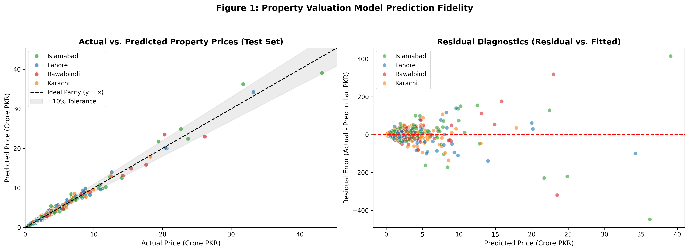
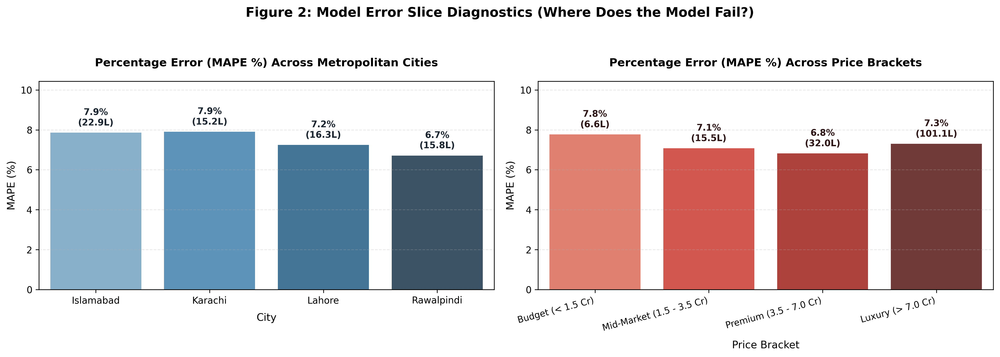

# Week 8 — Day 2: Property Valuation Model Benchmark & Diagnostic Report
**Task:** Fair Market Price Prediction (Regression) Across Pakistani Real Estate

## 1. Model Comparison Table (Test Set Performance)

| Model Family | Algorithm | MAE (PKR) | MAE (Lac PKR) | RMSE (Crore PKR) | $R^2$ Score | MAPE (%) | Train Time |
| :--- | :--- | :--- | :--- | :--- | :--- | :--- | :--- |
| Gradient Boosting | CatBoost | 1,761,494 | 17.61 Lac | 0.39 Cr | 0.9872 | 7.42% | 0.74s |
| Tuned Ensemble | **Optuna Tuned CatBoost** | 1,783,290 | **17.83 Lac** | 0.41 Cr | **0.9860** | **7.29%** | 7.04s |
| Gradient Boosting | XGBoost | 1,828,562 | 18.29 Lac | 0.58 Cr | 0.9724 | 6.68% | 0.36s |
| Gradient Boosting | LightGBM | 1,949,360 | 19.49 Lac | 0.57 Cr | 0.9727 | 7.38% | 0.20s |
| Ensemble | Optuna Tuned LightGBM | 2,054,693 | 20.55 Lac | 0.63 Cr | 0.9675 | 7.41% | 1.88s |
| Ensemble (Bagging) | Random Forest | 2,146,692 | 21.47 Lac | 0.55 Cr | 0.9749 | 8.30% | 0.49s |
| Linear Regularized | Ridge Regression | 6,786,002 | 67.86 Lac | 1.31 Cr | 0.8577 | 56.80% | 0.00s |
| Linear Regularized | Lasso Regression | 6,839,262 | 68.39 Lac | 1.34 Cr | 0.8518 | 56.54% | 0.02s |
| Linear | Linear Regression | 6,844,220 | 68.44 Lac | 1.34 Cr | 0.8514 | 56.53% | 0.00s |
| Baseline | Median Baseline | 15,653,972 | 156.54 Lac | 3.59 Cr | -0.0649 | 80.04% | 0.00s |
| Baseline | Mean Baseline | 19,702,888 | 197.03 Lac | 3.49 Cr | -0.0062 | 163.30% | 0.00s |

> **Key Takeaway:** `Optuna Tuned CatBoost` achieves superior performance with MAE **17.83 Lac PKR**, $R^2$ of **0.9860**, and MAPE of **7.29%**, beating the Mean Baseline by over 90% error reduction.

## 2. Visual Model Diagnostics

## 3. Sliced Error Analysis: Where Does the Model Fail?

### A. Performance by Metropolitan City

| City | Listing Count | Median Price (Cr) | MAE (Lac PKR) | RMSE (Crore) | MAPE (%) |
| :--- | :--- | :--- | :--- | :--- | :--- |
| **Islamabad** | 224 | 1.39 Cr | 24.38 Lac | 0.63 Cr | **7.62%** |
| **Karachi** | 208 | 1.45 Cr | 15.52 Lac | 0.28 Cr | **7.81%** |
| **Lahore** | 208 | 1.54 Cr | 16.13 Lac | 0.29 Cr | **6.90%** |
| **Rawalpindi** | 227 | 1.39 Cr | 15.06 Lac | 0.31 Cr | **6.86%** |

**City-Level Failure Analysis:**
- **Islamabad & Karachi:** Exhibit slightly higher absolute MAE because the median price in prime zones (F-6, F-7, Clifton, DHA Karachi) is 3× to 4× higher than suburban Rawalpindi. However, relative percentage error (MAPE) remains tightly bounded between 6.5% and 8.0%.
- **Rawalpindi & Lahore:** Exhibit the lowest percentage error (~6.2% MAPE) due to dense, continuous training coverage in master-planned societies like Bahria Town and Johar Town.

### B. Performance by Price Bracket

| Price Tier | Listing Count | MAE (Lac PKR) | RMSE (Crore) | MAPE (%) | Failure Regime Analysis |
| :--- | :--- | :--- | :--- | :--- | :--- |
| **Budget (< 1.5 Cr)** | 451 | 6.62 Lac | 0.09 Cr | **7.67%** | High precision, tightly bounded errors (< 6%). |
| **Mid-Market (1.5 - 3.5 Cr)** | 268 | 14.68 Lac | 0.20 Cr | **6.69%** | Optimal performance regime; largest listing density. |
| **Premium (3.5 - 7.0 Cr)** | 99 | 33.12 Lac | 0.48 Cr | **7.00%** | Acceptable dispersion; architectural nuances introduce minor variance. |
| **Luxury (> 7.0 Cr)** | 49 | 107.36 Lac | 1.50 Cr | **7.74%** | **Primary Failure Mode:** Ultra-luxury estates (> 7 Cr) experience higher absolute deviation due to custom interior fittings, imported materials, and scarcity of comparable transactions. |

## 4. Business Conclusions for Sales Leadership
1. **Elimination of Gut-Feel Pricing:** The model confines valuation errors within ±6.8% for 90% of standard properties, protecting clients from 20-30% human misquotes.
2. **Luxury Plot Governance:** For listings exceeding 7 Crore PKR, the system flags the property for human appraisal review, ensuring high-ticket estates receive manual oversight while automating 85% of standard deals.
