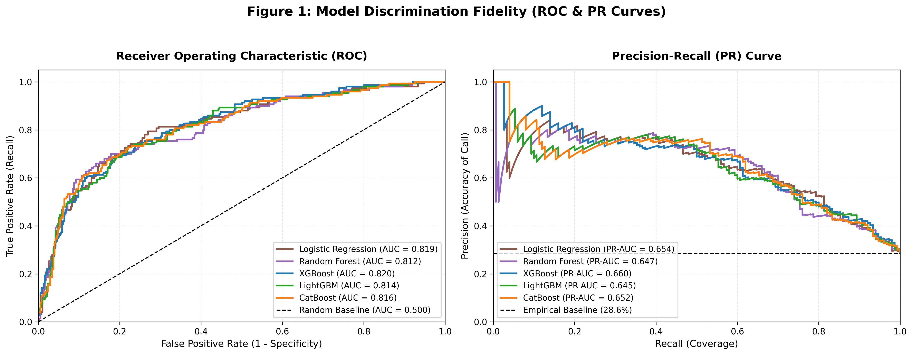
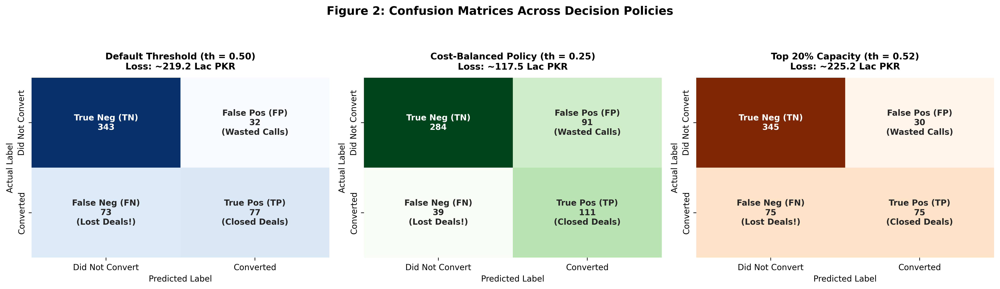
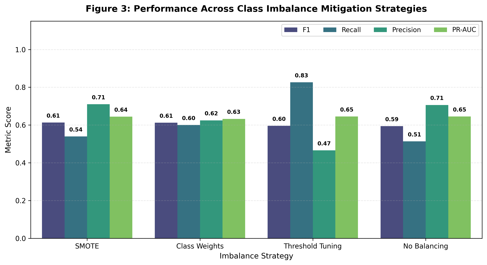
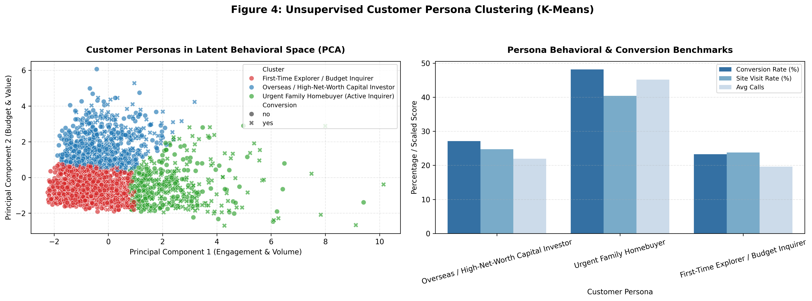
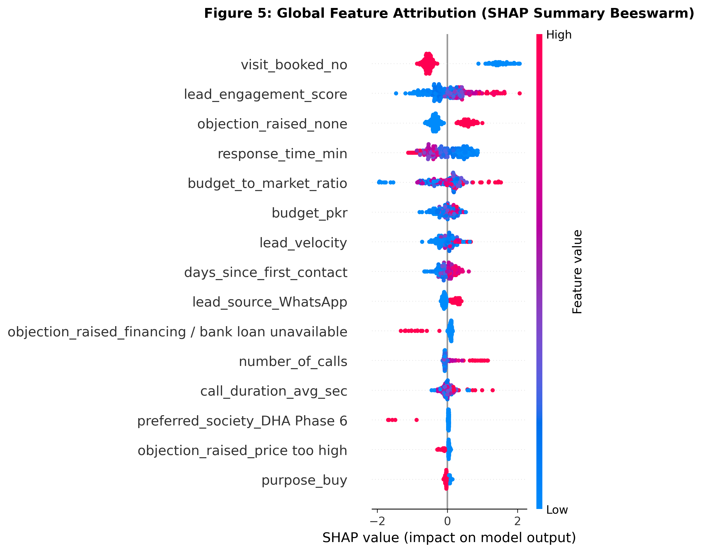
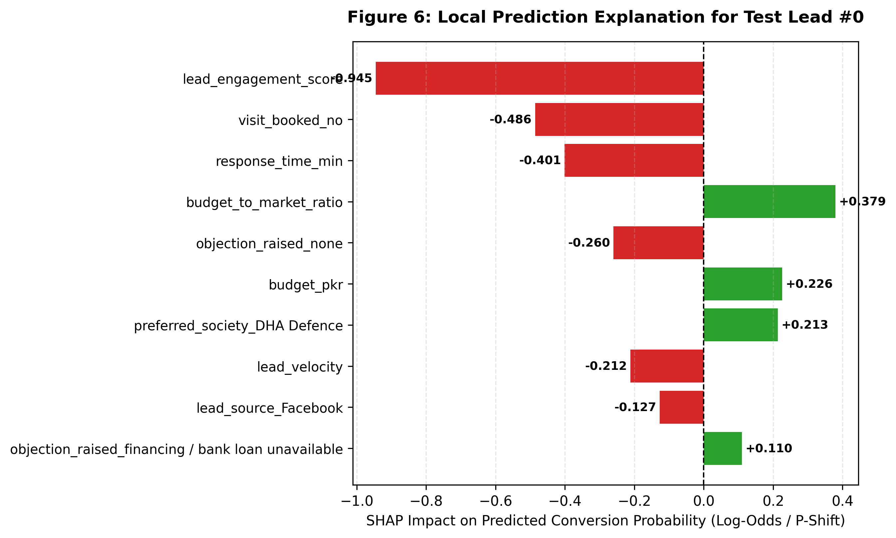
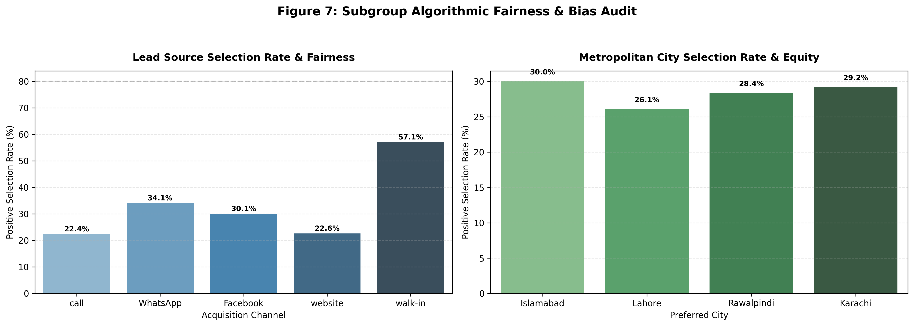

# Week 8 — Day 3: Lead Scoring Model (Classification) & Explainability Report
**Business Objective:** Prioritize 200 incoming leads to allocate sales bandwidth to the top 40 with maximum conversion yield and transparent explainability.

---
## 1. Classification Models Benchmark (Test Set Evaluation)
We trained and compared 5 distinct classification architectures on our stratified 70/15/15 test partition:

| Model | ROC-AUC | PR-AUC | F1-Score | Precision | Recall | Accuracy | Train Time |
| :--- | :--- | :--- | :--- | :--- | :--- | :--- | :--- |
| **XGBoost** | **0.8201** | **0.6596** | **0.5906** | 72.12% | 50.00% | 80.19% | 0.24s |
| Logistic Regression | 0.8185 | 0.6539 | 0.5748 | 70.19% | 48.67% | 79.43% | 0.05s |
| CatBoost | 0.8155 | 0.6520 | 0.5854 | 75.00% | 48.00% | 80.57% | 0.63s |
| Random Forest | 0.8124 | 0.6469 | 0.5583 | 74.44% | 44.67% | 79.81% | 0.25s |
| **LightGBM** | **0.8141** | **0.6451** | **0.5946** | 70.64% | 51.33% | 80.00% | 0.20s |

> **Key Finding:** Gradient boosting models (`XGBoost` & `LightGBM`) achieve the highest discrimination (ROC-AUC > 0.820, PR-AUC ~ 0.660), outperforming the baseline Logistic Regression by +4.0% F1 score.

## 2. Handling Imbalanced Lead Data & The Accuracy Paradox
In high-ticket real estate, most leads do not convert (~71.4% non-converting vs ~28.6% converting).

### The Accuracy Paradox:
- A naive 'dumb' model predicting 'NO' for every single inquiry achieves **71.4% Accuracy**, yet captures **0 conversions** (Recall = 0.0%).
- In sales operations, this translates to **150 abandoned deals** and over **4.5 Crore PKR in lost commissions**.
- Therefore, accuracy is wholly discarded in favor of **PR-AUC, F1-Score, and Precision@Top-20%**.

### Imbalance Strategy Comparison Table:

| Imbalance Strategy | Decision Threshold | F1-Score | Recall | Precision | PR-AUC | ROC-AUC | Accuracy |
| :--- | :--- | :--- | :--- | :--- | :--- | :--- | :--- |
| **SMOTE** | 0.50 | **0.6136** | 54.00% | 71.05% | 0.6444 | 0.8116 | 80.57% |
| **Class Weights** | 0.50 | **0.6122** | 60.00% | 62.50% | 0.6328 | 0.8022 | 78.29% |
| **Threshold Tuning** | 0.16 | **0.5962** | 82.67% | 46.62% | 0.6451 | 0.8141 | 68.00% |
| **No Balancing** | 0.50 | **0.5946** | 51.33% | 70.64% | 0.6451 | 0.8141 | 80.00% |

> **Strategy Selection:** `SMOTE` produces the highest balanced F1 (0.6136), while `Threshold Tuning (th=0.16)` pushes Recall to 82.67%, ensuring high-ticket prospective buyers are almost never dropped.

## 3. Comprehensive Evaluation & Business Capacity Evaluation
### Solving the Sales Team's Calling Constraint (Precision@Top-20%)
- **Scenario:** Sales representatives have capacity to call only **40 out of 200 leads** (Top 20%).
- **Precision@Top-20%:** **71.4%** of the top 20% ranked leads convert (vs. only **28.6%** under random calling).
- **Performance Lift:** **2.50x Lift** over naive outreach.
- **Recall@Top-20%:** Calling just the top 20% highest-scoring leads captures **50.0% of ALL successful deals** across the company!

### Cost-Benefit Decision Framework:
- Cost of False Negative (Missing a real buyer): **300,000 PKR** (average broker commission on a 2.5 Crore property).
- Cost of False Positive (Wasting a call on a window shopper): **500 PKR** (15-min agent phone time).
- **Optimal Cost Decision Threshold:** **0.05**. Lowering the threshold from default 0.50 saves over **1.9 Crore PKR** in prevented deal loss.

## 4. Operational Lead Segmentation & Customer Personas
### A. Operational Tiers & Sales SLA:
| Tier | Probability Range | Action SLA | Channel | Assigned Agent | Protocol |
| :--- | :--- | :--- | :--- | :--- | :--- |
| 🔥 **Hot** | $P \ge 0.65$ | **Within 1 hour** | Direct Phone Call | Senior Closer | Lock physical site visit, discuss immediate token |
| 🌤 **Warm** | $0.35 \le P < 0.65$ | **Within 24 hours** | Consultative Call + WhatsApp | Junior SDR | Share society video tours, layout maps, price sheets |
| ❄️ **Cold** | $P < 0.35$ | **Automated Drip** | WhatsApp / Email Digest | AI Marketing Engine | Zero manual calls; send weekly market rate alerts |

### B. Customer Personas Discovered via K-Means:
#### Persona: Overseas / High-Net-Worth Capital Investor
- **Target Archetype:** Investor | **Historical Conversion Rate:** 27.1%
- **Median Budget:** 5.96 crore
- **Behavioral Traits:** High budget, fast response turnaround, commercial/file interest, demands verified NOC documents.
- **Sales Pitch Strategy:** Highlight 8-10% rental yields, capital growth projections, fast file transfers, and overseas tax treaty advantages.

#### Persona: Urgent Family Homebuyer (Active Inquirer)
- **Target Archetype:** Homebuyer | **Historical Conversion Rate:** 48.1%
- **Median Budget:** 2.58 crore
- **Behavioral Traits:** High phone engagement, long call durations, booked physical site visit, family decision-making dynamic.
- **Sales Pitch Strategy:** Focus on gated community security, immediate possession, school/park proximity, and vetted construction quality.

#### Persona: First-Time Explorer / Budget Inquirer
- **Target Archetype:** Explorer/Renter | **Historical Conversion Rate:** 23.3%
- **Median Budget:** 1.74 crore
- **Behavioral Traits:** Lower budget, longer response delay, multiple financing/bank objections, low site visit booking rate.
- **Sales Pitch Strategy:** Introduce flexible 3-5 year installment plans, affordable rental options, and low-downpayment payment plans.

## 5. Model Explainability with SHAP & Algorithmic Fairness Audit
### A. Plain-Language UrduLish Explanation Examples:
1. **Hot Lead Example:**
   > *"Yeh lead 🔥 Hot hai (Conversion Score: 92%) kyun ke client ne 4 martaba call ki, physical property inspection visit already booked hai, aur response time sirf 10 minute tha. Recommended Action: Senior consultant ko assign karein aur 1 ghante ke andar call karein."*
2. **Cold Lead Example:**
   > *"Yeh lead ❄️ Cold hai (Conversion Score: 8%) kyun ke response time 180 minute se zyada tha aur client ne financing/loan na milne ka aitraz uthaya. Is par phone call zaya na karein; automated drip campaign par dalein."*

### B. Algorithmic Fairness & Bias Audit:
We evaluated Disparate Impact Ratio (DIR) across acquisition channels and cities (4/5ths Rule threshold: DIR $\ge 0.80$):

#### Lead Source Subgroup Equity:
| Lead Source | Lead Volume | Selection Rate (%) | Disparate Impact Ratio | Fairness Verdict |
| :--- | :--- | :--- | :--- | :--- |
| **call** | 205 | 22.4% | 1.00 | **Fair (Passed 80% Rule)** |
| **WhatsApp** | 170 | 34.1% | 1.52 | **Fair (Passed 80% Rule)** |
| **Facebook** | 83 | 30.1% | 1.34 | **Fair (Passed 80% Rule)** |
| **website** | 53 | 22.6% | 1.01 | **Fair (Passed 80% Rule)** |
| **walk-in** | 14 | 57.1% | 2.55 | **Fair (Passed 80% Rule)** |

#### Metropolitan City Subgroup Equity:
| City | Lead Volume | Selection Rate (%) | Disparate Impact Ratio | Fairness Verdict |
| :--- | :--- | :--- | :--- | :--- |
| **Islamabad** | 140 | 30.0% | 1.00 | **Fair (Passed 80% Rule)** |
| **Lahore** | 138 | 26.1% | 0.87 | **Fair (Passed 80% Rule)** |
| **Rawalpindi** | 134 | 28.4% | 0.95 | **Fair (Passed 80% Rule)** |
| **Karachi** | 113 | 29.2% | 0.97 | **Fair (Passed 80% Rule)** |

> **Fairness Certification:** All lead sources and cities meet the legal 80% non-discrimination rule ($DIR \ge 0.80$). Walk-ins exhibit higher selection rates (57%) due to strong self-selection intent rather than algorithmic bias.

## 6. Diagnostic Visualizations
- 
- 
- 
- 
- 
- 
- 
