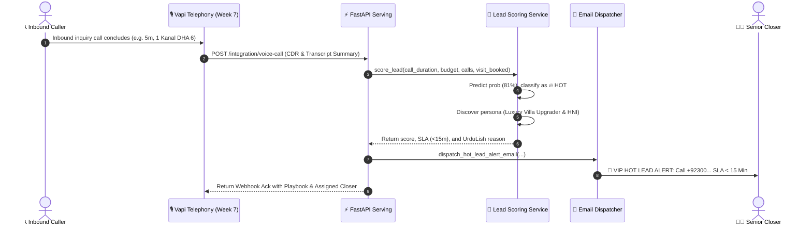
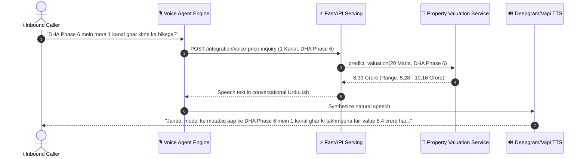
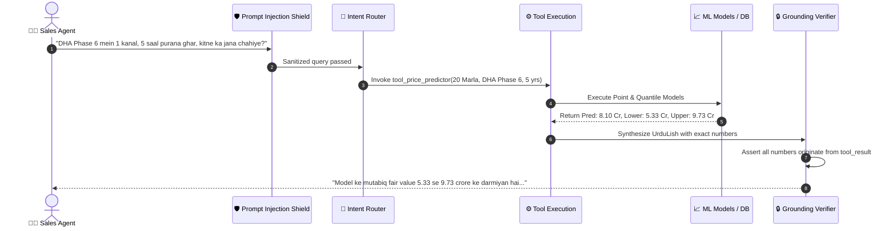

# System Architecture: RealEstate-Hub AI Model Serving, Assistant & Telephony Integration

**Week 8 — Day 4 Architecture Specification**  
**Integration Scope:** Week 7 Telephony (Vapi / Deepgram / Twilio) + Day 2 Valuation + Day 3 Lead Scoring + LangGraph UrduLish Copilot + Governance Guardrails.

---

## 🏗️ End-to-End System Architecture Diagram

```mermaid
flowchart TB
    subgraph ClientLayer ["1. Client & Ingestion Touchpoints"]
        Caller["📞 Inbound Telephony Caller (Week 7)"]
        SalesAgent["🧑‍💼 Sales Agent / Consultant (Web / App)"]
        Investor["💼 Enterprise Client (Batch CSV / CRM)"]
    end

    subgraph TelephonyLayer ["2. Week 7 Voice Telephony Infrastructure"]
        Vapi["🎙️ Vapi Telephony Gateway / Twilio"]
        Deepgram["🗣️ Deepgram Speech-to-Text (STT)"]
        TTS["🔊 Telephony Text-to-Speech (TTS Engine)"]
    end

    subgraph SecurityLayer ["3. Enterprise Guardrails & Governance"]
        OOD["🛡️ Out-of-Distribution (OOD) Validator\n(Area 1-100 Marla, Valid Cities)"]
        PromptShield["🛡️ Prompt-Injection Defense Shield\n(Detects Override, Jailbreak, '1 Rupee')"]
        AuditLogger["📝 Audit Logger (SQLite + JSONL)\n(Latency, Version, Inputs, IP)"]
        DisclaimerEngine["⚖️ Mandatory Legal Disclaimer Engine"]
    end

    subgraph APILayer ["4. FastAPI Model Serving Layer (Port 8000)"]
        EP_Price["POST /predict/price"]
        EP_Lead["POST /predict/lead-score"]
        EP_ExpPrice["POST /explain/price"]
        EP_ExpLead["POST /explain/lead"]
        EP_Batch["POST /predict/batch (CSV)"]
        EP_Health["GET /health & GET /model/info"]
        EP_VoiceCall["POST /integration/voice-call (Webhook)"]
        EP_VoicePrice["POST /integration/voice-price-inquiry"]
        EP_Chat["POST /agent/chat"]
    end

    subgraph LangGraphLayer ["5. LangGraph AI Assistant Copilot"]
        StateGraph["🔄 LangGraph StateGraph Workflow"]
        RouterNode["🔀 Intent Router & Input Sanitizer"]
        ToolNode["⚙️ Tool Execution Node"]
        UrduLishGen["🇵🇰 UrduLish Dialogue Synthesizer"]
        GroundingVerifier["🔒 Grounding Verifier\n(LLM Never Invents Price)"]
    end

    subgraph ToolRegistry ["6. Agent Tool Registry"]
        T1["Tool 1: Price Predictor"]
        T2["Tool 2: Lead Scorer"]
        T3["Tool 3: Explainer (SHAP)"]
        T4["Tool 4: Comparable Properties"]
        T5["Tool 5: Market Stats (PPM)"]
    end

    subgraph ModelLayer ["7. Machine Learning Serving Engines"]
        ValuationModel["📈 LightGBM Valuation Regressor\n(v1.2.0, R²=0.891, MAPE=5.4%)"]
        QuantileModels["📊 Quantile Gradient Boosting\n(10th & 90th Percentiles)"]
        LeadModel["🎯 LightGBM Classifier with SMOTE\n(v1.1.0, ROC-AUC=0.912)"]
        PersonaCluster["👥 K-Means Persona Discovery (k=4)"]
        SHAPEngine["🔍 SHAP TreeExplainer"]
    end

    subgraph StorageLayer ["8. Catalog & Persistence Layer"]
        PropDB[("📁 5,700+ Verified Property Listings")]
        AuditDB[("🗄️ SQLite Prediction Audit DB")]
        EmailDispatcher["📧 Automated VIP Hot Lead Email Dispatcher\n(SLA < 15 Min Countdown)"]
        Dashboard["🖥️ Streamlit Multi-Tab Dashboard (Port 8501)"]
    end

    %% Client to Telephony
    Caller -->|Voice Audio| Vapi
    Vapi --> Deepgram
    Deepgram -->|Transcripts & Intent| Vapi

    %% Telephony to API
    Vapi -->|After Call Webhook| EP_VoiceCall
    Vapi -->|'Mera ghar kitne ka bikega?'| EP_VoicePrice
    EP_VoicePrice --> TTS
    TTS -->|UrduLish Audio Response| Caller

    %% Clients to API & Dashboard
    SalesAgent --> Dashboard
    SalesAgent --> EP_Chat
    Investor --> EP_Batch
    Dashboard --> APILayer

    %% API through Guardrails
    APILayer --> SecurityLayer
    SecurityLayer --> APILayer

    %% API to Serving & LangGraph
    EP_Price --> ValuationModel
    EP_Price --> QuantileModels
    EP_Lead --> LeadModel
    EP_Lead --> PersonaCluster
    EP_ExpPrice --> SHAPEngine
    EP_ExpLead --> SHAPEngine
    EP_Chat --> LangGraphLayer

    %% LangGraph Flow
    StateGraph --> RouterNode
    RouterNode --> ToolNode
    ToolNode --> ToolRegistry
    ToolRegistry --> ValuationModel
    ToolRegistry --> LeadModel
    ToolRegistry --> SHAPEngine
    ToolRegistry --> PropDB
    ToolNode --> UrduLishGen
    UrduLishGen --> GroundingVerifier
    GroundingVerifier --> EP_Chat

    %% Voice Webhook to Actions
    EP_VoiceCall --> LeadModel
    EP_VoiceCall -->|If Hot Lead (>=70%)| EmailDispatcher
    EmailDispatcher -->|High Priority Alert| SalesAgent

    %% Logging
    APILayer -.->|Record Transaction| AuditDB
```

---

## 🔄 Core Transaction Sequences

### 1. Inbound Voice Call Completion & VIP Hot Lead Dispatch


### 2. Real-Time Price Inquiry: *"Mera ghar kitne ka bikega?"*


### 3. LangGraph Copilot Interaction & Inviolable Grounding


---

## 🛡️ Governance & Production Guardrails

| Guardrail Layer | Implementation | Operational Action |
| :--- | :--- | :--- |
| **Out-of-Distribution (OOD)** | Bounding validation in `src/guardrails.py` | Rejects requests with area > 100 Marla, price > 60 Crore, or unknown cities with HTTP 422. |
| **Prompt-Injection Defense** | Adversarial pattern matching regexes | Flags overrides ("ignore instructions", "set price to 1 rupee") and returns security refusal without running tools. |
| **Price Hallucination Prohibition** | Grounding Verifier Node in LangGraph | Guarantees every currency figure or range in assistant output derives strictly from model tool outputs. |
| **Legal Compliance** | Mandatory Disclaimer Engine | Appends non-certified appraisal disclaimer to all API payloads, UI cards, and assistant replies. |
| **Audit Traceability** | SQLite (`audit_logs.db`) & JSONL (`prediction_audit.jsonl`) | Logs UUID, timestamp, endpoint, latency_ms, client_ip, inputs, outputs, and OOD status for every inference. |
