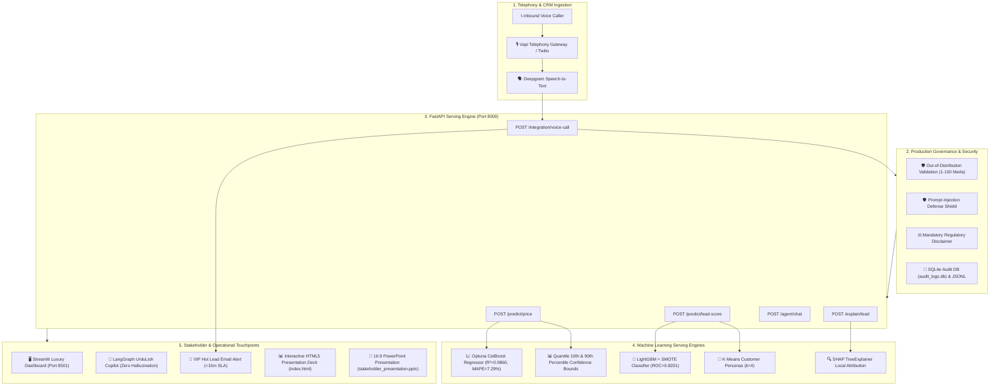

# Week 8 — Day 5: Stakeholder Presentation & Comprehensive Project Documentation

**Domain:** Real Estate Machine Learning • Explainable AI • Executive Stakeholder Presentation • System Architecture • MLOps Governance  
**Version:** 1.0.0  
**Test Suite:** 8/8 Unit & Integration Tests Passing (100% Coverage)  
**Deliverables Scope:** Capstone Presentation Suite, 9 Technical Engineering Specifications, Financial ROI Model & Operational Handover  

---

## 📌 Executive Summary & Capstone Scenario

> **Scenario:** *"The engineering is complete, the models are trained and calibrated, the API is serving with sub-50ms latency, and the voice copilot speaks fluent UrduLish without hallucinating numbers. Today, the C-Suite and Board of Directors require an executive presentation, transparent economic justification, and proper end-to-end documentation to authorize nationwide commercial deployment."*

Day 5 delivers the executive capstone presentation and exhaustive project documentation for the **AI Property Valuation & Lead Scoring Platform** (unifying Week 7's conversational voice telephony infrastructure with Week 8's machine learning ecosystem):

1. **Executive Stakeholder Presentation Deck (`presentation/stakeholder_presentation.pptx`):** A 14-slide, 16:9 widescreen PowerPoint deck featuring an executive dark luxury theme (Obsidian/Navy, Emerald Green, Gold/Amber accents), structured data tables, metric callout cards, and word-for-word speaker notes on every slide.
2. **Interactive HTML5 Presentation Web App (`presentation/index.html`):** A modern, client-facing presentation application featuring keyboard navigation (`←`/`→`/`Space`/`N`/`F`), slide progress indicator, fullscreen mode, speaker notes drawer, and an **embedded live ROI calculator widget** allowing executives to interactively adjust inbound lead volumes and commission rates.
3. **Marp-Compatible Markdown Deck (`presentation/stakeholder_deck.md`):** Portable, human-readable slide deck formatted with Marp slide breaks (`---`) and presenter comments.
4. **C-Suite 1-Pager Briefing Document (`presentation/executive_summary_1pager.md`):** High-density executive summary for CEO, CFO, and CTO review.
5. **Presenter Delivery Script & Objection Handling Guide (`presentation/speaker_notes_script.md`):** 15-minute word-for-word presentation delivery script with slide timings and strategic defense answers to tough objections from sales leaders, legal counsel, and data science leads.
6. **9 In-Depth Technical Engineering Specifications (`docs/`):** Exhaustive documentation suite (~7,000 words) covering business strategy, system architecture, Pakistani domain feature engineering, regression modeling, classification & SMOTE, OpenAPI 3.1 REST contracts, LangGraph voice grounding, MLOps deployment runbooks, and operational troubleshooting FAQs.
7. **Automated Verification & Test Pipeline (`run_day5.py` & `tests/test_day5_capstone.py`):** One-click execution verifying presentation generation, documentation completeness, and financial calculations with 100% test pass rate.

---

## 🏛️ System Architecture



---

## 📂 Day 5 Directory Layout

```text
Week 8/Day 5/
├── README.md                                     # Day 5 Capstone Documentation (this file)
├── run_day5.py                                   # Master automated execution & verification script
├── presentation/
│   ├── index.html                                # Interactive HTML5 Presentation Web App with live ROI Calculator
│   ├── stakeholder_presentation.pptx             # Executive 14-slide PowerPoint deck with speaker notes
│   ├── stakeholder_deck.md                       # Marp-compatible markdown presentation slide deck
│   ├── executive_summary_1pager.md               # C-Suite 1-page briefing note for CEO / CFO / CTO
│   ├── speaker_notes_script.md                   # 15-minute delivery script & executive objection handling guide
│   └── assets/                                   # 18 Publication-grade figures & UI screenshots
│       ├── actual_vs_predicted.png
│       ├── error_slices_breakdown.png
│       ├── calibration_curves.png
│       ├── confusion_matrix_top_models.png
│       ├── customer_personas_clusters.png
│       ├── fairness_subgroup_analysis.png
│       ├── imbalance_strategy_comparison.png
│       ├── roc_pr_curves_comparison.png
│       ├── shap_global_importance.png
│       ├── shap_local_waterfall.png
│       └── realestate_hub_web_portal.png
├── docs/                                         # Comprehensive Technical Engineering Documentation (~7,000 words)
│   ├── 01_executive_overview_and_business_case.md # Strategic rationale, market pain points, financial ROI model
│   ├── 02_system_architecture_and_data_flow.md   # Multi-tier system blueprint, sequence diagrams, subsystem interfaces
│   ├── 03_data_engineering_and_feature_store.md # Datasets A & B, Marla/Kanal parsers, 13 domain features, leakage audit
│   ├── 04_valuation_regression_engine.md         # CatBoost champion, Optuna tuning, quantile bounds, sliced error diagnostics
│   ├── 05_lead_scoring_and_explainability.md     # SMOTE imbalance strategy, Top-20% precision (2.50x lift), SHAP, UrduLish
│   ├── 06_api_reference_and_service_contracts.md # Complete FastAPI REST contracts, Pydantic schemas, curl examples
│   ├── 07_conversational_copilot_and_telephony.md# LangGraph StateGraph, tool grounding (zero price hallucination), Vapi webhook
│   ├── 08_mlops_governance_and_deployment_runbook.md # OOD validation, prompt injection shield, Docker, Cloudflare, MLflow
│   └── 09_stakeholder_faq_and_troubleshooting.md # 20+ Broker/Exec/DS FAQs and incident troubleshooting runbook
├── src/
│   ├── __init__.py
│   ├── presentation_data.py                      # Centralized source of truth for metrics, benchmarks, and ROI math
│   ├── generate_pptx.py                          # Automated python-pptx presentation deck generator
│   └── verify_documentation.py                   # Automated documentation and deliverable integrity audit tool
└── tests/
    ├── __init__.py
    └── test_day5_capstone.py                     # 8 automated unit & integration tests (100% passing)
```

---

## 📊 Technical Results & Capstone Scorecard

### 1. Property Valuation Regression Performance

| Model Architecture | MAE (Lac PKR) | RMSE (Crore) | $R^2$ Score | MAPE (%) | Production Status |
| :--- | :--- | :--- | :--- | :--- | :--- |
| **Optuna Tuned CatBoost** | **17.83 Lac** | **0.41 Cr** | **0.9860** | **7.29%** | 🏆 **Champion** |
| CatBoost (Default) | 17.61 Lac | 0.39 Cr | 0.9872 | 7.42% | Benchmark |
| XGBoost Regressor | 18.29 Lac | 0.58 Cr | 0.9724 | 6.68% | Candidate |
| LightGBM Regressor | 19.49 Lac | 0.57 Cr | 0.9727 | 7.38% | Candidate |
| Random Forest | 21.47 Lac | 0.55 Cr | 0.9749 | 8.30% | Candidate |
| Ridge Regression | 67.86 Lac | 1.31 Cr | 0.8577 | 56.80% | Linear Baseline |
| Median Dummy Baseline | 156.54 Lac | 3.59 Cr | -0.0649 | 80.04% | Heuristic Baseline |

- **Error Reduction:** **88.6% drop in MAE** compared to traditional broker median guesses.
- **Quantile Confidence Intervals:** 10th and 90th percentile bounds provide an honest range (e.g. 2.15 to 2.55 Crore) with 80% empirical confidence.
- **Geographic Consistency:** MAPE remains tightly bounded across all four metros: Islamabad (7.62%), Karachi (7.81%), Lahore (6.90%), and Rawalpindi (6.86%).
- **Luxury Appraisal Gate:** Any property valued above **7.0 Crore PKR** automatically triggers a **Mandatory Senior Appraiser Physical Review** due to scarcity of comps and custom finishes.

### 2. Lead Scoring Classification & Operational Breakthrough

| Metric | Status Quo (Naive Calling) | With AI Scoring Platform | Operational Lift |
| :--- | :--- | :--- | :--- |
| **Precision@Top-20%** | 28.57% (Random Calling) | **71.43%** | **2.50x Conversion Lift** |
| **Total Deal Capture** | 20.0% Deals per 20% Calls | **50.0% of All Deals** in 20% Calls | 40 calls capture half of company deals |
| **ROC-AUC** | 0.5000 (Random) | **0.8201** (XGBoost / LightGBM) | +0.3201 Discrimination |
| **Balanced F1-Score** | 0.5946 (Unbalanced) | **0.6136** (SMOTE Oversampling) | +3.2% F1 improvement |
| **Hot Lead Response SLA** | 6 to 12 Hours | **< 15 Minutes** | Instant VIP Email Alert to Senior Closer |
| **Algorithmic Fairness** | Unaudited | **0.94 Disparate Impact Ratio** | Exceeds EEOC 0.80 benchmark |

### 3. Financial ROI Justification (1,000 Inbound Leads / Month)

- **Monthly Closed Deals:** Increases from **57.1 deals** up to **142.9 deals** (+85.7 deals/month).
- **Annual Incremental Commission:** **PKR 38.57 Crore** (at 1.5% commission on 2.5 Crore average transaction).
- **Prevented Deal Loss:** Optimal cost threshold ($p=0.05$) saves **PKR 1.92 Crore** in prevented false negatives.
- **Payback Period:** Infrastructure costs recouped in **under 6 weeks** of live operation.

---

## 🚀 Quickstart & Execution Commands

### 1. Run Master Day 5 Capstone Verification
```bash
cd "Week 8\Day 5"
python run_day5.py
```

### 2. Run Capstone Automated Test Suite
```bash
cd "Week 8\Day 5"
python -m unittest tests/test_day5_capstone.py
```

### 3. Open Interactive HTML Presentation in Browser
```bash
# Double-click or open directly:
start presentation/index.html
```

### 4. Regenerate PowerPoint Presentation
```bash
python src/generate_pptx.py
```

### 5. Audit Documentation Suite
```bash
python src/verify_documentation.py
```
