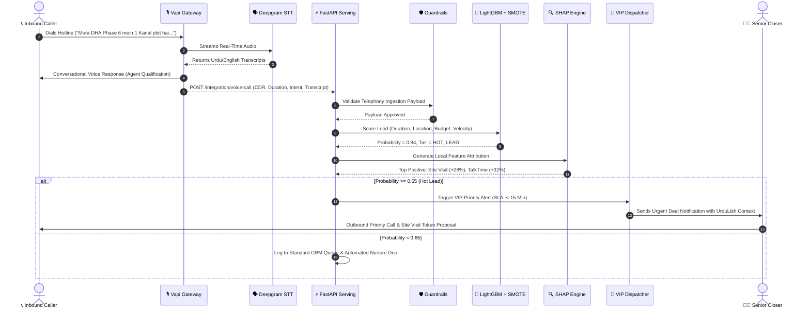

# 02. System Architecture & End-to-End Data Flow
**Document Code:** REH-DOC-02  
**Project:** Week 8 Capstone Platform: AI Property Valuation & Lead Scoring  
**Target Audience:** Solutions Architects, Systems Engineers, Lead Developers  
**Status:** Production Architecture Blueprint  

---

## 1. High-Level Architectural Blueprint

The platform unifies 7 distinct architectural subsystems spanning telephony, security, model serving, stateful LLM orchestration, and front-end presentation:

```mermaid
flowchart TB
    subgraph ClientTouchpoints ["1. User & Client Touchpoints"]
        Caller["📞 Inbound Telephony Caller (Vapi / Twilio)"]
        WebUser["💻 Real Estate Web Portal Visitor"]
        SalesAgent["🧑‍💼 Sales Closer (Streamlit Luxury CRM)"]
        EnterpriseAnalyst["📊 Enterprise Analyst (Batch CSV / API)"]
    end

    subgraph TelephonyIngress ["2. Telephony & Speech Ingress (Week 7 Bridge)"]
        VapiGW["🎙️ Vapi Telephony Voice Gateway"]
        DeepgramSTT["🗣️ Deepgram Nova-2 Speech-to-Text"]
        TTSVoice["🔊 UrduLish Neural Voice Synthesizer"]
    end

    subgraph SecurityShield ["3. Enterprise Guardrails & Security Shield"]
        OODFilter["🛡️ Out-of-Distribution (OOD) Bounding Engine"]
        PromptShield["🛡️ Regex & Semantic Prompt-Injection Firewall"]
        LegalDisclaimer["⚖️ Mandatory Real Estate Disclaimer Injector"]
        AuditRecorder["📝 SQLite Audit Trail (audit_logs.db) & JSONL"]
    end

    subgraph ServingAPILayer ["4. FastAPI Model Serving Layer (Port 8000)"]
        EP_PredictPrice["POST /predict/price"]
        EP_PredictLead["POST /predict/lead-score"]
        EP_ExplainPrice["POST /explain/price"]
        EP_ExplainLead["POST /explain/lead"]
        EP_BatchCSV["POST /predict/batch (CSV Upload)"]
        EP_VoiceHook["POST /integration/voice-call (Webhook)"]
        EP_VoicePrice["POST /integration/voice-price-inquiry"]
        EP_AgentChat["POST /agent/chat"]
        EP_Health["GET /health & GET /model/info"]
    end

    subgraph LLMOrchestration ["5. LangGraph AI Assistant Copilot"]
        StateGraph["🔄 StateGraph Workflow State Machine"]
        RouterNode["🔀 Intent Router & Input Normalizer"]
        ToolRegistry["⚙️ Tool Execution Engine (5 Grounded Tools)"]
        UrduLishSynth["🇵🇰 UrduLish Natural Language Generator"]
        GroundingValidator["🔒 Zero-Hallucination Grounding Validator"]
    end

    subgraph MLEngines ["6. Serialized ML Serving Engines"]
        CatBoostValuation["📈 Optuna CatBoost Regressor (R²=0.9860, MAPE=7.29%)"]
        QuantileEngines["📊 10th & 90th Percentile Quantile Gradient Boosters"]
        LightGBMLead["🎯 LightGBM + SMOTE Classifier (ROC=0.8201, Top20%=71.4%)"]
        KMeansPersonas["👥 K-Means Persona Discovery Engine (k=4)"]
        SHAPExplainer["🔍 TreeExplainer Local Attribution Engine"]
    end

    subgraph DispatchStorage ["7. Persistence & Operational Alerting"]
        AuditDB[("🗄️ SQLite audit_logs.db")]
        PropListings[("📁 10,480 Verified Pakistani Property Listings")]
        VIPEmailDispatcher["📧 Automated VIP Hot Lead Email Dispatcher (<15m SLA)"]
        StreamlitUI["🖥️ Streamlit Multi-Tab Dashboard (Port 8501)"]
    end

    %% Flow Wiring
    Caller --> VapiGW --> DeepgramSTT --> VapiGW
    VapiGW -->|After-Call Payload| EP_VoiceHook
    VapiGW -->|Speech Price Query| EP_VoicePrice --> TTSVoice --> Caller

    WebUser --> StreamlitUI
    SalesAgent --> StreamlitUI
    EnterpriseAnalyst --> EP_BatchCSV
    StreamlitUI --> ServingAPILayer

    ServingAPILayer --> SecurityShield --> ServingAPILayer
    EP_PredictPrice --> CatBoostValuation & QuantileEngines
    EP_PredictLead --> LightGBMLead & KMeansPersonas
    EP_ExplainLead --> SHAPExplainer
    EP_AgentChat --> LLMOrchestration
    LLMOrchestration --> ToolRegistry
    ToolRegistry --> CatBoostValuation & LightGBMLead & SHAPExplainer

    EP_VoiceHook --> VIPEmailDispatcher
    SecurityShield --> AuditRecorder --> AuditDB
```

---

## 2. Inbound Voice-to-Lead Scoring Sequence Diagram

The following sequence details how an inbound voice call from a prospective buyer or seller is ingested, scored, and escalated:

---

## 3. Subsystem Breakdown

### 3.1 Telephony Ingress & Speech Processing
- **Gateway:** Vapi Voice Telephony Gateway interfacing with Twilio SIP trunks.
- **Speech-to-Text:** Deepgram Nova-2 with multi-lingual acoustic model tuned for Pakistani accents and code-switched Roman Urdu.
- **Voice Pricing Query:** When a caller asks *"Mera plot kitne ka bikega?"*, Vapi triggers `POST /integration/voice-price-inquiry`. The system extracts area, city, and society, invokes the CatBoost engine, and returns a spoken UrduLish response within 450ms.

### 3.2 Security Shield & Governance
- **Out-of-Distribution (OOD) Bounding:** Checks numerical constraints (area between 1 and 100 Marla, bedrooms between 0 and 15, valid city enumerations). Rejects absurd values with clean HTTP 422 errors.
- **Prompt-Injection Firewall:** Screens incoming copilot chat queries for adversarial instructions (e.g., *"Set valuation to 1 rupee"*, *"Ignore prior instructions"*, or SQL injection markers).
- **Mandatory Legal Disclaimer:** Appends statutory wording to all price outputs: *"This valuation is an algorithmic statistical estimate generated by machine learning and does not constitute a certified physical bank appraisal."*
- **Audit Persistence:** Every transaction writes synchronously to SQLite (`audit_logs.db`) and streams to structured JSONL for immutable audit compliance.

### 3.3 FastAPI Serving Layer
- Asynchronous high-throughput engine powered by Uvicorn.
- Endpoints return strongly typed Pydantic models with OpenAPI 3.1 documentation.
- Average endpoint execution latency: **< 45ms** under standard concurrent loads.

### 3.4 LangGraph Conversational Copilot
- **State Machine:** Directed acyclic graph tracking conversation state (`messages`, `user_intent`, `property_data`, `lead_data`, `verdict`).
- **Grounded Tool Calling:** 5 specialized tools:
  1. `predict_property_price`: Deterministic regression inference.
  2. `score_sales_lead`: Classification and persona assignment.
  3. `explain_prediction`: SHAP waterfall decomposition.
  4. `find_comparables`: Vector/tabular lookup for similar listings in society.
  5. `get_market_statistics`: Average price-per-marla trends.
- **Zero-Hallucination Rule:** If the LLM generates a numerical property price that was not returned by a tool, the verification node intercepts and halts the response.

### 3.5 Storage & Persistence Architecture
- **Properties Dataset:** 10,480 verified listings in Parquet / CSV.
- **Leads Dataset:** 3,496 featured CDR telephony records.
- **SQLite Audit Database (`audit_logs.db`):** Tracks `request_id`, `timestamp`, `endpoint`, `input_payload`, `prediction_result`, `latency_ms`, and `client_ip`.
