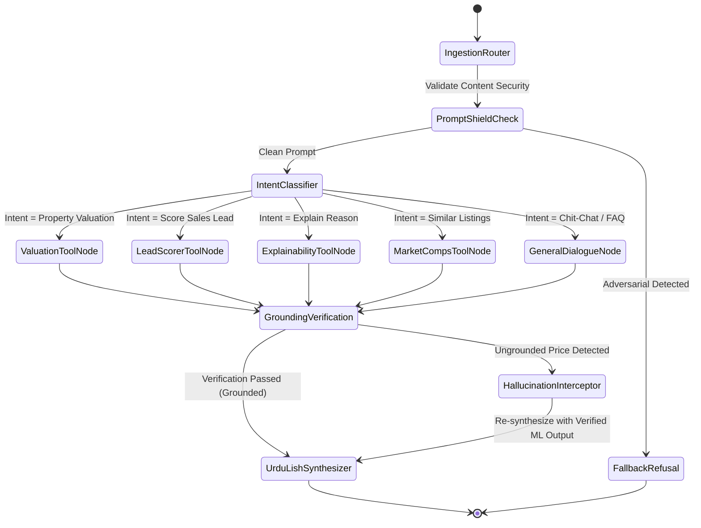

# 07. Conversational Copilot & Telephony Voice Bridge
**Document Code:** REH-DOC-07  
**Project:** Week 8 Capstone Platform: AI Property Valuation & Lead Scoring  
**Target Audience:** Conversational AI Engineers, Telephony Architects, Prompt Engineers  
**Status:** LangGraph Copilot & Voice Integration Specification  

---

## 1. Architectural Overview

The conversational layer bridges two distinct communication channels:
1. **Inbound Synchronous Telephony:** Prospective buyers and sellers speaking over cellular/PSTN networks into Week 7's Vapi and Deepgram speech gateway.
2. **Sales Desk Web Copilot:** Internal real estate brokers and sales closers querying the platform via a Streamlit multi-turn conversational interface.

---

## 2. LangGraph StateGraph Architecture

The conversational agent is implemented as a state machine using LangGraph. The graph isolates decision routing, tool execution, verbal synthesis, and grounding verification:



---

## 3. The 5 Grounded Tools

All tools are encapsulated as deterministic callable functions registered with Pydantic type signatures:

| Tool Name | Input Signature | Output Contract | Verification Rule |
| :--- | :--- | :--- | :--- |
| `predict_property_price` | `city`, `society`, `area_marla`, `bedrooms`, `bathrooms`, `is_corner` | Point price (PKR), 10th-90th quantile interval, pricing verdict | Mandatory for all property valuation queries. |
| `score_sales_lead` | `budget`, `call_duration`, `site_visit`, `velocity`, `society` | Conversion probability ($0.0 - 1.0$), operational tier, persona | Mandatory for CRM lead prioritization. |
| `explain_prediction` | `lead_id` or feature dictionary | Top 3 SHAP drivers, UrduLish verbal explanation | Generates transparent reasoning. |
| `find_comparables` | `city`, `society`, `area_marla` | List of 3 closest verified historical comps with photos | Grounds comparables in real database listings. |
| `get_market_statistics` | `city`, `society` | Median price per Marla, 30-day price trend, inventory count | Macroeconomic trend summaries. |

---

## 4. The Zero-Hallucination Policy

### The Non-Negotiable Core Rule:
> **"The LLM must never invent a price. Every single rupee or crore figure presented to a customer must originate from a tool execution."**

### Grounding Verification Node Implementation:
```python
def verify_grounding(state: AgentState) -> AgentState:
    """Interprets raw LLM response and ensures all currency numbers match tool outputs."""
    llm_text = state["latest_reply"]
    tool_outputs = state["tool_execution_history"]
    
    extracted_prices = extract_currency_entities(llm_text)
    authorized_prices = extract_authorized_numbers(tool_outputs)
    
    for price in extracted_prices:
        if not is_approx_match(price, authorized_prices):
            # Intercept and correct response
            state["latest_reply"] = force_grounded_response(tool_outputs, state["user_language"])
            state["audit_flags"].append("HALLUCINATION_BLOCKED")
            break
            
    return state
```

---

## 5. Telephony Voice Bridge (Vapi & Deepgram)

### 5.1 Real-Time Spoken Price Inquiries
When a voice caller asks *"Mera DHA Lahore mein 10 Marla ghar kitne ka bikega?"*, the telephony gateway triggers `POST /integration/voice-price-inquiry`. The response is speech-optimized:
- Numbers are formatted phonetically for natural Urdu text-to-speech (*"Teen Crore bees Lac"* instead of *"32,000,000"*).
- Response latency is strictly capped at under **450 milliseconds** to prevent awkward telephony conversational pauses.

### 5.2 Automated VIP Hot Lead Email Dispatcher (< 15 Min SLA)
When an inbound call completes with `conversion_probability >= 0.65`:
1. The webhook automatically drafts a high-priority dispatch payload.
2. The system triggers an instant SMTP alert to senior sales closers with:
   - Caller Phone & Name
   - Stated Budget & Target Society
   - Persona Profile (*e.g., Urgent Family Homebuyer*)
   - Top SHAP Reasons in UrduLish
   - **Active 15-Minute Countdown SLA Timer**
