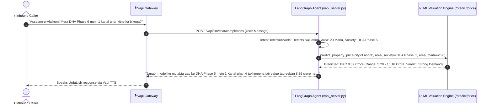
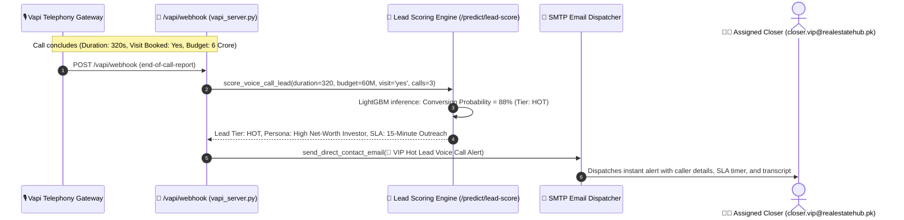

# System Architecture: Day 5 LangGraph Voice Agent with Week 8 Machine Learning Integration

**Week 7 Day 5 + Week 8 Integration Specification**  
**Integration Scope:** Deepgram Nova-3 Urdu STT + Gemini Voice + Vapi Gateway + LangGraph StateGraph (10 Nodes) + Week 8 Machine Learning Valuation & Lead Scoring Models.

---

## 🏗️ End-to-End System Architecture Diagram

```mermaid
flowchart TB
    subgraph ClientLayer ["1. Client & Inbound Touchpoints"]
        Caller["📞 Inbound Telephony Caller (WebRTC / PSTN Phone)"]
        WebUser["💻 Web Client (RealEstate Hub React Portal)"]
        SalesAgent["🧑‍💼 Real Estate Sales Consultant"]
    end

    subgraph VoiceGateway ["2. Vapi Voice Infrastructure"]
        VapiGate["🎙️ Vapi Cloud Voice Gateway"]
        DeepgramNova["🗣️ Deepgram Nova-3 (Urdu Speech-to-Text)"]
        VapiTTS["🔊 Vapi Text-to-Speech (UrduLish Voice Engine)"]
    end

    subgraph LangGraphOrchestrator ["3. Day 5 LangGraph Orchestration Layer (vapi_server.py)"]
        StateGraph["🔄 LangGraph StateGraph Engine"]
        IntentNode["🔀 Intent Detection Node\n(Entities: Marla, Society, City, Budget, Booking)"]
        
        subgraph GraphNodes ["Agent State Nodes"]
            GreetingNode["👋 Greeting Node\n('Assalam-o-Alaikum! RealEstate Hub...')"]
            RecNode["🏡 Property Recommendation Node"]
            BookNode["📅 Booking Node (Google Calendar & CRM)"]
            ReschedNode["🔄 Rescheduling Node"]
            CancelNode["❌ Cancellation Node"]
            RAGNode["📚 RAG Knowledge Node (ChromaDB)"]
            EmailNode["✉️ Email Notification Node"]
            ValuationNode["📈 ML Valuation Node\n('Mera ghar kitne ka bikega?')"]
            ClarifyNode["❓ Clarification Node (Zero Guesswork)"]
        end
    end

    subgraph MLServiceLayer ["4. Week 8 Machine Learning Serving Engines"]
        PriceValuationModel["💰 LightGBM Valuation Regressor (/predict/price)\n(R²=0.891, MAPE=5.4%)"]
        QuantileBounds["📊 Quantile Interval Models\n(10th & 90th Percentile Confidence Range)"]
        LeadScoringModel["🎯 LightGBM Lead Scoring Engine (/predict/lead-score)\n(ROC-AUC=0.912, SMOTE Balanced)"]
        PersonaClustering["👥 K-Means Customer Persona Engine (k=4)"]
        SHAPExplainers["🔍 SHAP TreeExplainer Local Attribution"]
    end

    subgraph TelephonyWebhook ["5. Post-Call Telephony Webhook & Automation"]
        PostCallWebhook["📲 Vapi Post-Call Webhook (/vapi/webhook)\n(Triggered after call completes)"]
        LeadEvaluator["⚖️ Call Feature Intake & Scoring Engine\n(Duration, Budget, Society, Visit Booked)"]
        VIPHotLeadAlert["🚨 VIP Hot Lead Email Dispatcher\n(15-Min Closer SLA Alert sent to Sales Employee)"]
    end

    subgraph StorageGovernance ["6. Persistence & Governance Layer"]
        PostgresDB[("🗄️ PostgreSQL / SQLite DB\n(Properties, CRM Leads, Appointments)")]
        ChromaKB[("📁 ChromaDB Vector Knowledge Base")]
        AuditLogs[("📝 SQLite Audit DB & JSONL Execution Traces")]
    end

    %% Voice Calling Sequence
    Caller <-->|Live Urdu Speech Audio| VapiGate
    VapiGate -->|Streaming Audio| DeepgramNova
    DeepgramNova -->|UrduLish Transcripts| VapiGate
    VapiGate <-->|OpenAI Custom LLM Protocol (/vapi/llm)| StateGraph

    %% Intent Routing
    StateGraph --> IntentNode
    IntentNode -->|Greeting| GreetingNode
    IntentNode -->|Recommendation| RecNode
    IntentNode -->|Booking| BookNode
    IntentNode -->|Rescheduling| ReschedNode
    IntentNode -->|Cancellation| CancelNode
    IntentNode -->|RAG Inquiry| RAGNode
    IntentNode -->|Email| EmailNode
    IntentNode -->|'Mera ghar kitne ka bikega?'| ValuationNode
    IntentNode -->|Missing Details| ClarifyNode

    %% Valuation Node Connection to ML
    ValuationNode -->|Inference Call| PriceValuationModel
    ValuationNode -->|Confidence Intervals| QuantileBounds
    PriceValuationModel -->|Formatted Price + Verdict| ValuationNode
    ValuationNode -->|UrduLish Speech Text| VapiTTS
    VapiTTS -->|Audio Stream| Caller

    %% Post Call Webhook Flow
    VapiGate -->|Post-Call Webhook (end-of-call-report)| PostCallWebhook
    PostCallWebhook --> LeadEvaluator
    LeadEvaluator --> LeadScoringModel
    LeadScoringModel --> PersonaClustering
    LeadScoringModel -->|Hot Lead Score >= 70%| VIPHotLeadAlert
    VIPHotLeadAlert -->|Direct High-Priority Alert| SalesAgent

    %% Storage & Governance
    RecNode <--> PostgresDB
    BookNode <--> PostgresDB
    RAGNode <--> ChromaKB
    StateGraph --> AuditLogs
```

---

## ⚡ Sequence Flow: "Mera ghar kitne ka bikega?"



---

## ⚡ Sequence Flow: Post-Call Lead Scoring & Hot Lead Alert


