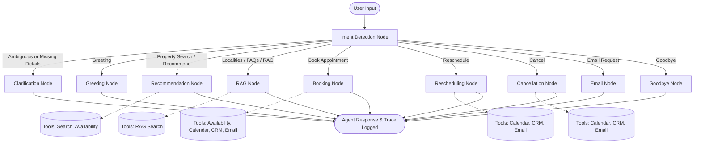

# 🏢 RealEstate Hub — Week 7 Day 5: LangGraph Orchestration & Tool Calling

A production-grade, stateful AI agent built with **LangGraph**, **LangChain Google GenAI**, and **SQLAlchemy/ChromaDB**, designed to transform RealEstate Hub into an autonomous real estate consultant.

---

## 🌟 Key Architecture & Capabilities

### 1. State Design (`state.py` — Task 1)
Centralized `AgentState` (`TypedDict` with `operator.add` reducers) managing the complete conversational lifecycle:
- **`conversation_history` / `messages`**: Turn-by-turn chat history.
- **`user_profile`**: Client contact details (`name`, `phone`, `email`, `lead_id`, `notes`).
- **`property_preferences`**: Search filters (`city`, `locality`, `property_type`, `area_marla`, `bedrooms`, `baths`, `purpose`, `desired_amenities`, `investment_goal`).
- **`budget`**: Numeric PKR budget (supports Urdu Crore/Lakh parsing).
- **`intent`**: Active detected user intent.
- **`tool_outputs`**: Complete audit trail of invoked tools and results.
- **`appointment_status`**: Active booking tracking (`appointment_id`, `date_str`, `time_str`, `status`, `calendar_link`, `agent_name`).
- **`clarification_needed` / `clarification_prompt`**: Proactive safeguard flags.
- **`validation_errors`**: Audit log of caught invariants.

---

### 2. Graph Design & Dynamic Routing (`graph.py` & `nodes/` — Task 2)



| Node | Purpose & Behavior |
|---|---|
| **`GreetingNode`** | Welcomes client in bilingual English/Roman Urdu, establishes AI consultant persona. |
| **`IntentDetectionNode`** | Extracts entities (Crore/Lakh budget, city, property type, marla, phone, dates) and classifies intent. |
| **`ClarificationNode`** | Proactively requests missing parameters instead of guessing. |
| **`RecommendationNode`** | Queries SQL database, ranks by amenities, and presents verified properties. |
| **`BookingNode`** | Validates slot availability, creates Google Calendar event, upserts CRM lead, logs appointment, and emails assigned agent. |
| **`ReschedulingNode`** | Updates Google Calendar event, modifies CRM record, and alerts agent. |
| **`CancellationNode`** | Cancels calendar event and CRM record with agent notification. |
| **`RAGNode`** | Answers locality, developer, NOC, school, hospital, and FAQ queries grounded in ChromaDB. |
| **`EmailNode`** | Dispatches property specifications and consultation dossiers to client/agent. |
| **`GoodbyeNode`** | Wraps up consultation with active appointment reminders. |

---

### 3. Wrapped Business Tools (`tools/` — Task 3)

1. **`property_search_tool`** (`tools/search_tools.py`): Verified SQL search with exact budget and amenity scoring.
2. **`availability_checker_tool`** (`tools/availability_tools.py`): Verifies database property existence and checks agent calendar availability to prevent double-booking.
3. **`calendar_tool`** (`tools/calendar_tools.py`): Creates one-click Google Calendar web links and RFC 5545 `.ics` files.
4. **`email_tool`** (`tools/email_tools.py`): Generates responsive HTML appointment notifications and dispatches via SMTP.
5. **`crm_tool`** (`tools/crm_tools.py`): Manages leads, appointments, and reminders in the database.
6. **`rag_search_tool`** (`tools/rag_tools.py`): Semantic retrieval over locality profiles, developers, amenities, and FAQs.

---

### 4. Validation Invariants (`tools/availability_tools.py`, `nodes/` — Task 4)

- 🛡️ **Invariant 1 — Never book unavailable slots**: Checks CRM database for overlapping appointments with the assigned agent and rejects bookings outside operating hours (9:00 AM - 7:00 PM). Proposes verified open alternative slots.
- 🛡️ **Invariant 2 — Never recommend unavailable properties**: Validates every search result against the verified active property database before presentation. If none match, clearly explains no matching verified properties exist rather than hallucinating fake listings.
- 🛡️ **Invariant 3 — Ask clarification instead of guessing**: If the user makes an underspecified request (e.g. asking to search without specifying city or budget, or booking without date/time/contact), routes directly to `ClarificationNode` to ask targeted questions.

---

### 5. State Transition Logging & Annotated Traces (`logger.py` — Task 5)

Every node transition is intercepted, timed, and logged with:
- `step_number`, `node_name`, `from_node`, `timestamp`, `elapsed_ms`
- `intent`, `input_summary`, `output_summary`
- Invariant validation results (`[PASSED]` / `[FAILED]`)
- Tool execution parameters and outputs
- Agent reasoning explanations

Traces are automatically saved to `traces/`:
- **Structured JSON**: `traces/trace_<session_id>_<timestamp>.json`
- **Annotated Markdown Report**: `traces/trace_<session_id>_<timestamp>.md`

---

## 🚀 Running the Project

### 1. Run Automated Test Suite
```bash
python test_day5_agent.py
```
*Executes all 15 test scenarios verifying state, routing, tools, validation invariants, and trace logging.*

### 2. Launch Interactive CLI
```bash
python agent_cli.py
```
*Interact with the AI agent in real-time, view live node transitions, and test property search, RAG queries, booking, and rescheduling.*
