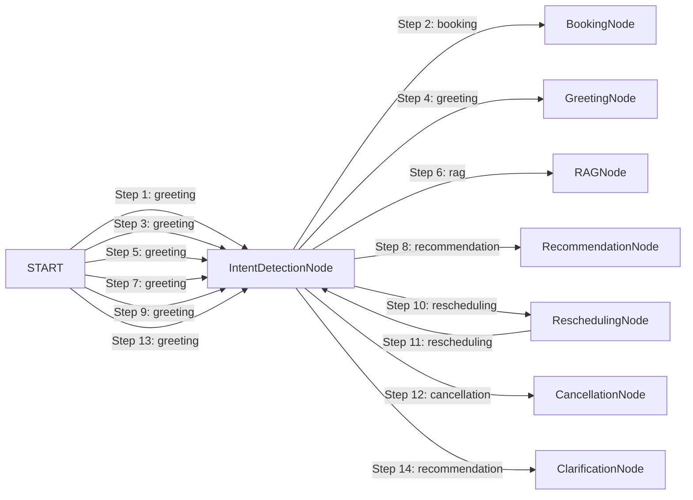

# LangGraph Agent Execution Trace Report

- **Session ID:** `default_session`
- **Timestamp:** `2026-09-01T04:35:07.320539+00:00`
- **Total Transitions:** `14`
- **Total Execution Latency:** `11641.75 ms`

---

## Transition Timeline & Node Graph



---

## Annotated Execution Steps

### Step 1: Node `IntentDetectionNode` (from `START`)
- **Timestamp:** `2026-09-01T04:34:51.867643+00:00` | **Latency:** `1.18 ms`
- **Detected Intent:** `greeting`
- **Agent Reasoning:** Classified intent as 'booking'. Clarification needed: False.
- **Tools Invocations:** None
- **Validation Checks:**
  > Standard Invariants Verified
- **Output Summary:**
  ```json
  {
  "budget": 8877665.0,
  "property_preferences": {
    "city": "",
    "locality": "",
    "property_type": "",
    "purpose": "For Sale",
    "area_marla": null,
    "bedrooms": null,
    "baths": null,
    "desired_amenities": [],
    "investment_goal": false
  },
  "user_profile": {
    "name": "Hamza phone",
    "phone": "03008877665"
  },
  "appointment_status": "none",
  "clarification_needed": false,
  "validation_errors": [],
  "final_response_snippet": ""
}
  ```

### Step 2: Node `BookingNode` (from `IntentDetectionNode`)
- **Timestamp:** `2026-09-01T04:34:51.869786+00:00` | **Latency:** `3191.76 ms`
- **Detected Intent:** `booking`
- **Agent Reasoning:** Successfully booked appointment appt_0671d34f2c with Calendar, CRM, and Email integration.
- **Tools Invocations:** `availability_checker_tool` (success), `crm_tool` (success), `calendar_tool` (success), `crm_tool` (success), `email_tool` (success)
- **Validation Checks:**
  > [PASSED] **Slot Availability Invariant**: Slot verified open for Ahmed Raza on Tomorrow at 3 PM
- **Output Summary:**
  ```json
  {
  "budget": null,
  "property_preferences": {},
  "user_profile": {
    "name": "Hamza phone",
    "phone": "03008877665",
    "lead_id": "lead_07ec8659b4"
  },
  "appointment_status": "scheduled",
  "clarification_needed": false,
  "validation_errors": [],
  "final_response_snippet": "\ud83c\udf89 **Your Property Visit is Confirmed!**\n\n\ud83d\udcc5 **Date:** Tomorrow\n\u23f0 **Time:** 3 PM\n\ud83c\udfe1 **Property:** House in Lahore (`PROP-1000`)\n\ud83d\udc64 **Assigned Consultant:** Ahmed Raza\n\ud83c\udd94 **Booking Ref:*..."
}
  ```

### Step 3: Node `IntentDetectionNode` (from `START`)
- **Timestamp:** `2026-09-01T04:34:55.067536+00:00` | **Latency:** `0.06 ms`
- **Detected Intent:** `greeting`
- **Agent Reasoning:** Classified intent as 'greeting'. Clarification needed: False.
- **Tools Invocations:** None
- **Validation Checks:**
  > Standard Invariants Verified
- **Output Summary:**
  ```json
  {
  "budget": null,
  "property_preferences": {
    "city": "",
    "locality": "",
    "property_type": "",
    "purpose": "For Sale",
    "area_marla": null,
    "bedrooms": null,
    "baths": null,
    "desired_amenities": [],
    "investment_goal": false
  },
  "user_profile": {},
  "appointment_status": "none",
  "clarification_needed": false,
  "validation_errors": [],
  "final_response_snippet": ""
}
  ```

### Step 4: Node `GreetingNode` (from `IntentDetectionNode`)
- **Timestamp:** `2026-09-01T04:34:55.068231+00:00` | **Latency:** `0.04 ms`
- **Detected Intent:** `greeting`
- **Agent Reasoning:** Provided welcoming onboarding message and set conversational direction.
- **Tools Invocations:** None
- **Validation Checks:**
  > Standard Invariants Verified
- **Output Summary:**
  ```json
  {
  "budget": null,
  "property_preferences": {},
  "user_profile": {},
  "appointment_status": "none",
  "clarification_needed": false,
  "validation_errors": [],
  "final_response_snippet": "Assalam-o-Alaikum & Welcome to RealEstate Hub! \ud83c\udfe1\nI am your AI Property Consultant. I can help you find verified houses, flats, or plots in Lahore, Islamabad, and Karachi, answer qu..."
}
  ```

### Step 5: Node `IntentDetectionNode` (from `START`)
- **Timestamp:** `2026-09-01T04:34:55.071647+00:00` | **Latency:** `0.07 ms`
- **Detected Intent:** `greeting`
- **Agent Reasoning:** Classified intent as 'rag'. Clarification needed: False.
- **Tools Invocations:** None
- **Validation Checks:**
  > Standard Invariants Verified
- **Output Summary:**
  ```json
  {
  "budget": null,
  "property_preferences": {
    "city": "",
    "locality": "Bahria Town",
    "property_type": "",
    "purpose": "For Sale",
    "area_marla": null,
    "bedrooms": null,
    "baths": null,
    "desired_amenities": [],
    "investment_goal": false
  },
  "user_profile": {},
  "appointment_status": "none",
  "clarification_needed": false,
  "validation_errors": [],
  "final_response_snippet": ""
}
  ```

### Step 6: Node `RAGNode` (from `IntentDetectionNode`)
- **Timestamp:** `2026-09-01T04:34:55.072797+00:00` | **Latency:** `2129.79 ms`
- **Detected Intent:** `rag`
- **Agent Reasoning:** Generated grounded answer from 0 verified KB chunks.
- **Tools Invocations:** `rag_search_tool` (success)
- **Validation Checks:**
  > Standard Invariants Verified
- **Output Summary:**
  ```json
  {
  "budget": null,
  "property_preferences": {},
  "user_profile": {},
  "appointment_status": "none",
  "clarification_needed": false,
  "validation_errors": [],
  "final_response_snippet": "I could not find verified records matching your specific question in our database. Our consultant can assist you directly with official society documentation."
}
  ```

### Step 7: Node `IntentDetectionNode` (from `START`)
- **Timestamp:** `2026-09-01T04:34:57.218505+00:00` | **Latency:** `0.07 ms`
- **Detected Intent:** `greeting`
- **Agent Reasoning:** Classified intent as 'recommendation'. Clarification needed: False.
- **Tools Invocations:** None
- **Validation Checks:**
  > Standard Invariants Verified
- **Output Summary:**
  ```json
  {
  "budget": 20000000.0,
  "property_preferences": {
    "city": "Lahore",
    "locality": "",
    "property_type": "House",
    "purpose": "For Sale",
    "area_marla": 5.0,
    "bedrooms": null,
    "baths": null,
    "desired_amenities": [],
    "investment_goal": false
  },
  "user_profile": {},
  "appointment_status": "none",
  "clarification_needed": false,
  "validation_errors": [],
  "final_response_snippet": ""
}
  ```

### Step 8: Node `RecommendationNode` (from `IntentDetectionNode`)
- **Timestamp:** `2026-09-01T04:34:57.219457+00:00` | **Latency:** `361.98 ms`
- **Detected Intent:** `recommendation`
- **Agent Reasoning:** Retrieved 5 verified properties without hallucinations.
- **Tools Invocations:** `property_search_tool` (success)
- **Validation Checks:**
  > [PASSED] **Property Availability (PROP-1116)**: Verified active in database. Locality: Elite Town, Lahore, Punjab, Price: PKR 3,000,000<br>[PASSED] **Property Availability (PROP-1161)**: Verified active in database. Locality: Bahria Nasheman, Lahore, Punjab, Price: PKR 4,600,000<br>[PASSED] **Property Availability (PROP-1069)**: Verified active in database. Locality: GT Road, Lahore, Punjab, Price: PKR 6,500,000<br>[PASSED] **Property Availability (PROP-1171)**: Verified active in database. Locality: Lalazaar Garden, Lahore, Punjab, Price: PKR 7,500,000<br>[PASSED] **Property Availability (PROP-1026)**: Verified active in database. Locality: Harbanspura Road, Lahore, Punjab, Price: PKR 8,000,000
- **Output Summary:**
  ```json
  {
  "budget": null,
  "property_preferences": {},
  "user_profile": {},
  "appointment_status": "none",
  "clarification_needed": false,
  "validation_errors": [],
  "final_response_snippet": "Here are the top **verified properties** in **Lahore** matching your budget of **PKR 20,000,000**:\n\n**1. PROP-1116** \u2014 *House* in Elite Town, Lahore, Punjab\n   \u2022 **Price:** PKR 30...."
}
  ```

### Step 9: Node `IntentDetectionNode` (from `START`)
- **Timestamp:** `2026-09-01T04:34:57.586151+00:00` | **Latency:** `0.07 ms`
- **Detected Intent:** `greeting`
- **Agent Reasoning:** Classified intent as 'rescheduling'. Clarification needed: False.
- **Tools Invocations:** None
- **Validation Checks:**
  > Standard Invariants Verified
- **Output Summary:**
  ```json
  {
  "budget": null,
  "property_preferences": {
    "city": "",
    "locality": "",
    "property_type": "",
    "purpose": "For Sale",
    "area_marla": null,
    "bedrooms": null,
    "baths": null,
    "desired_amenities": [],
    "investment_goal": false
  },
  "user_profile": {},
  "appointment_status": "scheduled",
  "clarification_needed": false,
  "validation_errors": [],
  "final_response_snippet": ""
}
  ```

### Step 10: Node `ReschedulingNode` (from `IntentDetectionNode`)
- **Timestamp:** `2026-09-01T04:34:57.586816+00:00` | **Latency:** `2968.81 ms`
- **Detected Intent:** `rescheduling`
- **Agent Reasoning:** Successfully rescheduled appointment in Calendar, CRM, and Email.
- **Tools Invocations:** `availability_checker_tool` (success), `calendar_tool` (success), `crm_tool` (success), `email_tool` (success)
- **Validation Checks:**
  > Standard Invariants Verified
- **Output Summary:**
  ```json
  {
  "budget": null,
  "property_preferences": {},
  "user_profile": {},
  "appointment_status": "rescheduled",
  "clarification_needed": false,
  "validation_errors": [],
  "final_response_snippet": "\ud83d\uddd3\ufe0f **Appointment Successfully Rescheduled!**\n\n\ud83d\udcc5 **New Date:** Tomorrow\n\u23f0 **New Time:** 4:00 PM\n\ud83c\udfe1 **Property:** 5 Marla House\n\ud83d\udc64 **Consultant:** Ahmed Raza\n\n\ud83d\udd17 [**Update Google Calend..."
}
  ```

### Step 11: Node `IntentDetectionNode` (from `ReschedulingNode`)
- **Timestamp:** `2026-09-01T04:35:00.617059+00:00` | **Latency:** `0.05 ms`
- **Detected Intent:** `rescheduling`
- **Agent Reasoning:** Classified intent as 'cancellation'. Clarification needed: False.
- **Tools Invocations:** None
- **Validation Checks:**
  > Standard Invariants Verified
- **Output Summary:**
  ```json
  {
  "budget": null,
  "property_preferences": {
    "city": "",
    "locality": "",
    "property_type": "",
    "purpose": "For Sale",
    "area_marla": null,
    "bedrooms": null,
    "baths": null,
    "desired_amenities": [],
    "investment_goal": false
  },
  "user_profile": {},
  "appointment_status": "rescheduled",
  "clarification_needed": false,
  "validation_errors": [],
  "final_response_snippet": ""
}
  ```

### Step 12: Node `CancellationNode` (from `IntentDetectionNode`)
- **Timestamp:** `2026-09-01T04:35:00.618524+00:00` | **Latency:** `2987.75 ms`
- **Detected Intent:** `cancellation`
- **Agent Reasoning:** Successfully processed cancellation across Calendar, CRM, and Email.
- **Tools Invocations:** `calendar_tool` (success), `crm_tool` (success), `email_tool` (success)
- **Validation Checks:**
  > Standard Invariants Verified
- **Output Summary:**
  ```json
  {
  "budget": null,
  "property_preferences": {},
  "user_profile": {},
  "appointment_status": "cancelled",
  "clarification_needed": false,
  "validation_errors": [],
  "final_response_snippet": "\u274c **Your appointment for 5 Marla House has been cancelled.**\n\nWe have updated our schedule and notified consultant **Ahmed Raza**.\nPlease let us know whenever you wish to schedule ..."
}
  ```

### Step 13: Node `IntentDetectionNode` (from `START`)
- **Timestamp:** `2026-09-01T04:35:07.318007+00:00` | **Latency:** `0.07 ms`
- **Detected Intent:** `greeting`
- **Agent Reasoning:** Classified intent as 'recommendation'. Clarification needed: True.
- **Tools Invocations:** None
- **Validation Checks:**
  > Standard Invariants Verified
- **Output Summary:**
  ```json
  {
  "budget": null,
  "property_preferences": {
    "city": "",
    "locality": "",
    "property_type": "House",
    "purpose": "For Sale",
    "area_marla": null,
    "bedrooms": null,
    "baths": null,
    "desired_amenities": [],
    "investment_goal": false
  },
  "user_profile": {},
  "appointment_status": "none",
  "clarification_needed": true,
  "validation_errors": [],
  "final_response_snippet": ""
}
  ```

### Step 14: Node `ClarificationNode` (from `IntentDetectionNode`)
- **Timestamp:** `2026-09-01T04:35:07.318755+00:00` | **Latency:** `0.05 ms`
- **Detected Intent:** `recommendation`
- **Agent Reasoning:** Requested targeted clarification from user to prevent guessing or unverified assumptions.
- **Tools Invocations:** None
- **Validation Checks:**
  > [PASSED] **Clarification Safeguard**: Prevented hallucinated/guessed state by requesting user clarification: 'I'd love to help you find the best property! Which city are you looking in (Lahore, Islamabad, or Karachi), and what is your approximate budget?'
- **Output Summary:**
  ```json
  {
  "budget": null,
  "property_preferences": {},
  "user_profile": {},
  "appointment_status": "none",
  "clarification_needed": false,
  "validation_errors": [],
  "final_response_snippet": "I'd love to help you find the best property! Which city are you looking in (Lahore, Islamabad, or Karachi), and what is your approximate budget?"
}
  ```
