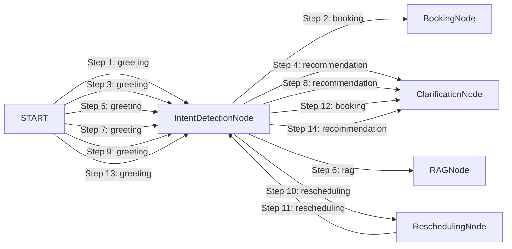

# LangGraph Agent Execution Trace Report

- **Session ID:** `default_session`
- **Timestamp:** `2026-09-01T04:57:12.355109+00:00`
- **Total Transitions:** `14`
- **Total Execution Latency:** `6110.49 ms`

---

## Transition Timeline & Node Graph



---

## Annotated Execution Steps

### Step 1: Node `IntentDetectionNode` (from `START`)
- **Timestamp:** `2026-09-01T04:57:03.123012+00:00` | **Latency:** `1.05 ms`
- **Detected Intent:** `greeting`
- **Agent Reasoning:** Classified intent as 'booking'. Clarification needed: False.
- **Tools Invocations:** None
- **Validation Checks:**
  > Standard Invariants Verified
- **Output Summary:**
  ```json
  {
  "budget": 8877665.0,
  "property_preferences": {
    "city": "",
    "locality": "",
    "property_type": "",
    "purpose": "For Sale",
    "area_marla": null,
    "bedrooms": null,
    "baths": null,
    "desired_amenities": [],
    "investment_goal": false
  },
  "user_profile": {
    "name": "Hamza",
    "phone": "03008877665"
  },
  "appointment_status": "none",
  "clarification_needed": false,
  "validation_errors": [],
  "final_response_snippet": ""
}
  ```

### Step 2: Node `BookingNode` (from `IntentDetectionNode`)
- **Timestamp:** `2026-09-01T04:57:03.125196+00:00` | **Latency:** `51.49 ms`
- **Detected Intent:** `booking`
- **Agent Reasoning:** Enforced slot availability invariant: Refused double-booking and presented verified open slots in UrduLish.
- **Tools Invocations:** `availability_checker_tool` (success)
- **Validation Checks:**
  > [FAILED] **Slot Availability Invariant**: Slot rejected: Agent Ahmed Raza already has a scheduled appointment on Tomorrow at 3 PM.
- **Output Summary:**
  ```json
  {
  "budget": null,
  "property_preferences": {},
  "user_profile": {},
  "appointment_status": "slot_unavailable",
  "clarification_needed": false,
  "validation_errors": [],
  "final_response_snippet": "Maaf kijiye ga, Tomorrow 3 PM par consultant Ahmed Raza pehle se booked hain ya office hours se bahar hai. Kya aap in available timings mein se koi time prefer karenge: Tomorrow at..."
}
  ```

### Step 3: Node `IntentDetectionNode` (from `START`)
- **Timestamp:** `2026-09-01T04:57:03.182765+00:00` | **Latency:** `0.1 ms`
- **Detected Intent:** `greeting`
- **Agent Reasoning:** Classified intent as 'recommendation'. Clarification needed: True.
- **Tools Invocations:** None
- **Validation Checks:**
  > Standard Invariants Verified
- **Output Summary:**
  ```json
  {
  "budget": null,
  "property_preferences": {
    "city": "",
    "locality": "",
    "property_type": "",
    "purpose": "For Sale",
    "area_marla": null,
    "bedrooms": null,
    "baths": null,
    "desired_amenities": [],
    "investment_goal": false
  },
  "user_profile": {},
  "appointment_status": "none",
  "clarification_needed": true,
  "validation_errors": [],
  "final_response_snippet": ""
}
  ```

### Step 4: Node `ClarificationNode` (from `IntentDetectionNode`)
- **Timestamp:** `2026-09-01T04:57:03.183327+00:00` | **Latency:** `0.06 ms`
- **Detected Intent:** `recommendation`
- **Agent Reasoning:** Requested clarification from user in UrduLish.
- **Tools Invocations:** None
- **Validation Checks:**
  > [PASSED] **Clarification Safeguard**: Prompted user for clarification in UrduLish: 'Aap ghar dekh rahe hain, flat ya plot?'
- **Output Summary:**
  ```json
  {
  "budget": null,
  "property_preferences": {},
  "user_profile": {},
  "appointment_status": "none",
  "clarification_needed": false,
  "validation_errors": [],
  "final_response_snippet": "Aap ghar dekh rahe hain, flat ya plot?"
}
  ```

### Step 5: Node `IntentDetectionNode` (from `START`)
- **Timestamp:** `2026-09-01T04:57:03.187069+00:00` | **Latency:** `0.08 ms`
- **Detected Intent:** `greeting`
- **Agent Reasoning:** Classified intent as 'rag'. Clarification needed: False.
- **Tools Invocations:** None
- **Validation Checks:**
  > Standard Invariants Verified
- **Output Summary:**
  ```json
  {
  "budget": null,
  "property_preferences": {
    "city": "",
    "locality": "Bahria Town",
    "property_type": "",
    "purpose": "For Sale",
    "area_marla": null,
    "bedrooms": null,
    "baths": null,
    "desired_amenities": [],
    "investment_goal": false
  },
  "user_profile": {},
  "appointment_status": "none",
  "clarification_needed": false,
  "validation_errors": [],
  "final_response_snippet": ""
}
  ```

### Step 6: Node `RAGNode` (from `IntentDetectionNode`)
- **Timestamp:** `2026-09-01T04:57:03.188089+00:00` | **Latency:** `2773.24 ms`
- **Detected Intent:** `rag`
- **Agent Reasoning:** Generated grounded UrduLish answer from 0 verified KB chunks.
- **Tools Invocations:** `rag_search_tool` (success)
- **Validation Checks:**
  > Standard Invariants Verified
- **Output Summary:**
  ```json
  {
  "budget": null,
  "property_preferences": {},
  "user_profile": {},
  "appointment_status": "none",
  "clarification_needed": false,
  "validation_errors": [],
  "final_response_snippet": "Is bare mein verified details ke liye hamare property consultant aap se direct rabta kar lenge."
}
  ```

### Step 7: Node `IntentDetectionNode` (from `START`)
- **Timestamp:** `2026-09-01T04:57:05.984741+00:00` | **Latency:** `0.09 ms`
- **Detected Intent:** `greeting`
- **Agent Reasoning:** Classified intent as 'recommendation'. Clarification needed: True.
- **Tools Invocations:** None
- **Validation Checks:**
  > Standard Invariants Verified
- **Output Summary:**
  ```json
  {
  "budget": 20000000.0,
  "property_preferences": {
    "city": "Lahore",
    "locality": "",
    "property_type": "House",
    "purpose": "For Sale",
    "area_marla": 5.0,
    "bedrooms": null,
    "baths": null,
    "desired_amenities": [],
    "investment_goal": false,
    "locality_asked": true
  },
  "user_profile": {},
  "appointment_status": "none",
  "clarification_needed": true,
  "validation_errors": [],
  "final_response_snippet": ""
}
  ```

### Step 8: Node `ClarificationNode` (from `IntentDetectionNode`)
- **Timestamp:** `2026-09-01T04:57:05.985106+00:00` | **Latency:** `0.04 ms`
- **Detected Intent:** `recommendation`
- **Agent Reasoning:** Requested clarification from user in UrduLish.
- **Tools Invocations:** None
- **Validation Checks:**
  > [PASSED] **Clarification Safeguard**: Prompted user for clarification in UrduLish: 'Lahore mein hamare paas DHA Defence, Bahria Town, Johar Town, Faisal Town, Model Town, aur College Road jaisi societies available hain. Aap kis area mein prefer karenge?'
- **Output Summary:**
  ```json
  {
  "budget": null,
  "property_preferences": {},
  "user_profile": {},
  "appointment_status": "none",
  "clarification_needed": false,
  "validation_errors": [],
  "final_response_snippet": "Lahore mein hamare paas DHA Defence, Bahria Town, Johar Town, Faisal Town, Model Town, aur College Road jaisi societies available hain. Aap kis area mein prefer karenge?"
}
  ```

### Step 9: Node `IntentDetectionNode` (from `START`)
- **Timestamp:** `2026-09-01T04:57:05.989031+00:00` | **Latency:** `0.11 ms`
- **Detected Intent:** `greeting`
- **Agent Reasoning:** Classified intent as 'rescheduling'. Clarification needed: False.
- **Tools Invocations:** None
- **Validation Checks:**
  > Standard Invariants Verified
- **Output Summary:**
  ```json
  {
  "budget": null,
  "property_preferences": {
    "city": "",
    "locality": "",
    "property_type": "",
    "purpose": "For Sale",
    "area_marla": null,
    "bedrooms": null,
    "baths": null,
    "desired_amenities": [],
    "investment_goal": false
  },
  "user_profile": {},
  "appointment_status": "scheduled",
  "clarification_needed": false,
  "validation_errors": [],
  "final_response_snippet": ""
}
  ```

### Step 10: Node `ReschedulingNode` (from `IntentDetectionNode`)
- **Timestamp:** `2026-09-01T04:57:05.990125+00:00` | **Latency:** `3283.64 ms`
- **Detected Intent:** `rescheduling`
- **Agent Reasoning:** Successfully rescheduled appointment.
- **Tools Invocations:** `availability_checker_tool` (success)
- **Validation Checks:**
  > Standard Invariants Verified
- **Output Summary:**
  ```json
  {
  "budget": null,
  "property_preferences": {},
  "user_profile": {},
  "appointment_status": "rescheduled",
  "clarification_needed": false,
  "validation_errors": [],
  "final_response_snippet": "Aap ka visit **5 Marla House** ke liye successfully **Tomorrow 4:00 PM** par reschedule kar diya gaya hai. Consultant Ahmed Raza ko bhi update send kar di gayi hai."
}
  ```

### Step 11: Node `IntentDetectionNode` (from `ReschedulingNode`)
- **Timestamp:** `2026-09-01T04:57:09.277650+00:00` | **Latency:** `0.09 ms`
- **Detected Intent:** `rescheduling`
- **Agent Reasoning:** Classified intent as 'booking'. Clarification needed: True.
- **Tools Invocations:** None
- **Validation Checks:**
  > Standard Invariants Verified
- **Output Summary:**
  ```json
  {
  "budget": null,
  "property_preferences": {
    "city": "",
    "locality": "",
    "property_type": "",
    "purpose": "For Sale",
    "area_marla": null,
    "bedrooms": null,
    "baths": null,
    "desired_amenities": [],
    "investment_goal": false
  },
  "user_profile": {},
  "appointment_status": "rescheduled",
  "clarification_needed": true,
  "validation_errors": [],
  "final_response_snippet": ""
}
  ```

### Step 12: Node `ClarificationNode` (from `IntentDetectionNode`)
- **Timestamp:** `2026-09-01T04:57:09.279212+00:00` | **Latency:** `0.08 ms`
- **Detected Intent:** `booking`
- **Agent Reasoning:** Requested clarification from user in UrduLish.
- **Tools Invocations:** None
- **Validation Checks:**
  > [PASSED] **Clarification Safeguard**: Prompted user for clarification in UrduLish: 'Main aap ka property visit schedule kar deta hoon. Baraye meherbani apna contact number bata dijiye.'
- **Output Summary:**
  ```json
  {
  "budget": null,
  "property_preferences": {},
  "user_profile": {},
  "appointment_status": "none",
  "clarification_needed": false,
  "validation_errors": [],
  "final_response_snippet": "Main aap ka property visit schedule kar deta hoon. Baraye meherbani apna contact number bata dijiye."
}
  ```

### Step 13: Node `IntentDetectionNode` (from `START`)
- **Timestamp:** `2026-09-01T04:57:12.349684+00:00` | **Latency:** `0.33 ms`
- **Detected Intent:** `greeting`
- **Agent Reasoning:** Classified intent as 'recommendation'. Clarification needed: True.
- **Tools Invocations:** None
- **Validation Checks:**
  > Standard Invariants Verified
- **Output Summary:**
  ```json
  {
  "budget": null,
  "property_preferences": {
    "city": "",
    "locality": "",
    "property_type": "House",
    "purpose": "For Sale",
    "area_marla": null,
    "bedrooms": null,
    "baths": null,
    "desired_amenities": [],
    "investment_goal": false
  },
  "user_profile": {},
  "appointment_status": "none",
  "clarification_needed": true,
  "validation_errors": [],
  "final_response_snippet": ""
}
  ```

### Step 14: Node `ClarificationNode` (from `IntentDetectionNode`)
- **Timestamp:** `2026-09-01T04:57:12.352890+00:00` | **Latency:** `0.09 ms`
- **Detected Intent:** `recommendation`
- **Agent Reasoning:** Requested clarification from user in UrduLish.
- **Tools Invocations:** None
- **Validation Checks:**
  > [PASSED] **Clarification Safeguard**: Prompted user for clarification in UrduLish: 'Aap kis city mein dekhna chahenge? Hamare paas Lahore, Islamabad aur Rawalpindi mein options available hain.'
- **Output Summary:**
  ```json
  {
  "budget": null,
  "property_preferences": {},
  "user_profile": {},
  "appointment_status": "none",
  "clarification_needed": false,
  "validation_errors": [],
  "final_response_snippet": "Aap kis city mein dekhna chahenge? Hamare paas Lahore, Islamabad aur Rawalpindi mein options available hain."
}
  ```
