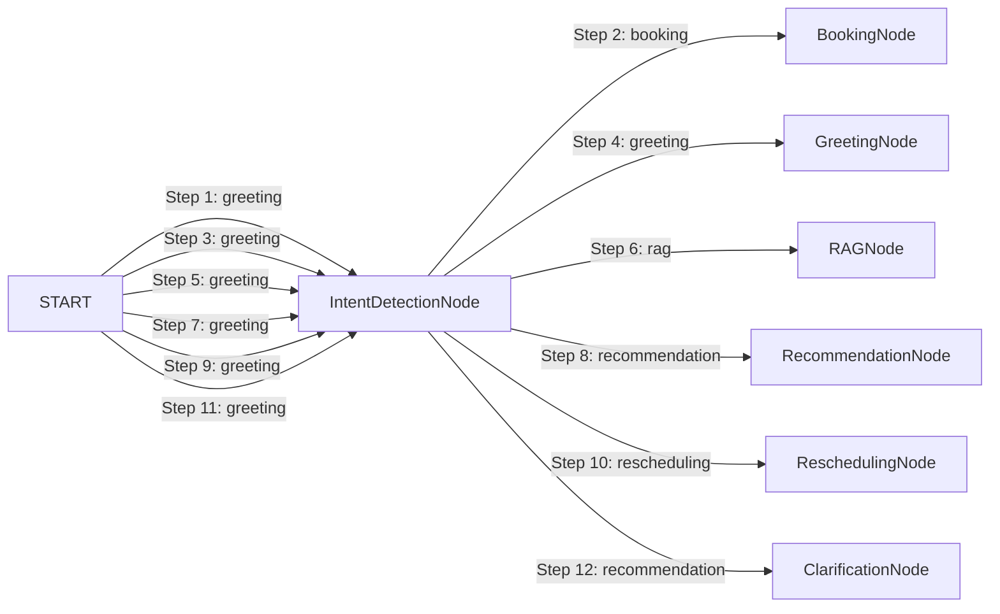

# LangGraph Agent Execution Trace Report

- **Session ID:** `default_session`
- **Timestamp:** `2026-09-01T04:58:00.577797+00:00`
- **Total Transitions:** `12`
- **Total Execution Latency:** `2968.63 ms`

---

## Transition Timeline & Node Graph



---

## Annotated Execution Steps

### Step 1: Node `IntentDetectionNode` (from `START`)
- **Timestamp:** `2026-09-01T04:57:54.256321+00:00` | **Latency:** `1.12 ms`
- **Detected Intent:** `greeting`
- **Agent Reasoning:** Classified intent as 'booking'. Clarification needed: False.
- **Tools Invocations:** None
- **Validation Checks:**
  > Standard Invariants Verified
- **Output Summary:**
  ```json
  {
  "budget": 8877665.0,
  "property_preferences": {
    "city": "",
    "locality": "",
    "property_type": "",
    "purpose": "For Sale",
    "area_marla": null,
    "bedrooms": null,
    "baths": null,
    "desired_amenities": [],
    "investment_goal": false
  },
  "user_profile": {
    "name": "Hamza",
    "phone": "03008877665"
  },
  "appointment_status": "none",
  "clarification_needed": false,
  "validation_errors": [],
  "final_response_snippet": ""
}
  ```

### Step 2: Node `BookingNode` (from `IntentDetectionNode`)
- **Timestamp:** `2026-09-01T04:57:54.258479+00:00` | **Latency:** `46.21 ms`
- **Detected Intent:** `booking`
- **Agent Reasoning:** Enforced slot availability invariant: Refused double-booking and presented verified open slots in UrduLish.
- **Tools Invocations:** `availability_checker_tool` (success)
- **Validation Checks:**
  > [FAILED] **Slot Availability Invariant**: Slot rejected: Agent Ahmed Raza already has a scheduled appointment on Tomorrow at 3 PM.
- **Output Summary:**
  ```json
  {
  "budget": null,
  "property_preferences": {},
  "user_profile": {},
  "appointment_status": "slot_unavailable",
  "clarification_needed": false,
  "validation_errors": [],
  "final_response_snippet": "Maaf kijiye ga, Tomorrow 3 PM par consultant Ahmed Raza pehle se booked hain ya office hours se bahar hai. Kya aap in available timings mein se koi time prefer karenge: Tomorrow at..."
}
  ```

### Step 3: Node `IntentDetectionNode` (from `START`)
- **Timestamp:** `2026-09-01T04:57:54.308083+00:00` | **Latency:** `0.08 ms`
- **Detected Intent:** `greeting`
- **Agent Reasoning:** Classified intent as 'greeting'. Clarification needed: False.
- **Tools Invocations:** None
- **Validation Checks:**
  > Standard Invariants Verified
- **Output Summary:**
  ```json
  {
  "budget": null,
  "property_preferences": {
    "city": "",
    "locality": "",
    "property_type": "",
    "purpose": "For Sale",
    "area_marla": null,
    "bedrooms": null,
    "baths": null,
    "desired_amenities": [],
    "investment_goal": false
  },
  "user_profile": {},
  "appointment_status": "none",
  "clarification_needed": false,
  "validation_errors": [],
  "final_response_snippet": ""
}
  ```

### Step 4: Node `GreetingNode` (from `IntentDetectionNode`)
- **Timestamp:** `2026-09-01T04:57:54.308591+00:00` | **Latency:** `0.03 ms`
- **Detected Intent:** `greeting`
- **Agent Reasoning:** Provided natural UrduLish greeting.
- **Tools Invocations:** None
- **Validation Checks:**
  > Standard Invariants Verified
- **Output Summary:**
  ```json
  {
  "budget": null,
  "property_preferences": {},
  "user_profile": {},
  "appointment_status": "none",
  "clarification_needed": false,
  "validation_errors": [],
  "final_response_snippet": "Walikum as Salam! RealEstate Hub mein khush aamdeed. Main aap ka property consultant hoon. Bataiye, aap ghar dekh rahe hain, flat ya plot?"
}
  ```

### Step 5: Node `IntentDetectionNode` (from `START`)
- **Timestamp:** `2026-09-01T04:57:54.312918+00:00` | **Latency:** `0.09 ms`
- **Detected Intent:** `greeting`
- **Agent Reasoning:** Classified intent as 'rag'. Clarification needed: False.
- **Tools Invocations:** None
- **Validation Checks:**
  > Standard Invariants Verified
- **Output Summary:**
  ```json
  {
  "budget": null,
  "property_preferences": {
    "city": "",
    "locality": "Bahria Town",
    "property_type": "",
    "purpose": "For Sale",
    "area_marla": null,
    "bedrooms": null,
    "baths": null,
    "desired_amenities": [],
    "investment_goal": false
  },
  "user_profile": {},
  "appointment_status": "none",
  "clarification_needed": false,
  "validation_errors": [],
  "final_response_snippet": ""
}
  ```

### Step 6: Node `RAGNode` (from `IntentDetectionNode`)
- **Timestamp:** `2026-09-01T04:57:54.313427+00:00` | **Latency:** `2575.66 ms`
- **Detected Intent:** `rag`
- **Agent Reasoning:** Generated grounded UrduLish answer from 0 verified KB chunks.
- **Tools Invocations:** `rag_search_tool` (success)
- **Validation Checks:**
  > Standard Invariants Verified
- **Output Summary:**
  ```json
  {
  "budget": null,
  "property_preferences": {},
  "user_profile": {},
  "appointment_status": "none",
  "clarification_needed": false,
  "validation_errors": [],
  "final_response_snippet": "Is bare mein verified details ke liye hamare property consultant aap se direct rabta kar lenge."
}
  ```

### Step 7: Node `IntentDetectionNode` (from `START`)
- **Timestamp:** `2026-09-01T04:57:56.904887+00:00` | **Latency:** `0.09 ms`
- **Detected Intent:** `greeting`
- **Agent Reasoning:** Classified intent as 'recommendation'. Clarification needed: False.
- **Tools Invocations:** None
- **Validation Checks:**
  > Standard Invariants Verified
- **Output Summary:**
  ```json
  {
  "budget": 20000000.0,
  "property_preferences": {
    "city": "Lahore",
    "locality": "",
    "property_type": "House",
    "purpose": "For Sale",
    "area_marla": 5.0,
    "bedrooms": null,
    "baths": null,
    "desired_amenities": [],
    "investment_goal": false
  },
  "user_profile": {},
  "appointment_status": "none",
  "clarification_needed": false,
  "validation_errors": [],
  "final_response_snippet": ""
}
  ```

### Step 8: Node `RecommendationNode` (from `IntentDetectionNode`)
- **Timestamp:** `2026-09-01T04:57:56.906138+00:00` | **Latency:** `308.09 ms`
- **Detected Intent:** `recommendation`
- **Agent Reasoning:** Retrieved 5 verified properties without hallucinations.
- **Tools Invocations:** `property_search_tool` (success)
- **Validation Checks:**
  > [PASSED] **Property Availability (PROP-1116)**: Verified active in database. Locality: Elite Town, Lahore, Punjab, Price: PKR 3,000,000<br>[PASSED] **Property Availability (PROP-1161)**: Verified active in database. Locality: Bahria Nasheman, Lahore, Punjab, Price: PKR 4,600,000<br>[PASSED] **Property Availability (PROP-1069)**: Verified active in database. Locality: GT Road, Lahore, Punjab, Price: PKR 6,500,000<br>[PASSED] **Property Availability (PROP-1171)**: Verified active in database. Locality: Lalazaar Garden, Lahore, Punjab, Price: PKR 7,500,000<br>[PASSED] **Property Availability (PROP-1026)**: Verified active in database. Locality: Harbanspura Road, Lahore, Punjab, Price: PKR 8,000,000
- **Output Summary:**
  ```json
  {
  "budget": null,
  "property_preferences": {},
  "user_profile": {},
  "appointment_status": "none",
  "clarification_needed": false,
  "validation_errors": [],
  "final_response_snippet": "Ji sir, Lahore Lahore mein hamare paas 5 marla houses ke liye yeh behtareen options available hain:\n\n**1.** 5 marla House in Elite Town, Lahore, Punjab, price 30 lakh, 3 bedrooms\n*..."
}
  ```

### Step 9: Node `IntentDetectionNode` (from `START`)
- **Timestamp:** `2026-09-01T04:57:57.217526+00:00` | **Latency:** `0.08 ms`
- **Detected Intent:** `greeting`
- **Agent Reasoning:** Classified intent as 'rescheduling'. Clarification needed: False.
- **Tools Invocations:** None
- **Validation Checks:**
  > Standard Invariants Verified
- **Output Summary:**
  ```json
  {
  "budget": null,
  "property_preferences": {
    "city": "",
    "locality": "",
    "property_type": "",
    "purpose": "For Sale",
    "area_marla": null,
    "bedrooms": null,
    "baths": null,
    "desired_amenities": [],
    "investment_goal": false
  },
  "user_profile": {},
  "appointment_status": "scheduled",
  "clarification_needed": false,
  "validation_errors": [],
  "final_response_snippet": ""
}
  ```

### Step 10: Node `ReschedulingNode` (from `IntentDetectionNode`)
- **Timestamp:** `2026-09-01T04:57:57.218608+00:00` | **Latency:** `37.03 ms`
- **Detected Intent:** `rescheduling`
- **Agent Reasoning:** Reschedule slot unavailable in UrduLish.
- **Tools Invocations:** `availability_checker_tool` (success)
- **Validation Checks:**
  > Standard Invariants Verified
- **Output Summary:**
  ```json
  {
  "budget": null,
  "property_preferences": {},
  "user_profile": {},
  "appointment_status": "none",
  "clarification_needed": false,
  "validation_errors": [],
  "final_response_snippet": "Maaf kijiye ga, Tomorrow 4:00 PM available nahi hai. Yeh timings available hain: Tomorrow at 11:30 AM, Tomorrow at 3:30 PM, Tomorrow at 5:30 PM."
}
  ```

### Step 11: Node `IntentDetectionNode` (from `START`)
- **Timestamp:** `2026-09-01T04:58:00.573486+00:00` | **Latency:** `0.09 ms`
- **Detected Intent:** `greeting`
- **Agent Reasoning:** Classified intent as 'recommendation'. Clarification needed: True.
- **Tools Invocations:** None
- **Validation Checks:**
  > Standard Invariants Verified
- **Output Summary:**
  ```json
  {
  "budget": null,
  "property_preferences": {
    "city": "",
    "locality": "",
    "property_type": "House",
    "purpose": "For Sale",
    "area_marla": null,
    "bedrooms": null,
    "baths": null,
    "desired_amenities": [],
    "investment_goal": false
  },
  "user_profile": {},
  "appointment_status": "none",
  "clarification_needed": true,
  "validation_errors": [],
  "final_response_snippet": ""
}
  ```

### Step 12: Node `ClarificationNode` (from `IntentDetectionNode`)
- **Timestamp:** `2026-09-01T04:58:00.574764+00:00` | **Latency:** `0.06 ms`
- **Detected Intent:** `recommendation`
- **Agent Reasoning:** Requested clarification from user in UrduLish.
- **Tools Invocations:** None
- **Validation Checks:**
  > [PASSED] **Clarification Safeguard**: Prompted user for clarification in UrduLish: 'Aap kis city mein dekhna chahenge? Hamare paas Lahore, Islamabad aur Rawalpindi mein options available hain.'
- **Output Summary:**
  ```json
  {
  "budget": null,
  "property_preferences": {},
  "user_profile": {},
  "appointment_status": "none",
  "clarification_needed": false,
  "validation_errors": [],
  "final_response_snippet": "Aap kis city mein dekhna chahenge? Hamare paas Lahore, Islamabad aur Rawalpindi mein options available hain."
}
  ```
