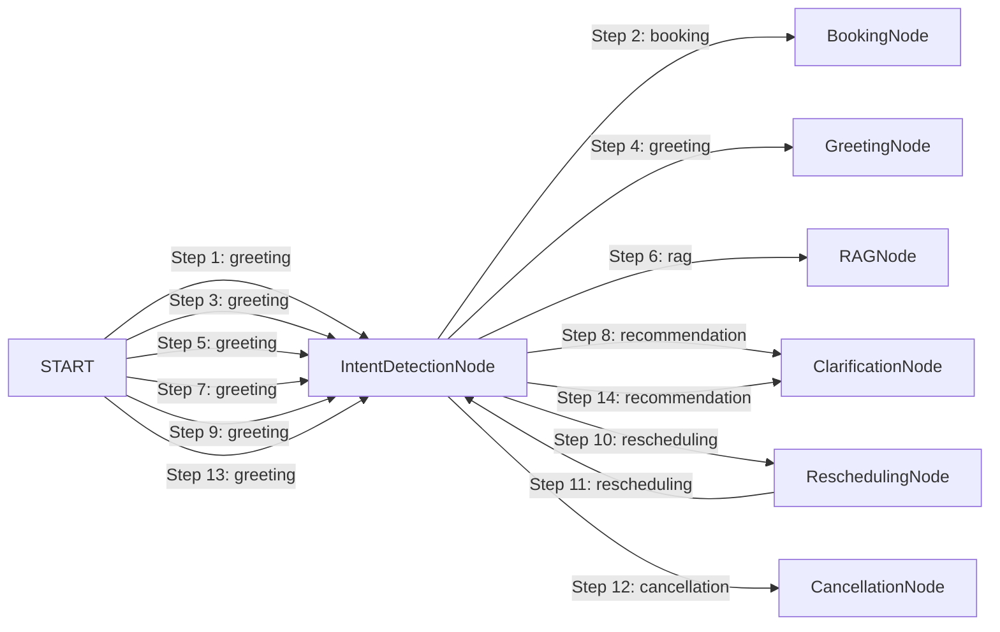

# LangGraph Agent Execution Trace Report

- **Session ID:** `default_session`
- **Timestamp:** `2026-09-01T05:05:25.955657+00:00`
- **Total Transitions:** `14`
- **Total Execution Latency:** `8779.88 ms`

---

## Transition Timeline & Node Graph



---

## Annotated Execution Steps

### Step 1: Node `IntentDetectionNode` (from `START`)
- **Timestamp:** `2026-09-01T05:05:14.017038+00:00` | **Latency:** `1.43 ms`
- **Detected Intent:** `greeting`
- **Agent Reasoning:** Classified intent as 'booking'. Funnel step clarification: False.
- **Tools Invocations:** None
- **Validation Checks:**
  > Standard Invariants Verified
- **Output Summary:**
  ```json
  {
  "budget": 8877665.0,
  "property_preferences": {
    "city": "",
    "locality": "",
    "property_type": "",
    "purpose": "For Sale",
    "area_marla": null,
    "bedrooms": null,
    "baths": null,
    "desired_amenities": [],
    "investment_goal": false
  },
  "user_profile": {
    "name": "Hamza",
    "phone": "03008877665"
  },
  "appointment_status": "none",
  "clarification_needed": false,
  "validation_errors": [],
  "final_response_snippet": ""
}
  ```

### Step 2: Node `BookingNode` (from `IntentDetectionNode`)
- **Timestamp:** `2026-09-01T05:05:14.020060+00:00` | **Latency:** `56.57 ms`
- **Detected Intent:** `booking`
- **Agent Reasoning:** Enforced slot availability invariant: Refused double-booking and presented verified open slots in UrduLish.
- **Tools Invocations:** `availability_checker_tool` (success)
- **Validation Checks:**
  > [FAILED] **Slot Availability Invariant**: Slot rejected: Agent Ahmed Raza already has a scheduled appointment on 2026-12-20 at 10:00 AM.
- **Output Summary:**
  ```json
  {
  "budget": null,
  "property_preferences": {},
  "user_profile": {},
  "appointment_status": "slot_unavailable",
  "clarification_needed": false,
  "validation_errors": [],
  "final_response_snippet": "Maaf kijiye ga, 2026-12-20 10:00 AM par consultant Ahmed Raza pehle se booked hain ya office hours se bahar hai. Kya aap in available timings mein se koi time prefer karenge: 2026-..."
}
  ```

### Step 3: Node `IntentDetectionNode` (from `START`)
- **Timestamp:** `2026-09-01T05:05:14.081828+00:00` | **Latency:** `0.11 ms`
- **Detected Intent:** `greeting`
- **Agent Reasoning:** Classified intent as 'greeting'. Funnel step clarification: False.
- **Tools Invocations:** None
- **Validation Checks:**
  > Standard Invariants Verified
- **Output Summary:**
  ```json
  {
  "budget": null,
  "property_preferences": {
    "city": "",
    "locality": "",
    "property_type": "",
    "purpose": "For Sale",
    "area_marla": null,
    "bedrooms": null,
    "baths": null,
    "desired_amenities": [],
    "investment_goal": false
  },
  "user_profile": {},
  "appointment_status": "none",
  "clarification_needed": false,
  "validation_errors": [],
  "final_response_snippet": ""
}
  ```

### Step 4: Node `GreetingNode` (from `IntentDetectionNode`)
- **Timestamp:** `2026-09-01T05:05:14.082792+00:00` | **Latency:** `0.05 ms`
- **Detected Intent:** `greeting`
- **Agent Reasoning:** Provided natural UrduLish greeting.
- **Tools Invocations:** None
- **Validation Checks:**
  > Standard Invariants Verified
- **Output Summary:**
  ```json
  {
  "budget": null,
  "property_preferences": {},
  "user_profile": {},
  "appointment_status": "none",
  "clarification_needed": false,
  "validation_errors": [],
  "final_response_snippet": "Walikum as Salam! RealEstate Hub mein khush aamdeed. Main aap ka property consultant hoon. Bataiye, aap ghar dekh rahe hain, flat ya plot?"
}
  ```

### Step 5: Node `IntentDetectionNode` (from `START`)
- **Timestamp:** `2026-09-01T05:05:14.085970+00:00` | **Latency:** `0.09 ms`
- **Detected Intent:** `greeting`
- **Agent Reasoning:** Classified intent as 'rag'. Funnel step clarification: False.
- **Tools Invocations:** None
- **Validation Checks:**
  > Standard Invariants Verified
- **Output Summary:**
  ```json
  {
  "budget": null,
  "property_preferences": {
    "city": "",
    "locality": "Bahria Town",
    "property_type": "",
    "purpose": "For Sale",
    "area_marla": null,
    "bedrooms": null,
    "baths": null,
    "desired_amenities": [],
    "investment_goal": false
  },
  "user_profile": {},
  "appointment_status": "none",
  "clarification_needed": false,
  "validation_errors": [],
  "final_response_snippet": ""
}
  ```

### Step 6: Node `RAGNode` (from `IntentDetectionNode`)
- **Timestamp:** `2026-09-01T05:05:14.086481+00:00` | **Latency:** `2713.81 ms`
- **Detected Intent:** `rag`
- **Agent Reasoning:** Generated grounded UrduLish answer from 0 verified KB chunks.
- **Tools Invocations:** `rag_search_tool` (success)
- **Validation Checks:**
  > Standard Invariants Verified
- **Output Summary:**
  ```json
  {
  "budget": null,
  "property_preferences": {},
  "user_profile": {},
  "appointment_status": "none",
  "clarification_needed": false,
  "validation_errors": [],
  "final_response_snippet": "Is bare mein verified details ke liye hamare property consultant aap se direct rabta kar lenge."
}
  ```

### Step 7: Node `IntentDetectionNode` (from `START`)
- **Timestamp:** `2026-09-01T05:05:16.818638+00:00` | **Latency:** `0.11 ms`
- **Detected Intent:** `greeting`
- **Agent Reasoning:** Classified intent as 'recommendation'. Funnel step clarification: True.
- **Tools Invocations:** None
- **Validation Checks:**
  > Standard Invariants Verified
- **Output Summary:**
  ```json
  {
  "budget": 20000000.0,
  "property_preferences": {
    "city": "Lahore",
    "locality": "",
    "property_type": "House",
    "purpose": "For Sale",
    "area_marla": 5.0,
    "bedrooms": null,
    "baths": null,
    "desired_amenities": [],
    "investment_goal": false,
    "societies_shared": true
  },
  "user_profile": {},
  "appointment_status": "none",
  "clarification_needed": true,
  "validation_errors": [],
  "final_response_snippet": ""
}
  ```

### Step 8: Node `ClarificationNode` (from `IntentDetectionNode`)
- **Timestamp:** `2026-09-01T05:05:16.819443+00:00` | **Latency:** `0.05 ms`
- **Detected Intent:** `recommendation`
- **Agent Reasoning:** Requested clarification from user in UrduLish.
- **Tools Invocations:** None
- **Validation Checks:**
  > [PASSED] **Clarification Safeguard**: Prompted user for clarification in UrduLish: 'Lahore mein hamare paas DHA Defence, Bahria Town, Johar Town, Faisal Town, Model Town, aur College Road jaisi societies available hain. Aap kis area mein prefer karenge?'
- **Output Summary:**
  ```json
  {
  "budget": null,
  "property_preferences": {},
  "user_profile": {},
  "appointment_status": "none",
  "clarification_needed": false,
  "validation_errors": [],
  "final_response_snippet": "Lahore mein hamare paas DHA Defence, Bahria Town, Johar Town, Faisal Town, Model Town, aur College Road jaisi societies available hain. Aap kis area mein prefer karenge?"
}
  ```

### Step 9: Node `IntentDetectionNode` (from `START`)
- **Timestamp:** `2026-09-01T05:05:16.828050+00:00` | **Latency:** `0.13 ms`
- **Detected Intent:** `greeting`
- **Agent Reasoning:** Classified intent as 'rescheduling'. Funnel step clarification: False.
- **Tools Invocations:** None
- **Validation Checks:**
  > Standard Invariants Verified
- **Output Summary:**
  ```json
  {
  "budget": null,
  "property_preferences": {
    "city": "",
    "locality": "",
    "property_type": "",
    "purpose": "For Sale",
    "area_marla": null,
    "bedrooms": null,
    "baths": null,
    "desired_amenities": [],
    "investment_goal": false
  },
  "user_profile": {},
  "appointment_status": "scheduled",
  "clarification_needed": false,
  "validation_errors": [],
  "final_response_snippet": ""
}
  ```

### Step 10: Node `ReschedulingNode` (from `IntentDetectionNode`)
- **Timestamp:** `2026-09-01T05:05:16.828602+00:00` | **Latency:** `3124.17 ms`
- **Detected Intent:** `rescheduling`
- **Agent Reasoning:** Successfully rescheduled appointment.
- **Tools Invocations:** `availability_checker_tool` (success)
- **Validation Checks:**
  > Standard Invariants Verified
- **Output Summary:**
  ```json
  {
  "budget": null,
  "property_preferences": {},
  "user_profile": {},
  "appointment_status": "rescheduled",
  "clarification_needed": false,
  "validation_errors": [],
  "final_response_snippet": "Aap ka visit **5 Marla House** ke liye successfully **2026-12-22 11:00 AM** par reschedule kar diya gaya hai. Consultant Ahmed Raza ko bhi update send kar di gayi hai."
}
  ```

### Step 11: Node `IntentDetectionNode` (from `ReschedulingNode`)
- **Timestamp:** `2026-09-01T05:05:19.962778+00:00` | **Latency:** `0.09 ms`
- **Detected Intent:** `rescheduling`
- **Agent Reasoning:** Classified intent as 'cancellation'. Funnel step clarification: False.
- **Tools Invocations:** None
- **Validation Checks:**
  > Standard Invariants Verified
- **Output Summary:**
  ```json
  {
  "budget": null,
  "property_preferences": {
    "city": "",
    "locality": "",
    "property_type": "",
    "purpose": "For Sale",
    "area_marla": null,
    "bedrooms": null,
    "baths": null,
    "desired_amenities": [],
    "investment_goal": false
  },
  "user_profile": {},
  "appointment_status": "rescheduled",
  "clarification_needed": false,
  "validation_errors": [],
  "final_response_snippet": ""
}
  ```

### Step 12: Node `CancellationNode` (from `IntentDetectionNode`)
- **Timestamp:** `2026-09-01T05:05:19.962778+00:00` | **Latency:** `2883.09 ms`
- **Detected Intent:** `cancellation`
- **Agent Reasoning:** Processed cancellation in UrduLish.
- **Tools Invocations:** None
- **Validation Checks:**
  > Standard Invariants Verified
- **Output Summary:**
  ```json
  {
  "budget": null,
  "property_preferences": {},
  "user_profile": {},
  "appointment_status": "cancelled",
  "clarification_needed": false,
  "validation_errors": [],
  "final_response_snippet": "Aap ka **5 Marla House** ka visit cancel kar diya gaya hai aur schedule update ho chuka hai. Jab bhi aap dobara visit plan karein, zaroor bataiye ga."
}
  ```

### Step 13: Node `IntentDetectionNode` (from `START`)
- **Timestamp:** `2026-09-01T05:05:25.951708+00:00` | **Latency:** `0.13 ms`
- **Detected Intent:** `greeting`
- **Agent Reasoning:** Classified intent as 'recommendation'. Funnel step clarification: True.
- **Tools Invocations:** None
- **Validation Checks:**
  > Standard Invariants Verified
- **Output Summary:**
  ```json
  {
  "budget": null,
  "property_preferences": {
    "city": "",
    "locality": "",
    "property_type": "House",
    "purpose": "For Sale",
    "area_marla": null,
    "bedrooms": null,
    "baths": null,
    "desired_amenities": [],
    "investment_goal": false
  },
  "user_profile": {},
  "appointment_status": "none",
  "clarification_needed": true,
  "validation_errors": [],
  "final_response_snippet": ""
}
  ```

### Step 14: Node `ClarificationNode` (from `IntentDetectionNode`)
- **Timestamp:** `2026-09-01T05:05:25.952866+00:00` | **Latency:** `0.05 ms`
- **Detected Intent:** `recommendation`
- **Agent Reasoning:** Requested clarification from user in UrduLish.
- **Tools Invocations:** None
- **Validation Checks:**
  > [PASSED] **Clarification Safeguard**: Prompted user for clarification in UrduLish: 'Aap kis city mein dekhna chahenge? Hamare paas Lahore, Islamabad aur Rawalpindi mein options available hain.'
- **Output Summary:**
  ```json
  {
  "budget": null,
  "property_preferences": {},
  "user_profile": {},
  "appointment_status": "none",
  "clarification_needed": false,
  "validation_errors": [],
  "final_response_snippet": "Aap kis city mein dekhna chahenge? Hamare paas Lahore, Islamabad aur Rawalpindi mein options available hain."
}
  ```
