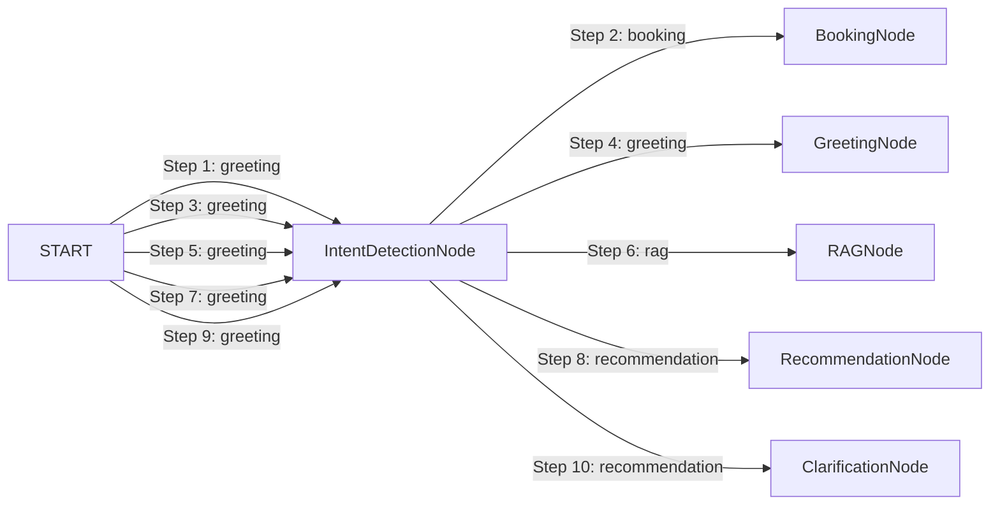

# LangGraph Agent Execution Trace Report

- **Session ID:** `default_session`
- **Timestamp:** `2026-09-01T05:11:24.585650+00:00`
- **Total Transitions:** `10`
- **Total Execution Latency:** `6029.13 ms`

---

## Transition Timeline & Node Graph



---

## Annotated Execution Steps

### Step 1: Node `IntentDetectionNode` (from `START`)
- **Timestamp:** `2026-09-01T05:11:15.182864+00:00` | **Latency:** `1.74 ms`
- **Detected Intent:** `greeting`
- **Agent Reasoning:** Classified intent as 'booking'. Persistent visit funnel active: True. Clarification needed: False.
- **Tools Invocations:** None
- **Validation Checks:**
  > Standard Invariants Verified
- **Output Summary:**
  ```json
  {
  "budget": 8877665.0,
  "property_preferences": {
    "city": "",
    "locality": "",
    "property_type": "",
    "purpose": "For Sale",
    "area_marla": null,
    "bedrooms": null,
    "baths": null,
    "desired_amenities": [],
    "investment_goal": false
  },
  "user_profile": {
    "name": "Hamza",
    "phone": "03008877665"
  },
  "appointment_status": "none",
  "clarification_needed": false,
  "validation_errors": [],
  "final_response_snippet": ""
}
  ```

### Step 2: Node `BookingNode` (from `IntentDetectionNode`)
- **Timestamp:** `2026-09-01T05:11:15.186067+00:00` | **Latency:** `3323.75 ms`
- **Detected Intent:** `booking`
- **Agent Reasoning:** Successfully booked appointment appt_245b7debf4 in UrduLish.
- **Tools Invocations:** `availability_checker_tool` (success)
- **Validation Checks:**
  > Standard Invariants Verified
- **Output Summary:**
  ```json
  {
  "budget": null,
  "property_preferences": {},
  "user_profile": {
    "name": "Hamza",
    "phone": "03008877665",
    "lead_id": "lead_07ec8659b4"
  },
  "appointment_status": "scheduled",
  "clarification_needed": false,
  "validation_errors": [],
  "final_response_snippet": "Zabardast! Aap ka visit House in Lahore ke liye 2027-01-22 10:00 AM par schedule ho gaya hai. Hamare consultant Ahmed Raza aap ko site par receive karenge. Aap ka Google Calendar i..."
}
  ```

### Step 3: Node `IntentDetectionNode` (from `START`)
- **Timestamp:** `2026-09-01T05:11:18.514076+00:00` | **Latency:** `0.1 ms`
- **Detected Intent:** `greeting`
- **Agent Reasoning:** Classified intent as 'greeting'. Persistent visit funnel active: None. Clarification needed: False.
- **Tools Invocations:** None
- **Validation Checks:**
  > Standard Invariants Verified
- **Output Summary:**
  ```json
  {
  "budget": null,
  "property_preferences": {
    "city": "",
    "locality": "",
    "property_type": "",
    "purpose": "For Sale",
    "area_marla": null,
    "bedrooms": null,
    "baths": null,
    "desired_amenities": [],
    "investment_goal": false
  },
  "user_profile": {},
  "appointment_status": "none",
  "clarification_needed": false,
  "validation_errors": [],
  "final_response_snippet": ""
}
  ```

### Step 4: Node `GreetingNode` (from `IntentDetectionNode`)
- **Timestamp:** `2026-09-01T05:11:18.515578+00:00` | **Latency:** `0.05 ms`
- **Detected Intent:** `greeting`
- **Agent Reasoning:** Provided natural UrduLish greeting.
- **Tools Invocations:** None
- **Validation Checks:**
  > Standard Invariants Verified
- **Output Summary:**
  ```json
  {
  "budget": null,
  "property_preferences": {},
  "user_profile": {},
  "appointment_status": "none",
  "clarification_needed": false,
  "validation_errors": [],
  "final_response_snippet": "Walikum as Salam! RealEstate Hub mein khush aamdeed. Main aap ka property consultant hoon. Bataiye, aap ghar dekh rahe hain, flat ya plot?"
}
  ```

### Step 5: Node `IntentDetectionNode` (from `START`)
- **Timestamp:** `2026-09-01T05:11:18.519016+00:00` | **Latency:** `0.16 ms`
- **Detected Intent:** `greeting`
- **Agent Reasoning:** Classified intent as 'rag'. Persistent visit funnel active: None. Clarification needed: False.
- **Tools Invocations:** None
- **Validation Checks:**
  > Standard Invariants Verified
- **Output Summary:**
  ```json
  {
  "budget": null,
  "property_preferences": {
    "city": "",
    "locality": "Bahria Town",
    "property_type": "",
    "purpose": "For Sale",
    "area_marla": null,
    "bedrooms": null,
    "baths": null,
    "desired_amenities": [],
    "investment_goal": false
  },
  "user_profile": {},
  "appointment_status": "none",
  "clarification_needed": false,
  "validation_errors": [],
  "final_response_snippet": ""
}
  ```

### Step 6: Node `RAGNode` (from `IntentDetectionNode`)
- **Timestamp:** `2026-09-01T05:11:18.520118+00:00` | **Latency:** `2423.51 ms`
- **Detected Intent:** `rag`
- **Agent Reasoning:** Generated grounded UrduLish answer from 0 verified KB chunks.
- **Tools Invocations:** `rag_search_tool` (success)
- **Validation Checks:**
  > Standard Invariants Verified
- **Output Summary:**
  ```json
  {
  "budget": null,
  "property_preferences": {},
  "user_profile": {},
  "appointment_status": "none",
  "clarification_needed": false,
  "validation_errors": [],
  "final_response_snippet": "Is bare mein verified details ke liye hamare property consultant aap se direct rabta kar lenge."
}
  ```

### Step 7: Node `IntentDetectionNode` (from `START`)
- **Timestamp:** `2026-09-01T05:11:20.968226+00:00` | **Latency:** `0.09 ms`
- **Detected Intent:** `greeting`
- **Agent Reasoning:** Classified intent as 'recommendation'. Persistent visit funnel active: None. Clarification needed: False.
- **Tools Invocations:** None
- **Validation Checks:**
  > Standard Invariants Verified
- **Output Summary:**
  ```json
  {
  "budget": 20000000.0,
  "property_preferences": {
    "city": "Lahore",
    "locality": "",
    "property_type": "House",
    "purpose": "For Sale",
    "area_marla": 5.0,
    "bedrooms": null,
    "baths": null,
    "desired_amenities": [],
    "investment_goal": false
  },
  "user_profile": {},
  "appointment_status": "none",
  "clarification_needed": false,
  "validation_errors": [],
  "final_response_snippet": ""
}
  ```

### Step 8: Node `RecommendationNode` (from `IntentDetectionNode`)
- **Timestamp:** `2026-09-01T05:11:20.969250+00:00` | **Latency:** `279.56 ms`
- **Detected Intent:** `recommendation`
- **Agent Reasoning:** Retrieved 5 verified properties formatted for voice.
- **Tools Invocations:** `property_search_tool` (success)
- **Validation Checks:**
  > [PASSED] **Property Availability (PROP-1116)**: Verified active in database. Locality: Elite Town, Lahore, Punjab, Price: PKR 3,000,000<br>[PASSED] **Property Availability (PROP-1161)**: Verified active in database. Locality: Bahria Nasheman, Lahore, Punjab, Price: PKR 4,600,000<br>[PASSED] **Property Availability (PROP-1069)**: Verified active in database. Locality: GT Road, Lahore, Punjab, Price: PKR 6,500,000<br>[PASSED] **Property Availability (PROP-1171)**: Verified active in database. Locality: Lalazaar Garden, Lahore, Punjab, Price: PKR 7,500,000<br>[PASSED] **Property Availability (PROP-1026)**: Verified active in database. Locality: Harbanspura Road, Lahore, Punjab, Price: PKR 8,000,000
- **Output Summary:**
  ```json
  {
  "budget": null,
  "property_preferences": {},
  "user_profile": {},
  "appointment_status": "none",
  "clarification_needed": false,
  "validation_errors": [],
  "final_response_snippet": "Ji sir, Lahore Lahore mein hamare paas 5 marla houses ke liye yeh behtareen options available hain: Option 1: 5 marla House in Elite Town, Lahore, price 30 lakh, 3 bedrooms. Option..."
}
  ```

### Step 9: Node `IntentDetectionNode` (from `START`)
- **Timestamp:** `2026-09-01T05:11:24.583590+00:00` | **Latency:** `0.11 ms`
- **Detected Intent:** `greeting`
- **Agent Reasoning:** Classified intent as 'recommendation'. Persistent visit funnel active: None. Clarification needed: True.
- **Tools Invocations:** None
- **Validation Checks:**
  > Standard Invariants Verified
- **Output Summary:**
  ```json
  {
  "budget": null,
  "property_preferences": {
    "city": "",
    "locality": "",
    "property_type": "House",
    "purpose": "For Sale",
    "area_marla": null,
    "bedrooms": null,
    "baths": null,
    "desired_amenities": [],
    "investment_goal": false
  },
  "user_profile": {},
  "appointment_status": "none",
  "clarification_needed": true,
  "validation_errors": [],
  "final_response_snippet": ""
}
  ```

### Step 10: Node `ClarificationNode` (from `IntentDetectionNode`)
- **Timestamp:** `2026-09-01T05:11:24.584380+00:00` | **Latency:** `0.06 ms`
- **Detected Intent:** `recommendation`
- **Agent Reasoning:** Requested clarification from user in UrduLish.
- **Tools Invocations:** None
- **Validation Checks:**
  > [PASSED] **Clarification Safeguard**: Prompted user for clarification in UrduLish: 'Aap kis city mein dekhna chahenge? Hamare paas Lahore, Islamabad aur Rawalpindi mein options available hain.'
- **Output Summary:**
  ```json
  {
  "budget": null,
  "property_preferences": {},
  "user_profile": {},
  "appointment_status": "none",
  "clarification_needed": false,
  "validation_errors": [],
  "final_response_snippet": "Aap kis city mein dekhna chahenge? Hamare paas Lahore, Islamabad aur Rawalpindi mein options available hain."
}
  ```
