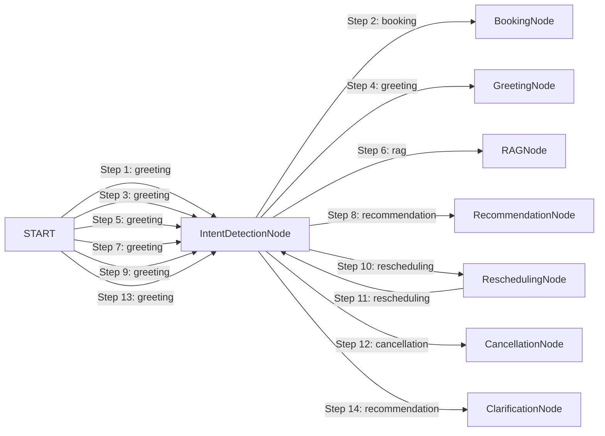

# LangGraph Agent Execution Trace Report

- **Session ID:** `default_session`
- **Timestamp:** `2026-09-01T06:43:22.486577+00:00`
- **Total Transitions:** `14`
- **Total Execution Latency:** `14395.46 ms`

---

## Transition Timeline & Node Graph



---

## Annotated Execution Steps

### Step 1: Node `IntentDetectionNode` (from `START`)
- **Timestamp:** `2026-09-01T06:43:04.792659+00:00` | **Latency:** `1.34 ms`
- **Detected Intent:** `greeting`
- **Agent Reasoning:** Intent: 'booking'. Investment goal: False. Clarification: False.
- **Tools Invocations:** None
- **Validation Checks:**
  > Standard Invariants Verified
- **Output Summary:**
  ```json
  {
  "budget": 8877665.0,
  "property_preferences": {
    "city": "",
    "locality": "",
    "property_type": "",
    "purpose": "For Sale",
    "area_marla": null,
    "bedrooms": null,
    "baths": null,
    "desired_amenities": [],
    "investment_goal": false
  },
  "user_profile": {
    "name": "Book",
    "phone": "03008877665"
  },
  "appointment_status": "none",
  "clarification_needed": false,
  "validation_errors": [],
  "final_response_snippet": ""
}
  ```

### Step 2: Node `BookingNode` (from `IntentDetectionNode`)
- **Timestamp:** `2026-09-01T06:43:04.794907+00:00` | **Latency:** `5165.01 ms`
- **Detected Intent:** `booking`
- **Agent Reasoning:** Successfully booked appointment appt_e00f18bfd8 in UrduLish.
- **Tools Invocations:** `availability_checker_tool` (success)
- **Validation Checks:**
  > Standard Invariants Verified
- **Output Summary:**
  ```json
  {
  "budget": null,
  "property_preferences": {},
  "user_profile": {
    "name": "Book",
    "phone": "03008877665",
    "lead_id": "lead_07ec8659b4"
  },
  "appointment_status": "scheduled",
  "clarification_needed": false,
  "validation_errors": [],
  "final_response_snippet": "Zabardast Book sahib! Aap ka visit House in Lahore ke liye 2027-07-22 10:00 AM par confirm schedule ho gaya hai. Hamare consultant Ahmed Raza aap ko site par receive karenge. Aap k..."
}
  ```

### Step 3: Node `IntentDetectionNode` (from `START`)
- **Timestamp:** `2026-09-01T06:43:09.966467+00:00` | **Latency:** `0.16 ms`
- **Detected Intent:** `greeting`
- **Agent Reasoning:** Intent: 'greeting'. Investment goal: False. Clarification: False.
- **Tools Invocations:** None
- **Validation Checks:**
  > Standard Invariants Verified
- **Output Summary:**
  ```json
  {
  "budget": null,
  "property_preferences": {
    "city": "",
    "locality": "",
    "property_type": "",
    "purpose": "For Sale",
    "area_marla": null,
    "bedrooms": null,
    "baths": null,
    "desired_amenities": [],
    "investment_goal": false
  },
  "user_profile": {},
  "appointment_status": "none",
  "clarification_needed": false,
  "validation_errors": [],
  "final_response_snippet": ""
}
  ```

### Step 4: Node `GreetingNode` (from `IntentDetectionNode`)
- **Timestamp:** `2026-09-01T06:43:09.967590+00:00` | **Latency:** `0.03 ms`
- **Detected Intent:** `greeting`
- **Agent Reasoning:** Provided natural UrduLish greeting without plot.
- **Tools Invocations:** None
- **Validation Checks:**
  > Standard Invariants Verified
- **Output Summary:**
  ```json
  {
  "budget": null,
  "property_preferences": {},
  "user_profile": {},
  "appointment_status": "none",
  "clarification_needed": false,
  "validation_errors": [],
  "final_response_snippet": "Walikum as Salam! RealEstate Hub mein khush aamdeed. Main aap ka property consultant hoon. Bataiye, aap ghar dekh rahe hain ya flat?"
}
  ```

### Step 5: Node `IntentDetectionNode` (from `START`)
- **Timestamp:** `2026-09-01T06:43:09.970187+00:00` | **Latency:** `0.2 ms`
- **Detected Intent:** `greeting`
- **Agent Reasoning:** Intent: 'rag'. Investment goal: False. Clarification: False.
- **Tools Invocations:** None
- **Validation Checks:**
  > Standard Invariants Verified
- **Output Summary:**
  ```json
  {
  "budget": null,
  "property_preferences": {
    "city": "",
    "locality": "Bahria Town",
    "property_type": "",
    "purpose": "For Sale",
    "area_marla": null,
    "bedrooms": null,
    "baths": null,
    "desired_amenities": [],
    "investment_goal": false
  },
  "user_profile": {},
  "appointment_status": "none",
  "clarification_needed": false,
  "validation_errors": [],
  "final_response_snippet": ""
}
  ```

### Step 6: Node `RAGNode` (from `IntentDetectionNode`)
- **Timestamp:** `2026-09-01T06:43:09.971551+00:00` | **Latency:** `2636.7 ms`
- **Detected Intent:** `rag`
- **Agent Reasoning:** Generated grounded UrduLish answer from 0 verified KB chunks.
- **Tools Invocations:** `rag_search_tool` (success)
- **Validation Checks:**
  > Standard Invariants Verified
- **Output Summary:**
  ```json
  {
  "budget": null,
  "property_preferences": {},
  "user_profile": {},
  "appointment_status": "none",
  "clarification_needed": false,
  "validation_errors": [],
  "final_response_snippet": "Yeh specific maloomat hamare verified record mein mojood nahi hai, lekin main consultant se rabta karwa sakta hoon."
}
  ```

### Step 7: Node `IntentDetectionNode` (from `START`)
- **Timestamp:** `2026-09-01T06:43:12.621759+00:00` | **Latency:** `0.12 ms`
- **Detected Intent:** `greeting`
- **Agent Reasoning:** Intent: 'recommendation'. Investment goal: False. Clarification: False.
- **Tools Invocations:** None
- **Validation Checks:**
  > Standard Invariants Verified
- **Output Summary:**
  ```json
  {
  "budget": 20000000.0,
  "property_preferences": {
    "city": "Lahore",
    "locality": "",
    "property_type": "House",
    "purpose": "For Sale",
    "area_marla": 5.0,
    "bedrooms": null,
    "baths": null,
    "desired_amenities": [],
    "investment_goal": false
  },
  "user_profile": {},
  "appointment_status": "none",
  "clarification_needed": false,
  "validation_errors": [],
  "final_response_snippet": ""
}
  ```

### Step 8: Node `RecommendationNode` (from `IntentDetectionNode`)
- **Timestamp:** `2026-09-01T06:43:12.622645+00:00` | **Latency:** `357.91 ms`
- **Detected Intent:** `recommendation`
- **Agent Reasoning:** Retrieved 5 verified properties formatted for voice.
- **Tools Invocations:** `property_search_tool` (success)
- **Validation Checks:**
  > [PASSED] **Property Availability (PROP-1116)**: Verified active in database. Locality: Elite Town, Lahore, Punjab, Price: PKR 3,000,000.0<br>[PASSED] **Property Availability (PROP-1069)**: Verified active in database. Locality: GT Road, Lahore, Punjab, Price: PKR 6,500,000.0<br>[PASSED] **Property Availability (PROP-1171)**: Verified active in database. Locality: Lalazaar Garden, Lahore, Punjab, Price: PKR 7,500,000.0<br>[PASSED] **Property Availability (PROP-1026)**: Verified active in database. Locality: Harbanspura Road, Lahore, Punjab, Price: PKR 8,000,000.0<br>[PASSED] **Property Availability (PROP-1185)**: Verified active in database. Locality: Ferozepur Road, Lahore, Punjab, Price: PKR 8,000,000.0
- **Output Summary:**
  ```json
  {
  "budget": null,
  "property_preferences": {},
  "user_profile": {},
  "appointment_status": "none",
  "clarification_needed": false,
  "validation_errors": [],
  "final_response_snippet": "Ji sir, Lahore Lahore mein hamare paas 5 marla houses ke liye yeh behtareen options available hain: Option 1: 5 marla House in Elite Town, Lahore, price 30 lakh, 3 bedrooms. Option..."
}
  ```

### Step 9: Node `IntentDetectionNode` (from `START`)
- **Timestamp:** `2026-09-01T06:43:12.987136+00:00` | **Latency:** `0.23 ms`
- **Detected Intent:** `greeting`
- **Agent Reasoning:** Intent: 'rescheduling'. Investment goal: False. Clarification: False.
- **Tools Invocations:** None
- **Validation Checks:**
  > Standard Invariants Verified
- **Output Summary:**
  ```json
  {
  "budget": null,
  "property_preferences": {
    "city": "",
    "locality": "",
    "property_type": "",
    "purpose": "For Sale",
    "area_marla": null,
    "bedrooms": null,
    "baths": null,
    "desired_amenities": [],
    "investment_goal": false
  },
  "user_profile": {},
  "appointment_status": "scheduled",
  "clarification_needed": false,
  "validation_errors": [],
  "final_response_snippet": ""
}
  ```

### Step 10: Node `ReschedulingNode` (from `IntentDetectionNode`)
- **Timestamp:** `2026-09-01T06:43:12.988843+00:00` | **Latency:** `3076.37 ms`
- **Detected Intent:** `rescheduling`
- **Agent Reasoning:** Successfully rescheduled appointment.
- **Tools Invocations:** `availability_checker_tool` (success)
- **Validation Checks:**
  > Standard Invariants Verified
- **Output Summary:**
  ```json
  {
  "budget": null,
  "property_preferences": {},
  "user_profile": {},
  "appointment_status": "rescheduled",
  "clarification_needed": false,
  "validation_errors": [],
  "final_response_snippet": "Aap ka visit **5 Marla House** ke liye successfully **2027-12-18 11:00 AM** par reschedule kar diya gaya hai. Consultant Ahmed Raza ko bhi update send kar di gayi hai."
}
  ```

### Step 11: Node `IntentDetectionNode` (from `ReschedulingNode`)
- **Timestamp:** `2026-09-01T06:43:16.069304+00:00` | **Latency:** `0.17 ms`
- **Detected Intent:** `rescheduling`
- **Agent Reasoning:** Intent: 'cancellation'. Investment goal: False. Clarification: False.
- **Tools Invocations:** None
- **Validation Checks:**
  > Standard Invariants Verified
- **Output Summary:**
  ```json
  {
  "budget": null,
  "property_preferences": {
    "city": "",
    "locality": "",
    "property_type": "",
    "purpose": "For Sale",
    "area_marla": null,
    "bedrooms": null,
    "baths": null,
    "desired_amenities": [],
    "investment_goal": false
  },
  "user_profile": {},
  "appointment_status": "rescheduled",
  "clarification_needed": false,
  "validation_errors": [],
  "final_response_snippet": ""
}
  ```

### Step 12: Node `CancellationNode` (from `IntentDetectionNode`)
- **Timestamp:** `2026-09-01T06:43:16.072164+00:00` | **Latency:** `3156.89 ms`
- **Detected Intent:** `cancellation`
- **Agent Reasoning:** Processed cancellation in UrduLish.
- **Tools Invocations:** None
- **Validation Checks:**
  > Standard Invariants Verified
- **Output Summary:**
  ```json
  {
  "budget": null,
  "property_preferences": {},
  "user_profile": {},
  "appointment_status": "cancelled",
  "clarification_needed": false,
  "validation_errors": [],
  "final_response_snippet": "Aap ka **5 Marla House** ka visit cancel kar diya gaya hai aur schedule update ho chuka hai. Jab bhi aap dobara visit plan karein, zaroor bataiye ga."
}
  ```

### Step 13: Node `IntentDetectionNode` (from `START`)
- **Timestamp:** `2026-09-01T06:43:22.483272+00:00` | **Latency:** `0.19 ms`
- **Detected Intent:** `greeting`
- **Agent Reasoning:** Intent: 'recommendation'. Investment goal: False. Clarification: True.
- **Tools Invocations:** None
- **Validation Checks:**
  > Standard Invariants Verified
- **Output Summary:**
  ```json
  {
  "budget": null,
  "property_preferences": {
    "city": "",
    "locality": "",
    "property_type": "House",
    "purpose": "For Sale",
    "area_marla": null,
    "bedrooms": null,
    "baths": null,
    "desired_amenities": [],
    "investment_goal": false
  },
  "user_profile": {},
  "appointment_status": "none",
  "clarification_needed": true,
  "validation_errors": [],
  "final_response_snippet": ""
}
  ```

### Step 14: Node `ClarificationNode` (from `IntentDetectionNode`)
- **Timestamp:** `2026-09-01T06:43:22.484969+00:00` | **Latency:** `0.14 ms`
- **Detected Intent:** `recommendation`
- **Agent Reasoning:** Requested clarification from user in UrduLish.
- **Tools Invocations:** None
- **Validation Checks:**
  > [PASSED] **Clarification Safeguard**: Prompted user for clarification in UrduLish: 'Aap kis city mein dekhna chahenge? Hamare paas Lahore, Islamabad aur Rawalpindi mein options available hain.'
- **Output Summary:**
  ```json
  {
  "budget": null,
  "property_preferences": {},
  "user_profile": {},
  "appointment_status": "none",
  "clarification_needed": false,
  "validation_errors": [],
  "final_response_snippet": "Aap kis city mein dekhna chahenge? Hamare paas Lahore, Islamabad aur Rawalpindi mein options available hain."
}
  ```
